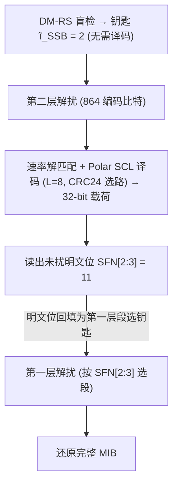
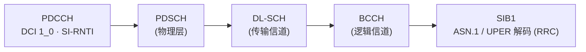
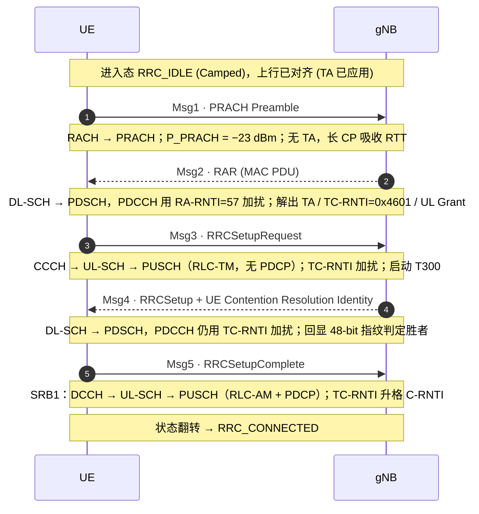
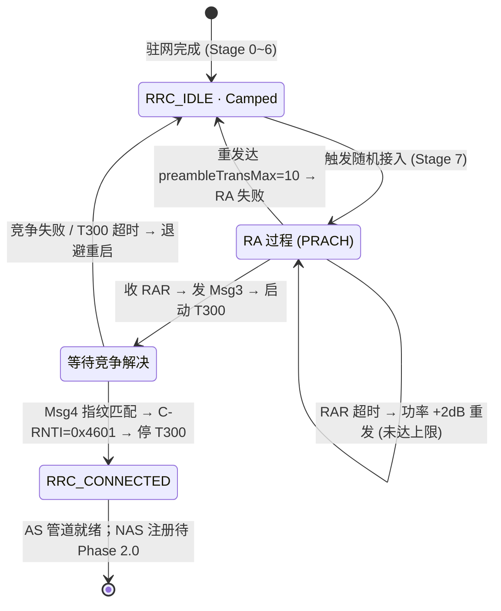

# 5G NR 初始接入全栈技术白皮书

### Phase 1.0：物理层与空口协议（AS 层）

> 适用读者：刚入行的通信工程师 / 协议栈开发者
> 配套工程：《5G NR 初始接入全流程交互沙盘》（纯静态 HTML/JS 状态机仿真）
> 本白皮书在论述物理过程与状态迁移时，直接锚定源码中的全局上下文 `NR_CTX` 字段、引擎原语 `Engine.ctxSet()` 及各子步状态标志位，以保证代码级工程可追溯性。

---

## 0 文档约定与仿真基准

### 0.1 参考小区配置（Reference Cell）

全文以一个确定的 FR1 现网场景为载体，配置取自仿真引擎顶栏的环境标签（`engine.js` `SKEL` 中 `env-tag static`）：

| 维度 | 取值 | 代码锚点 |
|------|------|----------|
| 频域范围 | FR1 / n78 / 3.5 GHz | —— |
| SSB Case | Case C，$\mu=1$（30 kHz SCS） | `NR_CTX.ssb_case='C'`、`NR_CTX.scs_khz=30` |
| 天线配置 | MIMO 2×4 | —— |
| 接入方式 | 4-Step CBRA | —— |
| 目标小区 PCI | 337 | `NR_CTX.pci` |

### 0.2 全局上下文 `NR_CTX` 与引擎状态机

仿真的核心是一个**响应式全局上下文** `window.NR_CTX`（定义于 `stage-data.js`）与一个纯状态机引擎（`engine.js`）。两条工程约束贯穿全程：

1. **零先验写入原则**：任一字段在被真正检测/解码之前恒为 `null`。写入通过原语 `Engine.ctxSet(key, val)` 完成，该原语同时执行三件事——更新 `NR_CTX[key]`、持久化到 `sessionStorage['nr_ctx_'+key]`（实现跨 Stage 页面传递）、调用 `_syncCtxTags()` 刷新顶栏。
2. **里程碑标签可视化**：顶栏六个动态标签由 `_TAG_MAP` 绑定到六个关键字段，未写入时 `dim`、写入后 `lit`。这六个字段构成了接入流程的「里程碑链」：

$$\texttt{gscn}\ \to\ \texttt{pci}\ \to\ \texttt{kssb}\ \to\ \texttt{initial\_bwp\_rb}\ \to\ \texttt{ta\_ns}\ \to\ \texttt{c\_rnti}$$

每个 Stage 的子步动画状态（如 `_dsPhase`、`_bdIdx`、`_alWriteCtx`）由 `Engine.addTimer()` 注册的定时器驱动，并在 `Engine.onStageExit()` 中统一清理。

### 0.3 时间口径

最小时间单位 $T_c$ 的精确值贯穿所有时域推导：

$$T_c=\frac{1}{\Delta f_{\max}\cdot N_f}=\frac{1}{480000\times 4096}\approx 0.50863\ \text{ns}$$

后文凡涉及时长/距离的换算（CP、TA、防护时间）一律以此值代入。

### 0.4 关键参数总表（Key Parameters at a Glance）

为便于查阅，下表汇总全流程的关键推导值及其代码落点（推导过程见对应 Stage）。

| 参数 | 数值 | `NR_CTX` 字段 | 写入 Stage |
|------|------|----------------|-----------|
| 最小时间单位 $T_c$ | 0.50863 ns | `tc_ns` | S0 |
| 同步栅格 GSCN / SSB 载频 | 7881 / 3550.08 MHz | `gscn`、`arfcn` | S1 |
| Numerology $\mu$ / SCS | $\mu=1$ / 30 kHz | `scs_khz` | S1 |
| $N_{ID}^{(2)}$ / $N_{ID}^{(1)}$ | 1 / 112 | `nid2`、`nid1` | S2 / S3 |
| 物理小区标识 PCI | 337 | `pci` | S3 |
| 系统帧号 SFN | 614 | `sfn_offset` | S4 |
| 频率微调 $k_{SSB}$ | 6 | `kssb` | S4 |
| pdcch-ConfigSIB1 | 0x10 | `mib.pdcchConfigSib1` | S4 |
| CORESET#0 | 24 RB × 2 sym, offset 1 RB | `coreset0_rb_start/size/sym` | S5 |
| 初始下行 BWP | 24 RB | `initial_bwp_rb` | S5 |
| DCI 1_0（RIV / MCS） | 47 / 5（QPSK） | （透传至 S6） | S5 |
| TBS / 信道编码 | 2472 bit (309 B) / LDPC BG2 | —— | S6 |
| Point A / NR-ARFCN | 3531.27 MHz / 635418 | `point_a_arfcn` | S6 |
| 小区选择余量 | $S_{rxlev}=+35$ dB | —— | S6 |
| RRC 状态（驻网） | IDLE（Camped） | `rrc_state` | S6 |
| Preamble / RA-RNTI | #27 / 57 | `preamble_idx` | S7 |
| 时间提前量 TA | $T_A{=}50\to13021$ ns（$\approx13.02\ \mu s$） | `ta_cmd`、`ta_ns` | S7 |
| 开环 PRACH 功率 | −23 dBm | —— | S7 |
| TC-RNTI → C-RNTI | 0x4601（值不变升格） | `tc_rnti`、`c_rnti` | S7 / S8 |
| RRC 状态（连接） | CONNECTED | `rrc_state` | S8 |

---

## 1 Stage 0 — 时钟基准建立（Clock Generation）

> **3GPP 锚定**：TS 38.211 §4.1（时域结构与 $T_c$ 定义）；TS 38.101-1 §4（频段与射频）
> **引擎徽标**：`STANDBY`｜**写入**：`NR_CTX.tc_ns`

### 1.1 待解未知量

终端上电时不存在任何统一的时间刻度。5G NR 允许 15/30/60/120/240 kHz 五种子载波间隔（Numerology $\mu=0\ldots4$）在同一载波上共存，若各 Numerology 的符号边界不能对齐到同一最小栅格，子载波正交性即被破坏，产生子载波间干扰（ICI）。因此第一项任务是**确立一个所有时域量都能整除的绝对原子刻度**。

### 1.2 机制与技术实现

$T_c$ 不是经验取值，而是由「极限 OFDM 系统」唯一确定：取协议规定的最大子载波间隔 $\Delta f_{\max}=480\ \text{kHz}$ 与最大 FFT 点数 $N_f=4096$，其乘积即极限采样率，倒数即 $T_c$（见 §0.3）。硬件上由三级时钟树合成：

$$f_s=\Delta f_{\max}\cdot N_f=480\ \text{kHz}\times 4096=1966.08\ \text{MHz},\qquad T_c=1/f_s$$

由 38.4 MHz TCXO 起振 → Integer-N PLL ×32 至 1228.8 MHz → Fractional-N PLL 精细合成 1966.08 MHz 采样钟。

**工程折中（Trade-off）**：所有真实 Numerology 都是该极限系统的 $2^{-\mu}$ 缩放，天然为 $T_c$ 整数倍，对齐问题被一个公约数一次性消解。由此派生出 LTE 兼容常数 $\kappa=T_s/T_c=64$（$T_s=1/(15000\times 2048)\approx 32.55\ \text{ns}$），协议中 16/144/2048/307200 等整数皆以 $T_s$ 为基准——**直接乘 $T_c$ 会引入 64 倍误差**，这是 Stage 7 推导 TA 时必须复用的口径。

### 1.3 承上启下与上下文对账

时间栅格是 Stage 1 时频网格的切分基础，TA 分辨率（Stage 7）亦由 $T_c$ 派生。

| 3GPP 信息元 / 物理量 | 取值 | 代码字段 | 写入时机 |
|------|------|----------|----------|
| $T_c$（time unit） | 0.50863 ns | `NR_CTX.tc_ns` | S0 时钟链建立后 |
| 先验字典（PSS 多项式 / GSCN 栅格 / PLMN） | $g(x)=x^7+x^4+1$ 等 | 本地 ROM（非空口） | S0 载入 |

---

## 2 Stage 1 — 下行频域盲搜（SSB Frequency Scanning）

> **3GPP 锚定**：TS 38.211 §7.4.3（SSB 资源映射）、§4.4（资源栅格与 Point A）；TS 38.213 §4.1（SSB 与定时）；TS 38.104（GSCN 同步栅格）
> **引擎徽标**：`SCANNING`｜**写入**：`NR_CTX.gscn`、`arfcn`、`ssb_case`、`scs_khz`

### 2.1 待解未知量

终端面临时域、频域、空域三重无知：不知帧头位置、不知精确载频、不知波束指向。它唯一能依赖的物理实体是同步信号块（SSB）。

### 2.2 机制与技术实现

SSB 由 PSS/SSS/PBCH/DM-RS 构成，占据 **20 RB × 4 OFDM 符号**的时频块。终端不盲扫连续频谱，而是仅遍历**全局同步信道号 GSCN** 定义的稀疏锚点（Sub-6 GHz 约 347 个，n78 范围 7708~8054）。本例锁定 GSCN=7881，载频由栅格公式给出：

$$f_c=3000+(\text{GSCN}-7499)\times 1.44=3000+(7881-7499)\times 1.44=3550.08\ \text{MHz}$$

时域上 SSB Burst Set 在 5 ms 半帧内轮询波束（本例 $L_{\max}=8$），**第 $i$ 个 SSB 块隐式编码第 $i$ 个波束方向**，零信令开销完成空间标识。

**工程折中**：GSCN 栅格将搜索空间相对 NR-ARFCN（约 $3\times10^4$ 频点）压缩约 96 倍，把开机扫网从分钟级降到秒级，代价是约束了 SSB 的可部署位置（运营商须将 SSB 中心对齐到法定锚点）。

### 2.3 承上启下与上下文对账

频域粗同步确立后，PSS 相关检测（Stage 2）方有输入样本；所有后续频域定位均以 SSB 为参照反推。

| 3GPP 信息元 / 物理量 | 取值 | 代码字段 | 写入时机 |
|------|------|----------|----------|
| GSCN | 7881 | `NR_CTX.gscn`（顶栏 `dt-gscn` 点亮） | S1.2 锁频 |
| NR-ARFCN | —— | `NR_CTX.arfcn` | S1.2 |
| SSB Case / SCS | C / 30 kHz | `NR_CTX.ssb_case`、`scs_khz` | S1 初始化 |

---

## 3 Stage 2 & 3 — 物理小区标识合成（PSS/SSS Blind Detection & PCI Composition）

> **3GPP 锚定**：TS 38.211 §7.4.2.2（PSS）、§7.4.2.3（SSS）
> **引擎徽标**：`PSS CORR` → `SSS CORR`｜**写入**：`NR_CTX.nid2`、`nid1`、`pci`

### 3.1 待解未知量

终端需同时解出两个未知量：**符号定时**（信号起始采样点）与**物理小区标识 PCI**。PCI 由两段构成，$N_{ID}^{(2)}\in\{0,1,2\}$ 与 $N_{ID}^{(1)}\in\{0,\ldots,335\}$，共 1008 个取值。

### 3.2 机制与技术实现

**PSS（Stage 2）——盲相关同时定时与定 $N_{ID}^{(2)}$**。三条 PSS 是同一条长度 127 的 m-序列的循环移位（移位量 $0/43/86$）：

$$d_{PSS}(n)=1-2\,x(m),\qquad m=(n+43\,N_{ID}^{(2)})\bmod 127$$

终端以三条本地模板对含噪信号做滑动互相关，取全局最大峰：峰位置定**符号定时**、峰所属模板定 $N_{ID}^{(2)}$。其稳健性源于 m-序列的低互相关——正确对齐相关值 $\approx 127$、错误模板 $\approx -1$，约 127 倍相关增益使其在 SNR$\approx 0$ dB 仍可检出。本例判定 $N_{ID}^{(2)}=1$，经 `Engine.ctxSet('nid2', det)` 写入（仿真状态 `_csScan` 驱动扫描、`CS_DATA` 为预计算相关曲线）。

**SSS（Stage 3）——补齐 $N_{ID}^{(1)}$**。SSS 为两条 m-序列逐元素相乘（BPSK 域「相乘 ≡ 比特异或」，硬件成本极低），其中一条的移位量复用已解出的 $N_{ID}^{(2)}$。终端在 PSS 锁定的同一定时上做 336 路盲检（状态 `_bsScan`、预计算 `BS_PEAKS`），正确路峰 $\approx 127$、其余 $\approx 15$。本例解出 $N_{ID}^{(1)}=112$，合成 PCI：

$$\text{PCI}=3\times N_{ID}^{(1)}+N_{ID}^{(2)}=3\times 112+1=337$$

经 `Engine.ctxSet('nid1',112)` 与 `Engine.ctxSet('pci',337)` 写入，顶栏 `dt-pci` 点亮。

> **诚实点**：此刻无信道估计、有残余 CFO，实际相关器取幅度 $|\sum r\cdot\overline{d}|$（非相干），而非实值点积。

### 3.3 承上启下与上下文对账（因果锁死）

PCI 不仅是小区编号，更是后续物理信道扰码序列的**初始化种子**。PBCH 扰码、DM-RS 频域位置（$v=\text{PCI}\bmod 4$）均由 PCI 初始化。**未解出 PCI，Stage 4 的 PBCH 解扰种子缺失，译码输出必为乱码**——这是全链路最硬的因果约束。

| 3GPP 信息元 | 取值 | 代码字段 | 写入时机 |
|------|------|----------|----------|
| $N_{ID}^{(2)}$ | 1 | `NR_CTX.nid2` | S2.3（`ctxSet`） |
| $N_{ID}^{(1)}$ | 112 | `NR_CTX.nid1` | S3.3 |
| PCI | 337 | `NR_CTX.pci`（顶栏点亮） | S3.3 |

---

## 4 Stage 4 — PBCH 解析与 MIB 读取（PBCH Decoding & MIB Extraction）

> **3GPP 锚定**：TS 38.211 §7.3.3（PBCH）；TS 38.212 §7.1（BCH 编码链）、§7.1.2（扰码）、§5.3.1（Polar）；TS 38.331 §6.2.2（MIB）
> **引擎徽标**：`DECODING`｜**写入**：`NR_CTX.sfn_offset`、`hrf`、`ssb_index`、`kssb`、`dmrs_v`、`mib`
> **信道映射**：BCCH（逻辑）→ BCH（传输）→ PBCH（物理）

### 4.1 待解未知量

MIB 被双层扰码保护，且第一层解扰所需的钥匙（SFN 的低位比特）本身被封装在该层扰码内，构成解码死循环。终端需在此循环中破局，并取出系统帧号 SFN、频率微调 $k_{SSB}$ 与 CORESET#0 配置。

### 4.2 机制与技术实现：两层解扰自举（Descrambling Bootstrap）

编码链为「第一层扰码 → Polar 编码 → 第二层扰码」的三明治结构；解码顺序反向，钥匙逐级自举（仿真由状态 `_dsPhase`（0~4）逐相驱动）：

关键设计点：

- **第二层钥匙白送**：第二层按 SSB index 的低位选段，而该低位恰为 DM-RS 盲检出的 $\tilde{i}_{SSB}=2$，故进门即可解第二层，不依赖译码（DM-RS 一身二用：信道估计 + 盲检索引）。
- **明文岛破环**：FR1 下第一层故意**留 3 比特不扰**（SFN 第 2、3 位 + 半帧位），实扰位数 $M=32-3=29$。这 3 位既是可直接读出的明文，又是第一层段选钥匙——一物二用，闭合死循环。

Polar 段采用 $N=512$、$K=56$、$E=864$，456 个冻结位置 0；接收端先速率解匹配（$E>N$ 的重复位 LLR 合并），再以 SCL（列表深度 $L=8$）逐位剪枝，最终由 CRC24 在 8 条幸存路中辅助选路（CA-SCL）。

SFN 采用高低位拼接（高 6 位在 MIB，低 4 位在 PBCH 时间位，规避每帧重读 MIB）：

$$\text{SFN}=(\text{systemFrameNumber}\ll 4)\,|\,\text{PBCHbits}[3{:}0]=(38\times 16)+6=614$$

**工程折中**：留 3 比特不扰，牺牲了这 3 位的干扰随机化强度，换取解码死循环的破解——典型的「可解码性 > 完美随机化」工程取舍。

### 4.3 承上启下与上下文对账

MIB 中的 `pdcch-ConfigSIB1=0x10` 与 $k_{SSB}=6$ 是 Stage 5 划定搜索空间的唯一输入；`cellBarred=notBarred` 是 Stage 6 驻留判决的前置门。

| 3GPP 信息元（MIB IE） | 取值 | 代码字段 | 写入时机 |
|------|------|----------|----------|
| systemFrameNumber（高 6 位）→ SFN | 38 → 614 | `NR_CTX.sfn_offset` | S4.4 |
| 半帧指示 | 0 | `NR_CTX.hrf` | S4.4 |
| ssb-SubcarrierOffset（$k_{SSB}$） | 6 | `NR_CTX.kssb`（顶栏 `dt-kssb` 点亮，`ctxSet('kssb',6)`） | S4.4 |
| $v=\text{PCI}\bmod 4$（DM-RS 位移） | 1 | `NR_CTX.dmrs_v` | S4.4 |
| pdcch-ConfigSIB1 | 0x10 | `NR_CTX.mib.pdcchConfigSib1` | S4.4 |

---

## 5 Stage 5 — CORESET#0 盲检与 DCI 译码（Blind Detection & DCI Decoding）

> **3GPP 锚定**：TS 38.213 §13（CORESET#0 / Type0-PDCCH 搜索空间）；TS 38.212 §7.3.1（DCI 1_0）；TS 38.211 §7.3.2（PDCCH）
> **引擎徽标**：`BLIND DET`｜**写入**：`NR_CTX.coreset0_rb_start`、`coreset0_rb_size`、`coreset0_sym`、`initial_bwp_rb`

### 5.1 待解未知量

SIB1 经 PDSCH 承载，须先由 DCI 调度指令告知其时频位置与 MCS。而此刻终端**尚无 Point A 全局坐标**（offsetToPointA 要等 SIB1 才下发），无法用全局 CRB 坐标定位控制资源——又一处自举死循环。

### 5.2 机制与技术实现

`pdcch-ConfigSIB1 = 0x10 = 0b0001_0000` 拆为两个 4-bit 索引：高 4 位 `controlResourceSetZero=1`、低 4 位 `searchSpaceZero=0`（仿真由状态 `_t1Phase` 驱动双查表动画）。

- 由 SCS 配对 $\{30,30\}$ kHz、n78 最小带宽 10 MHz → 命中 **Table 13-4 第 1 行**：复用图样 1、$N_{RB}^{CORESET}=24$、$N_{symb}^{CORESET}=2$、相对 SSB 偏移 1 RB（24 RB @ 30 kHz = 8.64 MHz）。
- `searchSpaceZero=0` → **Table 13-11 第 0 行**：$O=0$、$M=1$、首符号 0，监测时机 $n_0=(O\cdot 2^{\mu}+\lfloor i\cdot M\rfloor)\bmod N_{slot}^{frame}$，$\mu=1$ → 偶帧 slot 0。

**自举锚定**：CORESET#0 的频域位置直接以 SSB 为参考（表内 offset 即「相对 SSB 的 RB 偏移」），叠加 $k_{SSB}=6$ 做 RE 级精对齐，绕开对 Point A 的依赖。

CORESET 含 48 个 REG → 8 个 CCE。终端在该资源池按聚合等级盲检（仿真 `_bdIdx`、预计算 `BD_CAND`/`BD_PWR`，含功率预检门限 0.5），候选 AL4×2、AL8×1，用 SI-RNTI（0xFFFF）做 CRC 校验。本例 AL8 命中，解出 **DCI Format 1_0**：载荷 37 bit = 22 语义 + 15 预留（状态 `_dciReveal` 逐字段揭示）。语义字段含频域资源指配（RIV=47）、时域资源指配（TDRA → 符号 2~13）、VRB-to-PRB 映射、MCS（索引 5 → QPSK）、冗余版本、系统信息指示等。

**工程折中**：① AL16 需 16 CCE，物理放不下，故不纳入盲检；② 15 个预留位用于**尺寸对齐（size alignment）**——使 DCI 1_0 与同搜索空间内其他 DCI 等长，从而压低盲检次数（以浪费比特换取译码复杂度下降）；③ 16-bit RNTI 仅加扰 CRC24 的低 16 位。

### 5.3 承上启下与上下文对账

DCI 给出的 PDSCH 调度参数（RIV/TDRA/MCS）是 Stage 6 取 SIB1 的直接依据。

| 3GPP 信息元 | 取值 | 代码字段 | 写入时机 |
|------|------|----------|----------|
| CORESET#0 起始 RB / 带宽 / 符号 | offset 1 RB / 24 RB / 2 | `coreset0_rb_start`、`coreset0_rb_size`、`coreset0_sym` | S5.4 |
| 初始下行 BWP | 24 RB | `NR_CTX.initial_bwp_rb`（顶栏 `dt-bwp` 点亮，`ctxSet('initial_bwp_rb',24)`） | S5.4 |
| DCI 1_0 调度（RIV/TDRA/MCS） | 47 / 符号2~13 / 5 | 透传至 S6 PDSCH 解调 | S5.4 |

---

## 6 Stage 6 — SIB1 解析与小区驻留（SIB1 Decoding & Cell Selection / Camped）

> **3GPP 锚定**：TS 38.331 §6.2.2/§6.3.2（SIB1、ServingCellConfigCommon）；TS 38.304 §5.2.3（小区选择 S 准则）；TS 38.214（PDSCH）、TS 38.212 §5.3.2（LDPC）；TS 38.211 §4.4（Point A）
> **引擎徽标**：`SIB1 DEC`｜**写入**：`NR_CTX.point_a_arfcn`、`rach_config`、`ra_response_win`、`rrc_state`
> **信道映射**：BCCH（逻辑）→ DL-SCH（传输）→ PDSCH（物理）

### 6.1 待解未知量

终端需读出 SIB1 完成三件事：闭合 Point A 全局坐标、抽取 RACH 配置、执行小区选择判决。SIB1 的 ASN.1/UPER 解包需穿透完整下行协议栈：

### 6.2 机制与技术实现

**PDSCH 解调与信道编码**：调度铺满 24 RB（求频率分集），$\text{RE}=138/\text{PRB}\times 24=3312$，推出 $N_{info}\approx 2452$，传输块 TBS = 2472 bit（309 B）。数据信道采用 **LDPC Base Graph 2**（$A=2472$、码率 $R\approx 0.37$ 落 BG2 分支），区别于控制/广播信道的 Polar。

> **诚实点**：TBS 309 B 是传输块容量，真实 SIB1 内容仅数十字节，余量由 MAC **Padding** 填满——为频率分集增益付出的「房租」。

**ASN.1/UPER 解包**（状态 `_asnStep` 0~7）：UPER 无字段名，按预共享语法「数 bit 切片」。比特流首位为**扩展位（Extension Bit）**（比 OPTIONAL 位图更靠前，0=按本版本解、1=后随未来字段按长度跳过），随后是 OPTIONAL 位图；字段位宽由取值范围决定 $w=\lceil\log_2(\text{取值个数})\rceil$。

**闭合 Point A**（贯穿全程的死循环在此还清，状态 `_kiStep`、防重复写标志 `_kiWritten`）：SIB1 给出 `offsetToPointA = 84 RB`，配合 $k_{SSB}=6$（一粗一细两偏移，均以 15 kHz 参考 SCS 计 RB，FR1 约定）：

$$f_{\text{PointA}}=f_{\text{SSB,sc0}}-k_{SSB}\cdot\Delta f_{15}-N_{\text{offsetToPointA}}\cdot 12\cdot\Delta f_{15}$$
$$=3546.48-6\times 0.015-84\times 12\times 0.015=3546.48-0.09-15.12=3531.27\ \text{MHz}$$

**工程折中**：84 RB ≈ 15.21 MHz 偏移是 n78 现网「甜点值」——既贴合 GSCN 栅格对齐，又避开频段边缘的带外泄漏。

**Point A 的 NR-ARFCN 换算**（TS 38.104 §5.4.2.1，FR1 3000–24250 MHz 段：$\Delta F_{\text{Global}}=15$ kHz、$F_{\text{Ref-Offs}}=3000$ MHz、$N_{\text{Ref-Offs}}=600000$）：

$$N_{\text{REF}}=N_{\text{Ref-Offs}}+\frac{f_{\text{PointA}}-F_{\text{Ref-Offs}}}{\Delta F_{\text{Global}}}=600000+\frac{3531.27-3000}{0.015}=635418$$

> **⚠ 源码勘误**：当前沙盘 `NR_CTX.point_a_arfcn = 642084` 反解得 $3000+0.015\times(642084-600000)=3631.26$ MHz，恰比 Point A 高约 100 MHz（即一个信道带宽，本配置 BW=100 MHz），与物理推导的 3531.27 MHz 不一致——疑为「以载波上边缘代替最低 CRB 参考点」的录入偏差。建议在 `stage-data.js` 将 `point_a_arfcn` 修正为 **635418**。本白皮书的频率推导（3531.27 MHz）自洽，对账表以勘误后值为准。

**小区选择判决（S 准则）**：三道闸门 PLMN 匹配 → `cellBarred=notBarred` → 接收电平准则（状态 `_cpTid`）。核心判据接收电平余量须为正：

$$S_{rxlev}=Q_{rxlevmeas}-(\text{q-RxLevMin}+\text{q-RxLevMinOffset})-P_{compensation}>0$$
$$S_{rxlev}=-75-(-110)-0=+35\ \text{dB}>0\ \Rightarrow\ \text{suitable cell}$$

其中 q-RxLevMin 的信令值为 −55，按 2 dB 粒度编码 → −110 dBm。+35 dB 余量表明信号远高于驻留门限。

### 6.3 承上启下与上下文对账（里程碑：Camped）

三关全过，终端**驻网（camping）成功**，状态机正式确立为 **RRC_IDLE（子态 Camped）**，经 `Engine.ctxSet('rrc_state','IDLE')` 写入。SIB1 抽出的 `rach_config` 整包是 Stage 7 的全部弹药。

> **诚实点**：Camped ≠ Connected。驻网仅获得广播信息与接入资格，无专属资源，状态仍为 RRC_IDLE。

| 3GPP 信息元 | 取值 | 代码字段 | 写入时机 |
|------|------|----------|----------|
| Point A 绝对频率 / NR-ARFCN | 3531.27 MHz / 635418（勘误后；沙盘存值 642084 待修正） | `NR_CTX.point_a_arfcn` | S6.3 |
| rach-ConfigCommon（整包） | 见 §7 | `NR_CTX.rach_config` | S6.3 |
| ra-ResponseWindow | sl20 | `NR_CTX.ra_response_win` | S6.3 |
| RRC 状态 | IDLE（Camped） | `NR_CTX.rrc_state` | S6.4 |

---

## 7 Stage 7 — PRACH 随机接入（Msg1 & Msg2 RAR）

> **3GPP 锚定**：TS 38.211 §6.3.3（PRACH）；TS 38.213 §8/§8.2（RA 过程 / RAR）、§4.2（上行定时 TA）；TS 38.321 §5.1（MAC 层 RA 过程）
> **引擎徽标**：`RACH TX`｜**写入**：`NR_CTX.preamble_idx`、`ta_cmd`、`ta_ns`、`tc_rnti`
> **信道映射**：Msg1：RACH（传输）→ PRACH（物理，无逻辑信道）；Msg2 RAR：MAC PDU 经 DL-SCH → PDSCH，PDCCH 以 RA-RNTI 加扰

### 7.1 待解未知量

驻网后两个未解问题：① **gNB 不知终端存在**（下行为广播，未分配任何上行资源）；② **上行未同步**（远近终端按各自下行定时发上行，到达 gNB 时刻错位、互相串扰）。RA 过程一次解决：获取上行定时提前量 TA + 临时身份 TC-RNTI + 上行授权。

### 7.2 机制与技术实现

**Msg1 — Preamble 发射**（状态 `_pmPhase`/`_m1Phase`）。由 ZC 根序列（$L_{RA}=839$）按零相关区 `zeroCorrelationZoneConfig=8` 推出循环移位量 $N_{CS}=46$，每根产出 $\lfloor 839/46\rfloor=18$ 个，连取 4 根凑 64 个 preamble；终端等概率随机选中 **#27**（第 2 根 × 第 9 移位）。

`prach-ConfigurationIndex=16` 查表得长格式 format 0：CP ≈ 103 µs、SEQ = 800 µs、GT ≈ 97 µs（落于 1 ms 内）。**此刻无 TA，终端只能按下行定时盲发**，发射时刻误差 = 整个往返时延，由超长 CP/GT 吸收。保护时间界定最大覆盖：

$$R_{\max}=\frac{c\cdot T_{GT}}{2}=\frac{3\times 10^8\times 97\times 10^{-6}}{2}\approx 14.5\ \text{km}$$

开环功控以下行 RSRP 反推路损：$\text{PL}=\text{ss-block-power}-\text{RSRP}=12-(-75)=87$ dB，

$$P_{PRACH}=\min(P_{\max},\ \text{preambleReceivedTargetPower}+\text{PL})=-110+87=-23\ \text{dBm}$$

**RA-RNTI（监听 RAR 的钥匙，由发射时频位置唯一确定）**：

$$\text{RA-RNTI}=1+s_{id}+14\,t_{id}+14\cdot 80\cdot f_{id}+14\cdot 80\cdot 8\cdot\text{ul}=1+0+14\times 4+0+0=57$$

常数 14/80/8 分别为「时隙符号数 / 10 ms 帧内最大时隙数（@120 kHz）/ 最大频域 RO 数」，构成帧内位置哈希，保证 RA-RNTI 全局唯一不撞车。

**Msg2 — RAR 接收**（状态 `_rarPhase`）。终端在 `ra-ResponseWindow=sl20`（20 时隙 @ 30 kHz = 10 ms）内，去 **CORESET#0** 盲检 RA-RNTI=57 加扰的 PDCCH——**复用 Stage 5 建立的整条下行链路，仅替换 RNTI**。命中后解出 RAR 三件套：RAPID（须 = #27）、TA 命令（$T_A=50$）、TC-RNTI（0x4601）、Msg3 上行授权。

**TA 推导（本 Stage 核心）**。3GPP 定义（TS 38.213 §4.2）：

$$N_{TA}=T_A\cdot\frac{16\cdot 64}{2^{\mu}},\qquad \Delta t=N_{TA}\cdot T_c$$

代入 $T_A=50$、$\mu=1$：

$$N_{TA}=50\times\frac{16\times 64}{2^{1}}=50\times 512=25600$$
$$\Delta t=25600\times 0.50863\ \text{ns}\approx 13021\ \text{ns}\approx 13.02\ \mu s$$

$\Delta t$ 为补偿**往返**时延的提前量，对应单程几何防护距离：

$$d=\frac{c\cdot\Delta t}{2}=\frac{3\times 10^8\times 13.02\times 10^{-6}}{2}\approx 1953\ \text{m}\approx 1.95\ \text{km}$$

终端将上行发射时刻整体提前 $\Delta t$，使信号到达 gNB 时恰压在统一时隙边界——**这是消除上行时隙串扰的根本机制**。TA 调整步长（$\mu=1$）为 $512\,T_c\approx 0.26\ \mu s$，对应距离分辨率约 39 m，足以在 CP 预算内维持上行正交。

> **⚠ 公式口径校准**：任务草案写作 $N_{TA}=T_A\times 512\times 2^{-\mu}$ 会在 $\mu=1$ 时再乘一次 $2^{-1}$，得 6.51 µs（结果减半）。正确口径是常数 $512=16\cdot 64/2^{\mu}$ **已在 $\mu=1$ 处内含 $2^{-\mu}$**，故 $N_{TA}=512\,T_A$ 与 $N_{TA}=T_A\cdot 16\cdot 64/2^{\mu}$ 等价、不应叠乘。本白皮书采用 3GPP 原始口径以保证 13.02 µs 自洽。

### 7.3 鲁棒性与异常收敛（TS 38.321 §5.1）

黄金路径之外，MAC 状态机依赖以下窗口/计数器收敛异常：

- **RAR 接收超时**：窗内未检出 RA-RNTI 加扰 PDCCH，`PREAMBLE_TRANSMISSION_COUNTER` 自增；若未达 `preambleTransMax=10`，则按 `powerRampingStep=2 dB` 抬高发射功率重发 Msg1（功率攀升）；达上限则向高层上报 RA 问题。
- **前导码碰撞**：若另一终端同样随机选中 #27，二者收到同一 RA-RNTI/RAPID 的 RAR，将各自发出携不同 `ue-Identity` 的 Msg3，碰撞在 Stage 8 竞争解决阶段裁决（败方退避重启）。
- **退避指示（Backoff Indicator, BI）**：拥塞时 gNB 在 RAR 的 MAC 子头携 BI，命令失败终端在 $[0,\text{BI}]$ 内随机退避后重发，抑制信道雪崩。本例 BI=0。

> **诚实点**：`ra-ResponseWindow` 起算于 Msg1 后 ≥1 符号处的首个 PDCCH 时机；RAR 落在窗口中段（本例 slot 7 命中）是 gNB 的真实处理时延（FFT/相关峰搜索/组 RAR）所致，而非那 1 符号——终端须熬完整个窗，不可在首时机失败即放弃。

### 7.4 承上启下与上下文对账

TA 应用后上行首次接通（状态 `_alPhase`，末相由 `_alWriteCtx` 写总线）。但身份仍为临时，竞争未解决。

| 3GPP 信息元 | 取值 | 代码字段 | 写入时机 |
|------|------|----------|----------|
| Preamble Index | 27 | `NR_CTX.preamble_idx` | S7.4 |
| Timing Advance Command | $T_A=50$ | `NR_CTX.ta_cmd` | S7.4 |
| TA（绝对时间） | 13021 ns | `NR_CTX.ta_ns`（顶栏 `dt-ta` 点亮，`ctxSet('ta_ns',13021)`） | S7.4 |
| TC-RNTI | 0x4601 | `NR_CTX.tc_rnti` | S7.4 |

> 顶栏 `dt-crnti` 此刻仍 `dim`——TC-RNTI 是临时身份，C-RNTI 待 Stage 8 竞争胜出后才点亮。

---

## 8 Stage 8 — RRC 连接建立与竞争解决（RRC Setup & Contention Resolution）

> **3GPP 锚定**：TS 38.331 §5.3.3（RRC 连接建立）；TS 38.321 §5.1.5（竞争解决、TC-RNTI→C-RNTI）；TS 33.501 §6.2（安全）；TS 38.323（PDCP）、TS 38.322（RLC）
> **引擎徽标**：`RRC CONN`｜**写入**：`NR_CTX.c_rnti`、`rrc_state`（及附加标志 `srb1_established`、`as_security`）

### 8.1 待解未知量

上行虽通，但竞争未解决（多终端可能共用同一 TC-RNTI），须裁出唯一胜者并将临时身份转正；随后建立 SRB1 并激活 AS 安全。

### 8.2 机制与技术实现：Msg1–Msg5 信令交互

**Msg3（状态 `_m3Phase`）**：用 Stage 7 的 UL Grant 在 PUSCH 发 `RRCSetupRequest`，携 48-bit 唯一标识。其 UPER 逐位预算严丝合缝：

$$\underbrace{4}_{\text{CHOICE 路由头}}+\underbrace{39}_{\text{ue-Identity}}+\underbrace{4}_{\text{establishmentCause}}+\underbrace{1}_{\text{spare}}=48\ \text{bit (6 字节 CCCH SDU)}$$

CHOICE 路由头 4 bit = UL-CCCH(1) + c1(2) + InitialUE-Identity(1)，按 $\lceil\log_2 N\rceil$ 计选择位。

**Msg4（状态 `_m4Phase`，写 `c_rnti`）**：gNB 在 PDSCH 下发 `RRCSetup`，并以 MAC CE「UE Contention Resolution Identity」**原样回显**收到的 48 bit。终端比对：匹配 → 竞争胜出；不匹配 → 退避重启。

> **诚实点**：Msg4 的 PDCCH 仍用 **TC-RNTI** 加扰（竞争尚未裁完，不能先用 C-RNTI）。

**身份升格（TS 38.321 §5.1.5）**：竞争胜出后

$$\text{C-RNTI}:=\text{TC-RNTI}=\texttt{0x4601}\ (=17921)$$

**值不变、身份转正**，经 `Engine.ctxSet('c_rnti', 0x4601)` 写入，顶栏 `dt-crnti` 点亮。

**协议栈升级与安全激活（状态 `_secPhase`/`_finPhase`）**：承载从 SRB0/CCCH/RLC-TM 升级为 SRB1/DCCH/RLC-AM + PDCP（PDCP 层于此进入）。安全侧由根密钥派生子密钥：

$$K_{gNB}\xrightarrow{\text{KDF}}\{K_{RRCint},\ K_{RRCenc},\ K_{UPenc}\}\quad(256\text{b 派生后截断 }128\text{b 喂算法})$$

完整性算法集 NIA0(空,仅紧急)/NIA1 SNOW3G/NIA2 AES-CMAC/NIA3 ZUC；加密算法集 NEA0(空,允许)/NEA1/NEA2 AES-CTR/NEA3。

> **诚实点（时序越界）**：真实 3GPP 序为 Msg4 → CONNECTED → Msg5(含 NAS) → NAS 鉴权 → SMC → SMP，即 **AS 安全激活（SMC）发生在 RRC_CONNECTED 之后**，且 $K_{gNB}$ 由 NAS 鉴权产生（越过物理层接入边界，属 Phase 2.0）。不应将其画成建连的同步动作。

**工程折中**：39-bit 随机 `ue-Identity` 使两终端碰撞概率 $\approx 2^{-39}\approx 1.8\times 10^{-12}$，以极低开销换取竞争解决的统计可靠；TC→C-RNTI 值不变升格，免去一次身份重新信令。

### 8.3 RRC 状态机与异常收敛（含 T300）

`T300` 于发送 Msg3 时启动、收到 Msg4 时停止；若 `T300` 超时仍未收到 `RRCSetup`，终端释放连接配置、回退 RRC_IDLE 并视为接入失败，由高层决定是否重启 RA。

### 8.4 承上启下与上下文对账（里程碑：CONNECTED）

| 3GPP 信息元 | 取值 | 代码字段 | 写入时机 |
|------|------|----------|----------|
| C-RNTI | 0x4601 | `NR_CTX.c_rnti`（顶栏 `dt-crnti` 点亮） | S8.2 |
| RRC 状态 | CONNECTED | `NR_CTX.rrc_state` | S8.4 |
| SRB1 / AS 安全 | established | `srb1_established`、`as_security`（附加写入） | S8.4 |
| NAS 上下文（预留） | null | `NR_CTX.nas_state`、`pdu_session_id`、`drb_id` | 留待 Phase 2.0 |

---

## 9 全局工程闭环复盘

从协议栈状态迁移视角，整条初始接入是「物理层同步 → MAC 层接入 → RRC 层建连」的三段式闭环：

1. **物理层同步（Stage 0–4）**：由 $T_c$ 立时基 → SSB 频域粗同步 → PSS/SSS 合成 PCI（解扰种子）→ PBCH 自举解扰读出 MIB。产物是时频对齐与系统级时间地图（SFN/$k_{SSB}$）。
2. **物理/MAC 层接入准备（Stage 5–6）**：由 MIB 的 8-bit 钥匙自举出 CORESET#0、盲检 DCI 取回 SIB1，闭合 Point A 全局坐标，跨过 S 准则门限完成驻网（RRC_IDLE/Camped）。
3. **MAC + RRC 层建连（Stage 7–8）**：PRACH 获取 TA 消除上行串扰、拿临时身份，Msg3/Msg4 竞争解决使 TC-RNTI 升格 C-RNTI，状态机翻转 RRC_CONNECTED，SRB1 与 AS 安全激活。

**协议栈信道映射总表（关键消息）**：

| 消息 | 逻辑信道 | 传输信道 | 物理信道 | RLC/PDCP | 加扰 RNTI |
|------|----------|----------|----------|----------|-----------|
| MIB | BCCH | BCH | PBCH | —— | —— |
| SIB1 | BCCH | DL-SCH | PDSCH | —— | SI-RNTI |
| Msg2 RAR | （MAC PDU） | DL-SCH | PDSCH | —— | RA-RNTI |
| Msg3 RRCSetupRequest | CCCH | UL-SCH | PUSCH | RLC-TM | TC-RNTI |
| Msg4 RRCSetup | DCCH/CCCH | DL-SCH | PDSCH | RLC-TM | TC-RNTI |
| Msg5 RRCSetupComplete | DCCH | UL-SCH | PUSCH | RLC-AM + PDCP | C-RNTI |

代码侧，这条迁移由 `NR_CTX` 六个里程碑字段的 `dim → lit` 翻转完整记录：`gscn → pci → kssb → initial_bwp_rb → ta_ns → c_rnti`，每一次点亮都对应一次 `Engine.ctxSet()` 的真实解码写入，严格遵守零先验原则。

---

## 10 边界与展望：Phase 2.0

至此，终端完成了 **AS 层（接入层）的空口管道建立**——它与本服务小区之间拥有了 RRC_CONNECTED 连接、C-RNTI 身份与 AS 安全上下文。

但 **NAS 层（非接入层）尚未启动**：终端未向核心网（5GC/AMF）发起注册与鉴权，`NR_CTX.nas_state` 仍为 `null`，根密钥 $K_{gNB}$ 的来源（NAS 鉴权产生的 $K_{AMF}$ 派生链）尚未建立，更没有任何 **PDU 会话 / DRB（数据无线承载）**被建立。

> **逻辑边界**：RRC_CONNECTED ≠ 可传输用户面业务数据。空口管道已通，但承载用户面的端到端通路（UE ↔ UPF）尚未打通——这正是 AS 层与 NAS 层的职责分界。

下一阶段《**Phase 2.0：核心网注册与 PDU 会话**》将跨过这条边界，解析 NAS 鉴权（5G-AKA）、注册流程（Registration）、$K_{AMF}/K_{gNB}$ 密钥层级、PDU 会话建立与 QoS Flow → DRB 映射，直至用户面数据真正可达。
