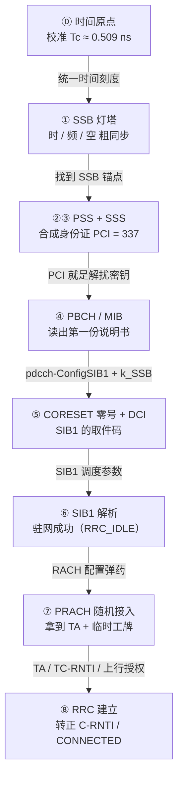
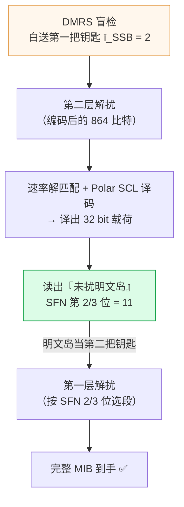
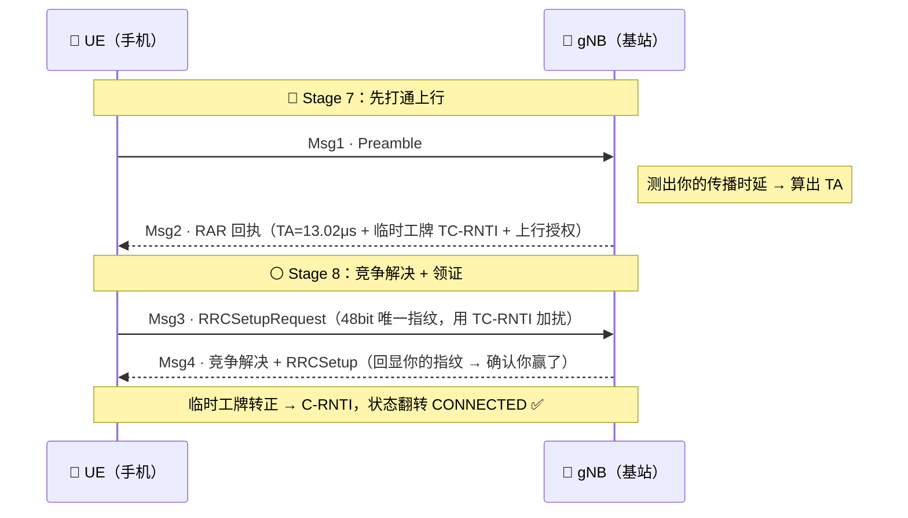
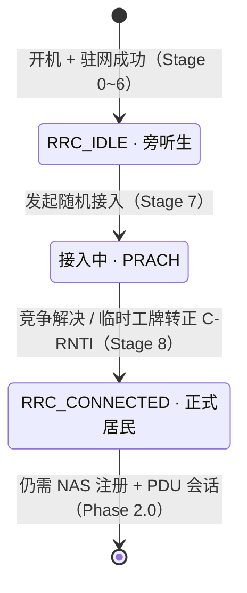

# 从「瞎子」到「合法居民」：5G NR 初始接入全景通关指南

> **Phase 1.0 · 物理层**｜读者定位：通信小白 / 刚入行的工程师
> 一句话剧透：本文带你跟着一台刚开机的手机，走一遍它在 **400 毫秒内** 从「四无黑户」蜕变成「持证网民」的求生之路。

---

## 序章：一台手机的「至暗时刻」

想象你是一台刚刚被按下电源键的手机。这一瞬间，你是宇宙里最孤独的存在：

- **你不知道现在几点** —— 没有任何时间基准，连「一秒」有多长都不知道；
- **你不知道自己在哪** —— 频谱浩瀚，你不知道基站把信号撒在了哪个频率上；
- **你听不懂任何话** —— 周围所有信号都被加密扰乱，在你眼里全是雪花噪点；
- **没有人知道你存在** —— 基站从没给你分配过任何资源，你是个彻底的「黑户」。

**瞎子 + 聋子 + 文盲 + 黑户。** 这就是开机时的你（在协议里，「你」叫 **UE**，User Equipment）。

而仅仅几百毫秒之后，你就要手持一张叫 **C-RNTI** 的「身份证」，能和基站（**gNB**）双向通话。这惊心动魄的求生过程，就是 5G 的**初始接入**，它被拆成 **9 个生死关卡（Stage 0 ~ 8）**。

### 看懂全文的「黄金三件套」

这不是一篇流水账。每一关，手机都在解决一个**「不解决就活不下去」的绝境**。所以每个关卡我都会用同一套逻辑拆给你看：

> 🩸 **核心痛点** —— 此刻手机面临什么绝境？哪里是它的盲区？
> 💡 **破局思路** —— 5G 引入了什么机制来破局？（这里会有大量比喻）
> 🔒 **因果锁死** —— **本文灵魂**：不走完这一步，下一步会死在哪里？

整条求生路，其实是一根**环环相扣的因果链**——每一关的产出，都是下一关的「弹药」。先看全景图，记住这根链条，后面就不会迷路：

好，深呼吸。开机键已经按下，求生倒计时开始。

---

## Stage 0 · 时间原点：先学会「心跳」

> 万物基于精确的时钟。

🩸 **核心痛点**
手机想做任何射频操作，第一个拦路虎居然是「时间」。5G 同时支持 15 / 30 / 60 / 120 / 240 kHz 五种「子载波间隔」共存。这些信号像五种不同节奏的鼓点，**只要鼓点边界对不齐，子载波之间的正交性就会被破坏，互相打架（ICI 干扰）**。可此刻手机连一个统一的「秒」都没有，拿什么去对齐？

💡 **破局思路**
3GPP 给了一个堪称「时间界普朗克常数」的最小刻度 —— **$T_c$**。它不是随便定的，而是被「极限 OFDM 系统」从数学上唯一逼出来的：取**最大子载波间隔** 480 kHz 乘上**最大 FFT 点数** 4096，得到一个采样率，它的倒数就是 $T_c$：

$$T_c = \frac{1}{480000 \times 4096} \approx 0.509\,\text{ns}$$

**这意味着什么？** 所有真实的鼓点节奏（15/30/120 kHz……）都是这个极限系统的「整数倍缩放」，因此它们天然都是 $T_c$ 的整数倍——**对齐问题被一个最小公约数一劳永逸地解决了**。

手机内部是怎么造出这个 0.509 ns 的？靠一条三级时钟流水线：一颗 **38.4 MHz 的温补晶振（TCXO）**先起振 → 整数锁相环 ×32 倍频到 1228.8 MHz → 小数锁相环精细合成出 **1966.08 MHz** 的采样时钟。从此，L1 计数器以 $T_c$ 为步长滴答滚动，像心脏一样驱动后续所有动作。

> 🧠 **极客彩蛋**：协议里那些经典整数（16、144、2048、307200）其实是 LTE 老单位 $T_s$ 的倍数，而 $\kappa = T_s/T_c = 64$。新手最容易踩的坑就是拿这些数直接乘 $T_c$ —— 会差整整 64 倍。后面 Stage 7 算「时间提前量」时，这个 $\times 64$ 会再次出场。

除了校准时钟，手机还在这一刻偷偷「作弊」：它从 USIM 卡里读出**先验字典**——比如它早就知道 PSS 的生成多项式 $g(x)=x^7+x^4+1$、知道全频段只有约 **347 个合法的同步锚点（GSCN 格点）**。靠这本「作弊小抄」，搜网范围被压缩了约 **96 倍**，把分钟级的盲扫硬生生压进 2 秒内。

> 🔒 **因果锁死｜不走完这步，下一步死在哪**
> **没有 $T_c$ 这把统一的尺子，后面一切免谈。** Stage 1 要在时频网格上找信号，可「网格」本身就是用 $T_c$ 的整数倍切出来的；Stage 7 的时间提前量精度也直接等于 $T_c$ 派生的步长。时间原点不立，整座大厦没有地基。

---

## Stage 1 · 黑暗中的灯塔：SSB 盲搜

> 在伸手不见五指的频谱海里，找到那束规律闪烁的微光。

🩸 **核心痛点**
手机现在有了时钟，但依然是「三重无知」：**时域无知**（不知道帧头在哪一刻）、**频域无知**（只知道频段范围，不知道精确频点）、**空域无知**（5G 用波束赋形，信号是一束束打出去的，不知道哪束对着自己）。它就像深夜漂在海上的一条船，四面漆黑。

💡 **破局思路**
基站祭出了一座**「暗夜灯塔」—— SSB（同步信号块）**。这座灯塔一次性解决三重无知，设计精妙到令人拍案：

- **它只在固定的「礁石」上发光**：SSB 只能出现在协议钦定的 GSCN 锚点上（n78 频段步长约 1.44 MHz）。本例锁定 **GSCN = 7881**，套进公式就得到灯塔的中心频率：

$$f_c = 3000 + (\text{GSCN} - 7499) \times 1.44 = 3550.08\,\text{MHz}$$

- **灯光的「闪烁节奏」=方向**：基站在 5 ms 半帧内，依次朝不同方向打出多个 SSB（本例 8 个波束，#0~#7）。**第 $i$ 个 SSB = 第 $i$ 个方向**——时序即方向，零信令开销。手机捕获到第几个，就等于偷偷告诉了基站「我在哪个方向」，这在后面随机接入时还要复用。
- **灯塔本身是个精致的时频积木**：一个 SSB 占 **20 个 RB × 4 个符号 = 960 个资源粒子（RE）**，里面塞着 PSS（红）、SSS（紫）、PBCH（蓝）、DMRS（橙）四种信号，各司其职。

> 🔒 **因果锁死｜不走完这步，下一步死在哪**
> SSB 是手机在茫茫频谱里**唯一能抓住的实体**。抓不到这座灯塔，手机连「往哪看」都不知道，Stage 2 想做的相关检测连输入信号都没有。更关键的是：后续所有频域坐标（CORESET、PDCCH、Point A）全都要**以 SSB 为参照物反推**——灯塔就是手机在这片黑暗里的第一个、也是唯一的坐标锚点。

---

## Stage 2 & 3 · 确认眼神，验明正身：PSS / SSS 与 PCI 合成

> 先看清灯塔在闪哪种摩斯码，再读出它的门牌号，最后拼出一张完整身份证。

🩸 **核心痛点**
手机隐约看到了灯塔的微光，但有两个致命未知：**信号到底从哪个采样点开始？（符号定时）** 以及 **这是哪一座灯塔？（小区身份）**。而且此刻信号被噪声彻底淹没——这是真正的「海面捞针」。

### 第一针：PSS —— 同时定时间、定低位身份

💡 **破局思路**
基站让 PSS 充当「灯塔的招牌动作」。绝妙之处在于：**三种 PSS 不是三条独立序列，而是同一条 127 位母序列（m-序列）的三种循环移位**（移 0 / 43 / 86 格）。手机手里攥着这三条本地模板，对含噪信号做**滑动相关**——像拿三把不同的钥匙逐个去试锁：

$$d_{PSS}(n) = 1 - 2x(m), \quad m = (n + 43\,N_{ID}^{(2)}) \bmod 127$$

哪把钥匙在哪个位置「咔哒」一声冒出尖峰，就**同时**锁定了两件事：尖峰的**位置 = 符号定时**，尖峰所属的**模板 = $N_{ID}^{(2)}$**。本例捞出 $N_{ID}^{(2)} = 1$。

> 🧠 **诚实时刻**：为什么靠「取最大峰」而不是「过阈值」？因为 m-序列有个魔法属性——正确模板对齐时相关值飙到约 **127**，错误模板即使对齐也只有约 **−1**，差距悬殊。这约 127 倍的相关增益，正是手机能在小区边缘、信噪比近 0 dB 时依然捞到针的底气。顺便，手机还能复用这段 PSS 把残余频偏（晶振误差）也估出来，一鱼两吃。

### 第二针：SSS —— 补齐高位身份，合成 PCI

💡 **破局思路**
PSS 只给了身份证的「低位」（3 选 1）。SSS 要在 **PSS 已锁定的同一段定时上**，从 **336 个候选**里解出高位 $N_{ID}^{(1)}$。它的设计同样精打细算：**SSS = 两条 m-序列相乘**，而其中一条的移位量**直接复用了 PSS 刚解出的 $N_{ID}^{(2)}$**。在 BPSK 世界里「相乘 ≡ 比特异或」，硬件成本极低。

手机做 336 路盲检，正确那一路尖峰约 127、其余全趴在约 15。本例解出 $N_{ID}^{(1)} = 112$，于是两半身份合体，拼出完整的小区身份证 **PCI**：

$$\text{PCI} = 3 \times N_{ID}^{(1)} + N_{ID}^{(2)} = 3 \times 112 + 1 = \mathbf{337}$$

> 🔒 **因果锁死｜不走完这步，下一步死在哪**
> **PCI = 337 不只是个门牌号，它是后面所有加密锁的「主钥匙种子」。** Stage 4 的 PBCH 扰码、DMRS 的频域位置、参考信号的图样……全都由 PCI 初始化。如果你不解出 PCI，下一步去读 PBCH，收到的将是一片**永远解不开的乱码**。先验明正身，才能拿到解锁第一份说明书的钥匙——这是整条因果链上最硬的一环。

---

## Stage 4 · 第一份说明书：PBCH / MIB 与「自举解扰」的神之一手

> 说明书被锁在保险箱里，而开箱的钥匙……竟然就刻在保险箱的一角。

🩸 **核心痛点**
手机拿到了 PCI 主钥匙，终于能去读灯塔携带的第一份说明书 **MIB**（主信息块，藏在 PBCH 信道里）。但这里有个**鸡生蛋的死循环**：MIB 被两层扰码加密保护，**而解开第一层扰码所需的钥匙（SFN 的某几个比特），本身就被锁在这层扰码里面**。先有钥匙才能开锁，可钥匙在锁里——怎么破？

💡 **破局思路**
3GPP 的解法堪称这套系统里最优雅的一手：**「两层解扰夹住 Polar 译码」+ 自举**。

整个 MIB 的编码结构是个「三明治」：第一层扰码 → Polar 编码 → 第二层扰码。解码时顺序反过来走，而钥匙是**一把接一把、自己反哺自己**地凑齐的：

拆开看两个神来之笔：

1. **第二把钥匙根本不用解码就能拿到**：第二层扰码的钥匙是 SSB index 的低位，而这几位**恰好就是橙色的 DMRS 信号盲检出来的 $\tilde{i}_{SSB} = 2$**。手机一进门就能解第二层，完全不依赖译码。（DMRS 一身二用：既帮信道估计，又当盲检钥匙。）
2. **「明文岛」破解死循环**：FR1 场景下，第一层故意**留 3 个比特不加扰**（SFN 第 2、3 位 + 半帧位）。这 3 位既是能被**直接读出的明文**，又正好是**选对第一层扰码段的钥匙**——一物二用，死循环当场闭合。本例读出 SFN 2/3 位 = 11，拿它回去解第一层，完整 MIB 落地。

至于中间那块 Polar 译码：512 条子信道被「两极分化」，可靠的放 56 个信息位、不可靠的放 456 个冻结位（恒为 0，收发都知道）；**SCL 译码**保留 8 条候选路径边走边剪枝，最后靠 **CRC24 当裁判**一锤定音选出正解。

拿到 32 bit 后，还有个和 Stage 3 同款的「拼接魔术」：**SFN（系统帧号）的高 6 位藏在 MIB、低 4 位藏在 PBCH 时间位**，飞拢拼成完整 10 bit（左移 4 位即 ×16）：

$$\text{SFN} = (38 \ll 4)\ |\ 6 = 608 + 6 = \mathbf{614}$$

MIB 里还掏出几样关键家底：公共子载波间隔 30 kHz、$k_{SSB}=6$、还有那个貌不惊人却价值连城的 8-bit 字段 **pdcch-ConfigSIB1 = 0x10**。

> 🔒 **因果锁死｜不走完这步，下一步死在哪**
> MIB 是说明书的**第一页**，它告诉手机「下一份更详细的说明书（SIB1）的入口在哪查」。那把 **0x10 的钥匙**和 **$k_{SSB}=6$** 就是 Stage 5 的全部输入。读不出 MIB，手机就拿不到 pdcch-ConfigSIB1，下一步连「去哪听基站的调度指令」都无从谈起——直接卡死在原地。

---

## Stage 5 · 信息海里捞指令：CORESET 零号 与 DCI 取件码

> 没有全城地图的情况下，靠一张「贴在灯塔旁边」的小公告栏，找到取件码。

🩸 **核心痛点**
手机想要 SIB1，但 SIB1 的正文走的是数据信道 PDSCH——**它不可能盲扫整个频带去大海捞针**。它需要一条**调度指令（DCI）**来告诉它「SIB1 落在哪、用什么参数解」。可 DCI 又藏在控制信道 PDCCH 里，PDCCH 又必须落在一个**预先约定的时频窗口**。这个窗口在哪？更要命的是，此刻手机**还没有全局坐标系（Point A 还没下发）**，它根本不知道「频率零点」在哪——又一个鸡生蛋。

💡 **破局思路**
答案就是**「自举式」的第一个控制资源集 —— CORESET 零号**。手机把 MIB 给的 8-bit 钥匙 0x10 沿中线劈成两半，分别去开两把锁：

$$\texttt{0x10} = \underbrace{\texttt{0001}}_{\text{cset0}=1} \ \underbrace{\texttt{0000}}_{\text{ss0}=0}$$

- **左锁（查 Table 13-4）→ 回答「在哪监听」**：得到 CORESET 是 **24 个 RB × 2 个符号**（24 RB = 8.64 MHz），且它的位置**相对 SSB 偏移 1 个 RB**。
- **右锁（查 Table 13-11）→ 回答「何时监听」**：得到监测时机在**偶数帧的 slot 0、符号 0**。

**化解死循环的关键诚实点**：既然没有 Point A，3GPP 干脆让 **CORESET 零号的频域位置直接挂在 SSB 上**（表里的 offset 就是「相对 SSB 的 RB 偏移」），再用 Stage 4 解出的 $k_{SSB}=6$ 做子载波级精对齐。**先有鸡（SSB），后有蛋（SIB1 / Point A）**，靠把第一个落脚点死死锚在 SSB 上，绕开了对全局坐标的依赖。

锁定窗口后，手机在 **8 个 CCE** 的资源池里做 **PDCCH 盲检**：按不同聚合等级（AL4、AL8）逐个试解，用 **SI-RNTI** 做 CRC 校验。本例在 **AL8** 命中。

> 🧠 **诚实彩蛋三连**（专为工程师保留）：① **AL16 需要 16 个 CCE，物理上根本塞不进这 8 个 CCE 的池子**，所以这里压根不试它；② 命中后解出的 **DCI 1_0 真实载荷是 37 bit**（22 位有语义 + 15 位是凑数的预留位）；③ 那 16-bit 的 RNTI **只加扰 CRC24 的低 16 位**，不是整个 24 位。这些「不够整」的细节，恰恰是协议真实的样子。

DCI 这张「**快递取件码**」一旦解出，SIB1 的 PDSCH 调度参数（比如 RIV = 47，编码出 24 个 RB 的频域位置）就全有了。

> 🔒 **因果锁死｜不走完这步，下一步死在哪**
> DCI 就是取 SIB1 这个「大包裹」的取件码。没有 CORESET 零号这个公告栏，手机就找不到 PDCCH；解不出 DCI，就拿不到 SIB1 落在哪个时频块的调度信息。Stage 6 想去 PDSCH 上取 SIB1，**连去哪个货架取都不知道**。

---

## Stage 6 · 正式安家：SIB1 解析 与 Camped 驻留

> 拿到了小区户口本，终于能在这片土地上落脚——但你只是个「旁听生」。

🩸 **核心痛点**
手机凭 DCI 取件码取回了 SIB1 这个大包裹，但还剩三个悬而未决的问题：**这块地我能住吗（PLMN 是不是我的运营商）？这里禁止落户吗（cellBarred）？信号够不够强，住下去会不会天天掉线（S 准则）？** 同时，那个困扰全程的「全局坐标零点 Point A」也还没着落。

💡 **破局思路**
SIB1 是一本**身兼三职的「小区户口本」**：① 给出驻留判据；② 闭合 Point A 坐标系；③ 下发随机接入（RACH）的全套配置。

**先还清坐标系这笔旧账。** SIB1 终于给出了那个缺失的粗偏移 **offsetToPointA = 84 RB**。配合 Stage 4 的 $k_{SSB}=6$（一粗一细两个偏移量），手机第一次算出了全局频率零点：

$$f_{PointA} = 3546.48 - 0.09 - 15.12 = \mathbf{3531.27}\,\text{MHz}$$

从此手机拥有了**以 Point A 为绝对零点的全局 CRB 坐标系**，此前所有「相对 SSB」的临时坐标，现在都能挂到这张全城地图上了。（顺带一提，84 RB ≈ 偏移 15.21 MHz，是 n78 现网常见的「甜点值」——既贴合栅格，又不蹭频段边缘吃带外泄漏。）

**再走三道闸门做驻留判决：**

| 闸门 | 判据 | 本例 |
|------|------|------|
| ① PLMN 匹配 | USIM 的 46001 是否在小区列表里 | ✅ 命中 |
| ② cellBarred | 小区是否禁止驻留 | ✅ notBarred |
| ③ S 准则 | 接收电平余量是否为正 | ✅ 见下 |

第三关的 **S 准则**对新手最不友好，因为它涉及负数减法。别慌，把它翻译成大白话：**「你测到的信号强度」要高于「这片地的最低生存线」**，高出的那部分余量必须是正的：

$$S_{rxlev} = \underbrace{-75}_{\text{你的信号 RSRP}} - \underbrace{(-110)}_{\text{死亡线 q-RxLevMin}} = \mathbf{+35\ dB} > 0$$

余量 +35 dB，意味着你的信号远远高出生存线 35 dB——这片地**信号杠杠的，适合居住**。三关全过，手机正式 **🚩 驻网（camping）成功**！

> 🔒 **因果锁死 + 终极诚实点｜驻网 ≠ 已连接**
> **请务必记住：此刻手机的状态是 RRC_IDLE（空闲态）。** 严格意义上的「驻网」到这里就完成了——这是本项目「同步 + 解析」主线的终点旗。但驻网拿到的只是**广播信息和「接入资格」，没有任何专属资源**，你只是个能听讲、不能发言的**旁听生**。SIB1 里那包 RACH 配置（PRACH 配置索引 16、根序列、RAR 窗 sl20……），就是为下一步「转正」准备的全部弹药——它把接力棒交给了 Stage 7。

---

## Stage 7 · 第一次开口：PRACH 与「时间提前量」的绝对核心

> 旁听了半天，你终于要在黑暗中举手喊出第一声——而且必须「抢跑」。

🩸 **核心痛点**
驻网后手机把下行听得一清二楚，但有两个「非解决不可」的死结：

1. **gNB 根本不知道你存在**：下行是广播，谁都能听；但基站从没给你分配过任何上行资源，你想说话却没有「话筒」。
2. **上行完全不同步**：你离基站有远有近，信号飞过去需要时间。**如果所有 UE 都按自己收到的下行定时去发上行，远近不同的信号到达基站时必然互相错位、彼此打架**——这是上行的灾难。

💡 **破局思路**
靠一套**四步走的竞争式随机接入（CBRA）**。Stage 7 负责前两步，Stage 8 负责后两步，整套流程长这样：

**第一步（Msg1）：在黑暗中喊一句「暗号」。**
手机没有唯一身份，怎么办？它从 64 个**前导码（Preamble）**里**等概率随机抓一个**当暗号。这 64 个暗号是这么造的：取一条 839 长的 ZC 根序列，按循环移位量 $N_{CS}=46$ 切出 18 个，不够 64 个就连取 4 根凑齐。本例手机随机抓中了 **#27**。

这里藏着 PRACH 最核心的物理智慧。**此刻手机还没有时间提前量，只能按下行定时盲发**——信号到基站时已经迟了一整个往返时延，而这个时延「还不知道有多大」。怎么兜住这个未知？答案是用一个**超长的循环前缀（CP）+ 保护时间（GT）**把它整个吞下去。以长格式 format 0 为例：

| 段 | 时长 | 作用 |
|----|------|------|
| 循环前缀 CP | ≈ 103 μs | **吞下还不知道有多大的往返时延** + 多径 |
| ZC 序列 | = 800 μs | 839 点暗号本体 |
| 保护时间 GT | ≈ 97 μs | 防止串到下一个时机 |

这个超长 CP 撑起的最大小区半径约 **14.5 km**。**「用超长 CP/GT 吞下整个未知的往返时延」——这是 PRACH 不可替代的灵魂思想。** 至于发多大功率，靠开环功控反推：路损 PL = 12 −(−75) = 87 dB，于是 $P_{PRACH} = -110 + 87 = -23\,\text{dBm}$（等不到回执就按每次 2 dB 爬升，最多 10 次）。

**第二步（Msg2）：收回执，拿到上行的「命门」TA。**
手机怎么知道用什么身份去收回执？它不需要基站告诉它——**RA-RNTI 完全由 Msg1 的发射时频位置算出来**，收发两端各算各的、必然一致：

$$\text{RA-RNTI} = 1 + s_{id} + 14\,t_{id} + 14 \cdot 80 \cdot f_{id} + 14 \cdot 80 \cdot 8 \cdot \text{ul} = 1 + 14 \times 4 = \mathbf{57}$$

手机用 RA-RNTI = 57 去 **CORESET 零号**（没错，正是 Stage 5 建好的那台下行机器，只换了把钥匙）监听回执 RAR，从里面掏出三件套：**① 时间提前量命令、② 临时工牌 TC-RNTI = 0x4601、③ Msg3 的上行授权**。

现在轮到本 Stage 的绝对主角 **TA（时间提前量）** 登场。基站从暗号的尖峰位置量出了你的时延，命令你**提前发射**，提前量正好等于一个往返时延，这样信号飞到基站时就恰好压在统一的时隙边界上，不再和别人错位打架：

$$N_{TA} = T_A \times \frac{16 \times 64}{2^{\mu}} \times T_c = 50 \times 512 \times T_c = 25600\,T_c \approx \mathbf{13.02}\,\mu\text{s}$$

13.02 μs 折合单程约 1.95 km——这就是你离基站的距离。把这个提前量应用上去，**上行链路第一次接通**，里程碑达成。

> 🧠 **起跑线陷阱**（新手必踩）：那个 RAR 窗口（sl20 = 10 ms）**不是**在 Msg1 发完瞬间启动的，而真正让 RAR 落在窗口中段（本例 slot 7 才命中）的，是基站收到暗号后实打实的处理时延（做 FFT、搜相关峰、组装 RAR）。所以手机收完 Msg1 不能傻等第 0 个时机就放弃，要把整个窗口熬完。

> 🔒 **因果锁死｜不走完这步，下一步死在哪**
> **TA 是上行不打架的绝对核心。** 没有 TA，你的 Msg3（PUSCH）发出去会和别的 UE 在基站处叠成一团乱麻，基站谁也解不出。同时，你手里这块 **TC-RNTI 还只是「临时工牌」**——竞争还没解决（可能有别的 UE 也抓了 #27、也收了这同一个 RAR）。要等 Stage 8 用唯一指纹裁出胜者，工牌才能转正。**此刻状态栏依然写着 RRC_IDLE。**

---

## Stage 8 · 领证成为正式网民：RRC 建立 Msg3 / Msg4

> 排队叫号确认「这个号是我的」，临时工牌当场转正，状态机「咔哒」一声翻转。

🩸 **核心痛点**
上行虽然通了，但还有最后一道坎：**竞争尚未解决**。万一刚才有好几台手机都随机抓了 #27 这个暗号，它们会收到同一个 RAR、抢同一个 TC-RNTI——这就像几个人抽到了同一个排队号。**到底这个号是谁的？必须裁出唯一的胜者**，否则两台手机用同一个身份说话，基站会精神分裂。

💡 **破局思路**
靠 CBRA 的后两步 **Msg3 + Msg4** 做竞争解决。

**Msg3：亮出「唯一指纹」。**
手机用 Stage 7 拿到的上行授权，发出 **RRCSetupRequest**，里面塞进一个**随机生成的 48 bit 唯一身份**。这 48 bit 算得严丝合缝（呼应 Stage 6 的 UPER 无标签编码）：

$$\underbrace{4}_{\text{CHOICE 路由头}} + \underbrace{39}_{\text{ue-Identity}} + \underbrace{4}_{\text{建立原因}} + \underbrace{1}_{\text{spare}} = \mathbf{48}\ \text{bit（6 字节）}$$

> 🧠 **诚实细节**：那「消失的」几个比特不是凑数，而是 UPER 编码里的 **CHOICE 路由头**（用 $\lceil\log_2 N\rceil$ 算出的选择位）这类结构开销。两台手机的 48 bit 撞车概率约 **5500 亿分之一**（$2^{39}$）——极小，但不为零，所以「竞争」机制必须存在。

**Msg4：基站当众「叫号」，宣布胜者。**
基站在 Msg4 里**原样回显**它收到的那 48 bit 指纹（这叫竞争解决标识）。手机一比对：**和我发的一模一样 → 我赢了 ✅**（指纹对不上的那台 UE 则乖乖退避重来 ❌）。竞争解决的瞬间，那块临时工牌完成了最戏剧性的一步：

> **TC-RNTI = 0x4601 → C-RNTI = 0x4601**
> **值不变，但身份转正了。** 临时工牌升格为正式工牌（38.321 §5.1.5）。状态机「咔哒」一声从 IDLE 翻转到 **RRC_CONNECTED**！

转正之后，通信通道也升级了：从只能传裸消息的 **SRB0 / CCCH** 升级为可靠传输的 **SRB1 / DCCH（AM 模式）**。紧接着是**安全激活**：以根密钥 K_gNB 派生出一串子密钥（256 位派生后截断成 128 位喂给算法），完成完整性保护与加密的双激活，从此空口对话再也不是「裸奔」。

> 🧠 **越界诚实点**：为了「故事顺」，很容易把安全激活画成建连的同步动作，但**真实 3GPP 时序是 Msg4 → CONNECTED → Msg5（含 NAS）→ NAS 鉴权 → 安全激活（SMC）**，即 AS 安全其实发生在 CONNECTED **之后**，且根密钥 K_gNB 源自 NAS 鉴权（这已经越过物理层接入边界了）。诚实标注，不伪装。

> 🔒 **因果锁死｜这是空口接入主线的终点**
> 走完 Msg3/Msg4，手机终于持有了独一无二的 **C-RNTI 身份证**，进入 **RRC_CONNECTED**。从此基站能精准调度它收发数据。这是 Stage 0~8 整条因果链的终点——但故事还没完（见悬念）。

---

## 终章：从「瞎子」到「合法居民」

让我们回放这惊心动魄的 400 毫秒。

那台被按下电源键的手机，曾经是个**连「一秒有多长」都不知道**的可怜虫。它先在 Stage 0 校准出 **0.509 ns 的心跳**，给混沌的世界立下第一把尺子；在 Stage 1 于漆黑频谱里捕获到那座 **暗夜灯塔 SSB**，第一次有了方向；在 Stage 2/3 听清灯塔的摩斯码、读出门牌号，拼出身份证 **PCI = 337**，拿到了解开一切加密锁的主钥匙。

有了钥匙，它在 Stage 4 用「**自举解扰**」这记神之一手——拿保险箱一角刻着的明文当钥匙——撬开了第一份说明书 MIB；又在 Stage 5 凭一张「贴在灯塔旁的小公告栏」**CORESET 零号**，在没有全城地图的黑暗里摸到了 SIB1 的取件码 DCI；终于在 Stage 6 取回户口本 SIB1，闭合了 **Point A 全局坐标**，跨过 **+35 dB 的 S 准则生存线**，正式 **驻网**——但它清醒地知道，自己此刻只是个 **RRC_IDLE 的旁听生**。

不甘于旁听，它在 Stage 7 第一次在黑暗中举手，用**超长 CP 兜住未知的往返时延**盲发暗号，换回了上行的命门——**13.02 μs 的时间提前量 TA**，让自己的声音第一次精准地砸在基站的时隙边界上；最后在 Stage 8 的**排队叫号**中亮出唯一指纹、赢下竞争，眼睁睁看着临时工牌 **TC-RNTI 转正为 C-RNTI**，状态机「咔哒」一声——

**RRC_CONNECTED。它成了一名合法居民。**

从瞎子、聋子、文盲、黑户，到持证上岗的正式网民。每一步都不是流水账，而是一个「不解决就活不下去」的绝境，被一记记精妙的工程智慧化解；每一步的产出，都死死锁住了下一步的命门。这，就是 5G NR 初始接入的全部浪漫。

---

## 附录 · 隐喻 → 专业术语对照表

本文为降低门槛用了大量隐喻。下表把它们一一对应到工程术语——如果你想进阶，配套的《5G NR 初始接入全栈技术白皮书》正是用这些术语逐层展开的。

| 文中隐喻 | 对应专业术语 | 主要出现 |
|---|---|---|
| 瞎子 / 聋子 / 文盲 / 黑户 | 终端 UE（同步前的未驻网态） | 序章 |
| 心跳节拍 / 原子刻度 | 最小时间单位 $T_c$ | Stage 0 |
| 作弊小抄 | 先验字典（PSS 多项式 / GSCN 栅格 / PLMN） | Stage 0 |
| 暗夜灯塔 | SSB 同步信号块 | Stage 1 |
| 灯塔的礁石 | GSCN 全局同步栅格 | Stage 1 |
| 闪烁节奏 = 方向 | SSB Index / 波束赋形 | Stage 1 |
| 三把钥匙试锁 | PSS 滑动相关盲检 | Stage 2 |
| 门牌号 / 身份证 | 物理小区标识 PCI | Stage 2 & 3 |
| 主钥匙种子 | PCI 作为加扰序列初始化种子 | Stage 3 → 4 |
| 三明治 + 明文岛 | 两层解扰自举（Descrambling Bootstrap） | Stage 4 |
| 第一份说明书 | 主信息块 MIB（PBCH 承载） | Stage 4 |
| 高低位拼接魔术 | 系统帧号 SFN 拼接 | Stage 4 |
| 贴在灯塔旁的公告栏 | CORESET#0 + Type0-PDCCH 搜索空间 | Stage 5 |
| 快递取件码 | 下行控制信息 DCI Format 1_0 | Stage 5 |
| 全城地图原点 | Point A（全局 CRB 坐标零点） | Stage 6 |
| 户口本 | 系统信息块 SIB1 | Stage 6 |
| 生存线 | 接收电平门限 q-RxLevMin / S 准则 | Stage 6 |
| 旁听生 / 暂住 | RRC_IDLE（子态 Camped，驻网） | Stage 6 |
| 黑暗中喊暗号 | PRACH 前导码 Preamble | Stage 7 |
| 抢跑 / 提前发 | 时间提前量 TA（$N_{TA}\cdot T_c$） | Stage 7 |
| 自助取号 | RA-RNTI | Stage 7 |
| 回执 | 随机接入响应 RAR（Msg2） | Stage 7 |
| 临时工牌 | TC-RNTI | Stage 7 |
| 排队叫号确认 | 竞争解决（Msg3 / Msg4） | Stage 8 |
| 工牌转正 | TC-RNTI 升格为 C-RNTI | Stage 8 |
| 正式居民 | RRC_CONNECTED | Stage 8 |
| 上户口 / 通水电 | NAS 注册 + PDU 会话 / DRB | Phase 2.0 |

---

## 悬念：领了证，为什么还是上不了网？

且慢欢呼。现在请你打开这台手机的浏览器，输入一个网址——

**它依然纹丝不动，转圈，超时。**

为什么？因为我们这一路打通的，是 **AS 层（接入层）的空口连接**——你和**这座基站**之间的对话通道。但在基站背后，还有一个庞大的、对你**一无所知**的世界：**核心网（5GC）**。

C-RNTI 只是基站给你的「本地工牌」，可核心网的户籍系统里**根本没有你的档案**。你还没经过 **NAS 层的注册鉴权**，还没建立起承载真实数据的 **PDU 会话（DRB）**。换句话说，你只是进了小区大门、和门卫混熟了，但**还没去派出所上户口、没接通水电煤气**。

> 🚪 **CONNECTED ≠ 能上网。** 真正的上网之路，才刚刚开始。

这扇通往核心网的大门背后，藏着 NAS 鉴权、SUPI/GUTI、AMF/SMF/UPF、QoS Flow 与 PDU 会话建立的全套精彩——那是另一个同样惊心动魄的故事。

**敬请期待下一部大作：《Phase 2.0 · 核心网注册与 PDU 会话》。**

我们核心网见。🚀
