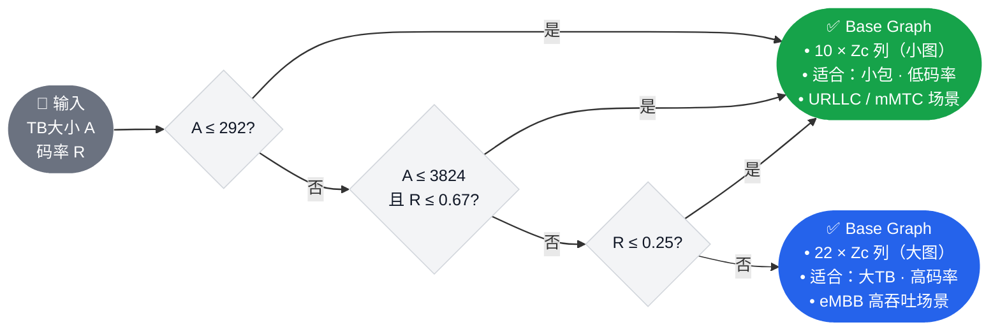
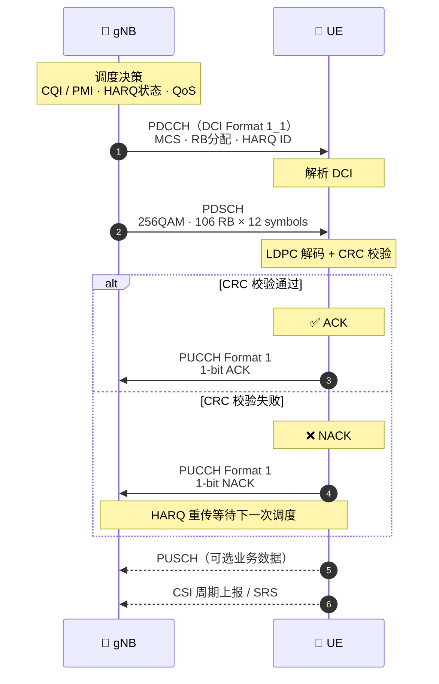

# 5G NR Channel Mapping（信道映射）

> **3GPP 版本定锚**
>
> | 内容 | 版本 | 规范 |
> |---|---|---|
> | 逻辑/传输/物理信道三层架构 | **Rel-15** | 38.321 §4, 38.211 §7 |
> | 物理信道处理（LDPC / Polar Code）| **Rel-15** | 38.212 |
> | PDSCH / PUSCH Mapping Type A/B | **Rel-15** | 38.211 §7.4.1 |
> | PUCCH Format 0~4 | **Rel-15** | 38.211 §6.3 |
> | NTN PRACH 增强（大时延）| **Rel-17** | 38.821 |
> | DFT-s-OFDM 覆盖增强（Msg3 重传）| **Rel-17** | 38.211 §6.3.1 |

---

## 📡 知识定位

```
Phase 1 学习路径
│
├── ✅ Numerology + 帧结构      已掌握：时域刻度（Symbol/Slot/Frame）
├── ✅ Resource Grid            已掌握：RE/RB/Point A/BWP 频域坐标系
│
├── ▶ Channel Mapping           ← 我们在这里
│     核心问题：资源网格这张"空白画布"上，
│               哪些格子画什么？谁来决定？
│
├── ⬜ OFDM 基础                物理波形的最终实现
└── ⬜ Phase 2：RACH / PDCCH / HARQ ...
```

**一句话理解**：Channel Mapping 回答了一个根本问题——从用户数据（IP 包）到空口电磁波，信息经过了哪几层"容器"的装载和转换？每一层容器叫什么名字，相互之间如何对应？

---

## 💡 核心逻辑

### 1. 三层信道架构：为什么需要三层？

直接把 IP 包"扔"到天线上传不行——不同类型的信息需要不同的可靠性保证、不同的调度方式、不同的接收对象。三层架构实现了**关注点分离**：

```
应用层（IP 包）
      ↓
┌─────────────────────────────────────────────────────────┐
│  逻辑信道（Logical Channel）                              │
│  "传什么" ——按信息类型分类（控制 vs 数据）               │
│  RLC ↔ MAC 层之间的接口                                   │
└─────────────────────────────────────────────────────────┘
      ↓ MAC 多路复用
┌─────────────────────────────────────────────────────────┐
│  传输信道（Transport Channel）                            │
│  "怎么传" ——按传输方式和处理方式分类                      │
│  MAC ↔ PHY 层之间的接口                                   │
└─────────────────────────────────────────────────────────┘
      ↓ PHY 编码 / 调制 / 映射
┌─────────────────────────────────────────────────────────┐
│  物理信道（Physical Channel）                             │
│  "落在哪些格子上" ——具体时频资源上的 RE 集合              │
│  PHY 层与空口电磁波之间的接口                              │
└─────────────────────────────────────────────────────────┘
      ↓
   天线 · 电磁波
```

---

### 2. 完整信道映射关系表

**参考：38.321 Table 6.1-1（下行）& Table 6.2-1（上行）**
<ChannelMapExplorer />

> **重要区别：**
PDCCH / PUCCH / PRACH 都属于直接由 PHY 层生成的物理信道
>
> - **PDCCH** 承载 DCI（Downlink Control Information），不经过逻辑信道与传输信道，直接由 PHY 层生成并映射到物理资源。
>
> - **PUCCH** 承载 HARQ-ACK / CSI / SR 等上行控制信息，不经过传输信道，由 PHY 层直接生成 UCI（Uplink Control Information）。
>
> - **PRACH** 用于随机接入前导传输，发送的是 Zadoff-Chu 序列而非 MAC 数据，因此也不存在逻辑信道与传输信道映射关系。
>

---

### 3. 物理信道总览

#### 3.1 与 LTE 的核心差异

在看每个信道之前，先建立"NR 与 LTE 的差异框架"——这两点差异影响整个物理层设计：

```
差异 1：NR 废除了 CRS（Cell Reference Signal）
  LTE：CRS 密布全带宽，UE 随时可用于信道估计和 RSRP 测量
  NR ：无 CRS → PDSCH 必须携带自己的 DMRS（解调参考信号）
       → 每条物理信道都"自带"参考信号，按需配置
       工程影响：更灵活（DMRS 密度可按信道条件调整）
                  更复杂（参考信号资源需要单独规划）

差异 2：信道编码方案更换
  PDSCH / PUSCH：Turbo Code（LTE）→ LDPC Code（NR）
  PDCCH / PBCH ：卷积码（LTE）    → Polar Code（NR）
  动机：LDPC 在高码率下性能更优；Polar Code 是信息论意义上的"容量达到码"
```

#### 3.2 物理信道一览表

| 信道 | 方向 | 承载内容 | 调制 | 信道编码 | 关联参考信号 |
|---|:---:|---|---|---|---|
| **PBCH** | DL | MIB（系统广播） | QPSK | Polar | DMRS (port 0~3) |
| **PDCCH** | DL | DCI（调度指令）| QPSK（仅此一种）| Polar | DMRS (port 2000) |
| **PDSCH** | DL | 用户数据 / SIB / 寻呼 | QPSK~256QAM | **LDPC** | DMRS + PT-RS（可选）|
| **PUSCH** | UL | 用户数据 / UCI（复用）| QPSK~256QAM（CP-OFDM）π/2-BPSK~64QAM（DFT-s）| **LDPC** | DMRS + SRS + PT-RS |
| **PUCCH** | UL | UCI（HARQ-ACK/SR/CSI）| 取决于 Format | Polar / RM | DMRS |
| **PRACH** | UL | 随机接入前导 Preamble | ZC 序列（Zadoff-Chu）| 无（序列检测）| 无 |

---

### 4. 物理信号（Physical Signals）

物理信号与物理信道的区别：**不来自上层，没有信息比特，由 PHY 层自身产生，用于同步/测量/估计。**

| 信号 | 方向 | 用途 | 资源位置 |
|---|:---:|---|---|
| **PSS** | DL | 符号级同步（检测小区 ID 组内 ID，0/1/2）| SSB 符号 #0 |
| **SSS** | DL | 帧级同步（检测小区 ID 组，0~335），确定完整 PCI | SSB 符号 #2 |
| **PBCH-DMRS** | DL | PBCH 信道估计 | SSB 符号 #1,#3 |
| **PDCCH-DMRS** | DL | PDCCH 信道估计 | CORESET 内与 PDCCH 共存 |
| **PDSCH-DMRS** | DL | PDSCH 信道估计（LTE 无此信号！）| Type A: 符号 2/3；Type B: 灵活 |
| **CSI-RS** | DL | 信道状态信息测量（CQI/RI/PMI/RSRP）| RRC 配置的周期/非周期图样 |
| **PT-RS** | DL/UL | 相位噪声跟踪（主要用于 FR2 高频）| 少量 RE，跟随 DMRS |
| **SRS** | UL | 上行信道探测（AMC / 波束管理 / 互易性）| RRC 配置的符号 / 周期 |
| **PUCCH-DMRS** | UL | PUCCH 信道估计 | 与各 PUCCH Format 绑定 |
| **PUSCH-DMRS** | UL | PUSCH 信道估计 | Type A/B，密度可配 |

**SSB（SS/PBCH Block）的结构**：

```
时域：4 个连续 OFDM 符号
  符号 0：PSS  （127 个子载波，中心对齐）
  符号 1：PBCH + PBCH-DMRS
  符号 2：SSS  （127 个子载波）+ PBCH（两侧）
  符号 3：PBCH + PBCH-DMRS

频域：20 RB（240 个子载波）
```

:::details 📖 PT-RS 详解：为什么 FR2 专属？

**PT-RS（Phase Tracking Reference Signal）** 用于估计和补偿本振（Local Oscillator）
的相位噪声（Phase Noise）。

**相位噪声的频率依赖性**：相位噪声功率谱密度与载频的平方成正比：

$$S_\phi(f) \propto f_c^2$$

- FR1（< 6 GHz）：相位噪声较小，PDSCH DMRS 已足够补偿
- FR2（24~52 GHz）：相位噪声比 FR1 大约 **16 倍**（频率比约 4 倍，平方后 16 倍）
  → 符号间的相位旋转显著，必须用 PT-RS 逐符号跟踪补偿

**PT-RS 资源位置**：
- 频域：极稀疏（每 2/4 个 RB 仅 1 个 PT-RS RE）
- 时域：每个 OFDM 符号均有（与 DMRS 不同，DMRS 只在特定符号）
- 总开销极小（< 1%），但对 FR2 EVM 改善显著

**3GPP 参考**：38.211 §7.4.1.2（DL PT-RS），§6.4.1.2（UL PT-RS）
:::
---

### 5. 深度剖析：PDSCH 传输处理全链路（12 步）

**参考：38.212 §7.2，38.211 §7.3.1**

PDSCH 是 5G 中最复杂的物理信道。理解其处理流程，等于理解了物理层"比特如何变成波形"的完整路径。

```
Transport Block（来自 MAC 层的 IP 数据）
      │
      ▼
 (1) TB-CRC 附加            A > 3824 bit → 24-bit CRC；否则 16-bit CRC
      │
      ▼
 (2) LDPC Base Graph 选择   由 TB 大小 A 和码率 R 决定：BG1（大 TB）/ BG2（小 TB）
      │
      ▼
 (3) 码块分割 + CB-CRC      若 TB > Kcb（BG1=8448 / BG2=3840），拆成多个 CB；
                             每个 CB 附 24-bit CRC
      │
      ▼
 (4) LDPC 信道编码           基于选定 Base Graph，产生冗余比特（系统位 + 校验位）
      │
      ▼
 (5) 速率匹配                圆形缓冲区选取；冗余版本 RV（RV=0/1/2/3）决定起点
                             → HARQ 重传时换用不同 RV 实现 Incremental Redundancy
      │
      ▼
 (6) 码块拼接                所有 CB 拼成统一比特流
      │
      ▼
 (7) 加扰（Scrambling）      用 RNTI + Cell-ID 生成 PRBS，XOR 操作
                             → 防止小区间干扰被"猜"中；每用户序列唯一
      │
      ▼
 (8) 调制（Modulation）      QPSK / 16QAM / 64QAM / 256QAM
                             → 由 CQI 驱动的 AMC 动态选择；MCS 表查询
      │
      ▼
 (9) 层映射（Layer Mapping） 最多 8 层（38.211 Table 7.3.1.3-1）
                             → 实现空间复用，充分利用 MIMO 自由度
      │
      ▼
(10) 天线端口映射            无 CSI → 直接到物理天线；有 CSI → 经预编码矩阵 W(i)
      │
      ▼
(11) 映射到 VRB              按频率优先顺序填充 RE（跳过 DMRS 占用的 RE）
      │
      ▼
(12) VRB → PRB 映射          非交织（连续 PRB）或交织（增加频率分集）
      │
      ▼
   IFFT → CP → 发射
```
#### PDSCH Mapping Type A vs Type B

| 维度 | Type A（Slot-based）| Type B（Mini-slot-based）|
|---|---|---|
| 起始符号 | 符号 #0 / #1 / #2 / #3（由 startSymbolIndex 决定）| 任意符号 |
| 最小时长 | 3 个符号 | **2 个符号** |
| DMRS 位置 | 固定在**符号 #2 或 #3**（dmrs-TypeA-Position）| 调度起始符号的第一个符号 |
| 典型用途 | eMBB 标准调度（全 slot）| URLLC / Mini-slot 低时延 |
| 3GPP 参考 | 38.211 §7.4.1.1.2 | 38.211 §7.4.1.1.3 |

> ⚠️ **排障关键**：gNB 和 UE 对 Mapping Type 的配置必须一致，否则 DMRS 位置错位，
> 信道估计失败，表现为 PDSCH BLER 高但 PDCCH 解码正常。

#### 关键步骤深挖：LDPC Base Graph 选择



#### 关键步骤深挖：HARQ 重传与冗余版本（RV）

```
首次传输（RV=0）：从圆形缓冲区位置 0 开始取比特
                  → 包含系统位（有用信息）+ 部分校验位

重传 1  （RV=2）：从位置约 1/3 处开始 → 更多校验位
重传 2  （RV=3）：从位置约 2/3 处开始 → 更多校验位
重传 3  （RV=1）：从位置约 1/6 处开始

接收端合并所有版本（Chase Combining 或 Incremental Redundancy）
→ 每次重传相当于提供"新的冗余视角"，联合解码性能递增
```

---

### 6. 深度剖析：PDCCH 传输处理（7 步）

PDCCH 传输的设计哲学是**最大化鲁棒性**——因为 UE 在收到 DCI 之前无法知道任何调度参数，PDCCH 必须在最恶劣的信道条件下也能被解码。

```
DCI 比特流（Format 0_0 / 1_0 / 0_1 / 1_1 / 2_x）
      │
      ▼
 (1) IE 复用          DCI 格式字段拼接；若 < 12 bit → 补零至 12 bit
      │
      ▼
 (2) 24-bit CRC 附加  ┌── CRC 计算
                      └── 后 16 bit 与 RNTI XOR（掩码）
                          → UE 通过 RNTI 验证"这条 DCI 是给我的"
                          → 不同 RNTI 类型对应不同 DCI 用途
      │
      ▼
 (3) Polar Code 编码  nmax=9，容量达到码；对比 LTE 的卷积码：
                      Polar Code 在短块长度下性能更优，适合 DCI 的小包特性
      │
      ▼
 (4) 速率匹配         子块交织 + 比特选择（IBIL=0，无额外交织）
                      输出长度 E = 聚合级别（AL）× 9 RE/CCE × 2 bit/RE（QPSK）
      │
      ▼
 (5) 加扰             cinit = (RNTI × 2¹⁶ + nID) mod 2³¹
                      nID 来自 PDCCH-DMRS-Scrambling-ID（UE 专属）或 Cell ID
      │
      ▼
 (6) QPSK 调制        PDCCH 固定使用 QPSK，不支持高阶调制（鲁棒性优先）
      │
      ▼
 (7) RE 映射           βPDCCH 缩放 → 映射到 CORESET 内的 RE
                       天线端口 p = 2000；按 k（子载波）升序，再按 l（符号）升序
                       跳过 PDCCH-DMRS 占用的 RE
```

#### CORESET 与 Search Space 速览

**CORESET（Control Resource Set）**：PDCCH 的时频资源容器。

| 参数 | 说明 | 配置方式 |
|---|---|---|
| 频域 RB 数 | 必须是 6 的倍数（6/12/18...96）| `frequencyDomainResources`（45 bit bitmap）|
| 时域符号数 | 1 / 2 / 3 | `duration` |
| CCE-REG 映射 | 交织 / 非交织 | `cce-REG-MappingType` |
| CORESET#0 | 由 MIB `pdcch-ConfigSIB1` 隐式查表决定 | 38.213 Table 13-x |

**Search Space**：UE 在 CORESET 内盲检 DCI 的时频位置规则，定义"什么时候看、看哪里"。CORESET 定义"资源在哪"，Search Space 定义"何时去找"。

#### RNTI 速查表（影响 PDCCH 解码的关键）

| RNTI | 值范围 | 用途 |
|---|---|---|
| **C-RNTI** | 0x0001~0xFFBF | UE 专属数据调度（RRC_CONNECTED）|
| **RA-RNTI** | 0x0001~0xFFFF（特殊计算）| 随机接入响应（RAR）|
| **TC-RNTI** | 0x0001~0xFFBF | 临时 C-RNTI（RACH 过程中）|
| **P-RNTI** | 0xFFFE | 寻呼 Paging |
| **SI-RNTI** | 0xFFFF | 系统信息 SIB |
| **CS-RNTI** | 0x0001~0xFFBF | 配置调度（Semi-Persistent）|
| **SFI-RNTI** | DCI 2_0 | Slot Format Indicator（TDD 灵活符号）|
| **INT-RNTI** | DCI 2_1 | 下行抢占指示 |
| **TPC-PUSCH-RNTI** | DCI 2_2 | PUSCH 功控 |

---

### 7. PUCCH Format 详解

PUCCH 的设计难点在于：**同一 UE 在不同场景下需要传输的 UCI 比特数差异极大**（HARQ-ACK 可能只有 1 bit，CSI 报告可达数百 bit），因此引入了 5 种 Format。

| Format | 符号数 | UCI 比特 | 调制 | 编码 | 主要用途 |
|:---:|:---:|:---:|:---:|:---:|---|
| **0** | 1~2 | 1~2 bit | 无（序列） | 无 | 短 HARQ-ACK / SR（低开销）|
| **1** | 4~14 | 1~2 bit | BPSK/QPSK | 扩频 | 长 HARQ-ACK / SR（高可靠）|
| **2** | 1~2 | > 2 bit | QPSK | Polar | 短 CSI / 多 HARQ-ACK |
| **3** | 4~14 | > 2 bit | QPSK 或 π/2-BPSK | Polar | 长 CSI / 多比特 HARQ-ACK |
| **4** | 4~14 | > 2 bit | QPSK（扩频）| Polar | 多 UE 复用场景（最多 4 UE）|

**Format 选择的工程逻辑**：

```
UCI 比特数 ≤ 2 bit（HARQ-ACK + SR）？
  ├── 是 → 用 Format 0 或 Format 1
  │         Format 0：符号短，开销低（URLLC 首选）
  │         Format 1：符号多，可靠性高（恶劣信道首选）
  │
  └── 否（含 CSI 或多 HARQ-ACK）→ 用 Format 2/3/4
        Format 2：短符号，低时延（1~2 symbols）
        Format 3：长符号，携带 π/2-BPSK 低 PAPR 优势（NTN 上行首选！）
        Format 4：多 UE 复用，带宽受限场景
```

**π/2-BPSK 与 NTN 的关系**：Format 3 支持 π/2-BPSK，PAPR 比 QPSK 低约 1.5 dB。NTN 场景 UE 上行功率受限，低 PAPR 意味着可将更多功率放在有效信号上，改善链路预算。这直接呼应了第一课 NTN 分析中的"上行链路预算紧张"问题。

---

### 8. PRACH 与 NTN 增强

PRACH 在 NTN 中面临的挑战与 PDSCH 完全不同——不是调制解调问题，而是**时序问题**：

```
地面 TN PRACH：
  UE 发送 Preamble → gNB 检测 → RAR（含 TA 命令）
  往返时延 RTT < 10 ms → 标准 RAR 窗口（ra-ResponseWindow）足够

LEO NTN PRACH（Rel-17）：
  UE 发送 Preamble（含 TA 预补偿）
  → 单程时延 1.73~10.6 ms → RTT = 3.5~21.2 ms
  → 标准 ra-ResponseWindow 最大 40 slots（μ=1 时 = 20 ms）可能不够！

Rel-17 解决方案：
  ① 扩展 ra-ResponseWindow：最大可配置到 640 slots（约 320 ms @ 30kHz）
  ② msg3-HoppingFlag：Msg3 支持跳频，改善覆盖
  ③ PRACH 序列预补偿：UE 在发送 Preamble 前先做时频预补偿
     → 基带 PRACH 检测窗口不需要专门扩大（补偿后到达时序正常）
```

Zadoff-Chu（ZC）序列的工程原理：

$$
x_u(n) = e^{-j\frac{\pi u n(n+1)}{N_{ZC}}}, \quad n = 0, 1, \ldots, N_{ZC}-1
$$

ZC 序列的关键特性：恒包络（PAPR = 0 dB）、完美自相关、不同根序列间低互相关。这使得 gNB 可以通过相关运算同时检测多个 UE 的不同 Preamble，并精确测量每个 UE 的时延（残差 TA）。

---

### 9. 信道间耦合关系：一次 PDSCH 传输的完整协议交互

NR 的一次数据传输，本质上是：
> **控制信道决定资源，数据信道承载业务，反馈信道驱动 HARQ 闭环。**

这张图展示了各信道在实际调度中如何配合工作——理解这个流程，后续的 HARQ、AMC、波束管理学习都会更容易"落地"：


---

## 🔍 实战信令视角（IE / Log Analysis）

### 关键 IE 速查

```
RRC: PDSCH-Config
├── mcs-Table               → qam64 / qam256 / qam64LowSE（决定 MCS 查找表）
├── maxNrofCodeWordsScheduledByDCI → 1 或 2（码字数 = MIMO 流数上限）
├── dmrs-DownlinkForPDSCH-MappingTypeA → DMRS Type A 配置（符号位置/额外 DMRS）
├── dmrs-DownlinkForPDSCH-MappingTypeB → DMRS Type B 配置
└── resourceAllocation      → resourceAllocationType0 / Type1

RRC: PDCCH-Config
├── controlResourceSetToAddModList → CORESET 配置列表（最多 3 个）
│   └── ControlResourceSet
│       ├── controlResourceSetId   → 0~11（0 = CORESET#0，由 MIB 隐式配置）
│       ├── frequencyDomainResources → 45 bit bitmap，6 RB 粒度
│       ├── duration               → 1/2/3 符号
│       └── cce-REG-MappingType    → interleaved / nonInterleaved
└── searchSpacesToAddModList → Search Space 配置列表

RRC: PUCCH-Config
├── resourceSetToAddModList  → PUCCH 资源集（不同场景用不同集合）
└── format1/2/3/4            → 各 Format 的具体参数

RRC: PRACH-Config（系统级）
├── prach-ConfigurationIndex → 决定 PRACH 时频资源位置（查 38.211 Table）
├── msg1-FrequencyStart      → PRACH 频域起始位置（相对 BWP）
└── ra-ResponseWindow        → RAR 等待窗口大小（NTN 中需扩大！）
```

### 🚨 故障排查速查表

| 故障现象 | 首先检查 | 最可能根因 |
|---|---|---|
| PDSCH 解调失败但信号强度正常 | DMRS 类型（A/B）与基带配置是否一致 | DMRS 符号位置错位，信道估计失败 |
| PDCCH 盲检失败（DCI 总找不到）| CORESET 频域 bitmap + Search Space 配置 | CORESET 位置/大小与基带配置不符 |
| HARQ NACK 率高但物理层 BLER 低 | RNTI 掩码是否正确 | C-RNTI 错误导致 CRC 验证失败 |
| PUCCH Format 3 灵敏度差 | `pi2BPSK` 字段是否 = 1 | π/2-BPSK 未正确实现，PAPR 优势丢失 |
| PRACH 在 NTN 中总失败 | `ra-ResponseWindow` 大小 | RAR 窗口太小，大时延 RAR 到达时 UE 已停止监听 |
| 256QAM 无法激活 | PDSCH-Config `mcs-Table` + UE 能力 | UE 未上报 256QAM 支持能力，或 mcs-Table 未配为 qam256 |

---

## 🐍 仿真实现

### 伪代码骨架

```
══════════════════════════════════════════════════════════════
【数学层】PDSCH LDPC 编码流程（38.212 §7.2）
──────────────────────────────────────────────────────────────
输入：Transport Block = A bit
输出：调制符号序列 → 映射到 RE

核心公式链：
  B = A + L_CRC                           (TB-CRC 后总比特数)
  C = ⌈B / (K_cb - L_cb)⌉               (码块数)
  K = 22·Zc  或  10·Zc                   (单个码块长度，取决于 BG)
  N = 66·Zc  或  52·Zc                   (编码后长度，取决于 BG)
  E_r = N_RE × Q_m × ν × R             (速率匹配输出长度)
  M_symb = Σ E_r / Q_m                  (总调制符号数)
══════════════════════════════════════════════════════════════
【算法层】
──────────────────────────────────────────────────────────────
FUNCTION pdsch_tx(tb_bits, mcs_index, n_rb, n_symbols, n_layers):
    # Step 1-3: CRC + 分割
    (crc_bits, n_cb) = tb_crc_and_segment(tb_bits)
    
    # Step 4-5: LDPC 编码 + 速率匹配
    coded = []
    FOR each code_block in crc_bits:
        encoded = ldpc_encode(code_block, base_graph)
        rate_matched = rate_match(encoded, E_r, rv=0)
        coded.append(rate_matched)
    
    # Step 6-8: 拼接 + 加扰 + 调制
    concatenated = concatenate(coded)
    scrambled    = scramble(concatenated, rnti, cell_id)
    symbols      = modulate(scrambled, modulation_order)   # QPSK~256QAM
    
    # Step 9-12: 层映射 + RE 映射
    layers   = layer_map(symbols, n_layers)
    re_grid  = map_to_vrb(layers, n_rb, n_symbols, dmrs_pattern)
    RETURN re_grid
══════════════════════════════════════════════════════════════
【实现层】→ channel_mapping_sim.py
──────────────────────────────────────────────────────────────
# LDPC 使用 scipy / custom 实现（简化版 BG1/BG2）
# 调制 / 加扰 / 层映射全部基于 torch（可微，为 AI 接收机准备）
# 可视化：资源网格上 PDCCH / PDSCH / DMRS / SSB 的 RE 占用分布
══════════════════════════════════════════════════════════════
```

**完整仿真代码见独立文件** → `code/channel_mapping_sim.py`

实现内容：
- PDSCH 调制链（CRC → 扰码 → QAM → 层映射）的 PyTorch 实现
- PDCCH Polar Code 编码（含 RNTI 掩码）
- ZC 序列（PRACH Preamble）生成与相关检测
- 资源网格 RE 占用可视化（PDCCH / PDSCH / DMRS / SSB）
- BER vs SNR 曲线（QPSK / 16QAM / 64QAM / 256QAM 对比）

---

## 🔗 走向 OFDM 基础

### 信道已经映射了，但"填格子"之后的最后一步是什么？

到目前为止，我们知道了哪些 RE 放 PDSCH 数据，哪些 RE 放 PDCCH，哪些 RE 放 DMRS。但这些 RE 里面装的**复数调制符号**，最终怎么变成天线口发出的时域信号？

这就是 OFDM 基础课的核心内容：

```
资源网格（频域：N_fft 个子载波）
      ↓
   IFFT（Inverse FFT）
      ↓
时域 OFDM 符号（N_fft 个采样点）
      ↓
添加 Cyclic Prefix（复制末尾 N_cp 个采样）
      ↓
串联多个符号 → 一个 Slot 的时域波形
      ↓
上变频（中频 → 射频）→ 发射
```

**OFDM 课程将解答的工程问题**：

- 为什么 DFT-s-OFDM（PUSCH 选项）比 CP-OFDM 的 PAPR 低 4~6 dB，在覆盖受限场景如此重要？
- DMRS 的频域位置（Type 1 vs Type 2）如何影响信道估计的插值精度？
- PT-RS 为什么只在 FR2（mmWave）使用——相位噪声的频率依赖性是什么？

---

## 📝 版本演进与工程自测

### 版本演进速览

| Feature | Rel-15 | Rel-16 | Rel-17 |
|---|:---:|:---:|:---:|
| 三层信道架构 + 基础物理信道 | ✅ | 不变 | 不变 |
| PDSCH 256QAM | ✅ | 不变 | 不变 |
| PUCCH Format 0~4 | ✅ | 不变 | 不变 |
| PUSCH DFT-s-OFDM | ✅ | 增强（π/2-BPSK）| 不变 |
| PDCCH Rel-16 增强（多 TRP）| ❌ | ✅ | 增强 |
| NTN PRACH（ra-ResponseWindow 扩展）| ❌ | ❌ | ✅ |
| PUSCH 重传增强（Msg3 NTN）| ❌ | ❌ | ✅ |
| PDSCH 16 层（FR2 增强）| ❌ | ❌ | ✅（部分）|

---

### 面试级自测题

**Q1 · 概念题**

> NR 废除了 CRS，但 PDSCH 引入了 DMRS。这个改动对网络规划和 UE 功耗分别有什么影响？

<details>
<summary>💡 展开答案</summary>

**网络规划影响**：
- LTE CRS 密布全带宽全时间，即使没有业务也持续发送，造成恒定干扰底噪（尤其跨运营商）
- NR DMRS 仅在有 PDSCH 传输时存在，空闲时无参考信号干扰 → **降低了小区间干扰基底**
- 代价：网络规划时需要为每条 PDSCH 单独规划 DMRS 密度和位置，灵活性提升但复杂度上升

**UE 功耗影响**：
- LTE UE 必须持续测量 CRS 以维持同步和 RSRP 测量，即使无业务
- NR UE 可在没有 SSB / CSI-RS 的时间段完全关闭接收机（DRX 深度睡眠更彻底）→ **功耗显著降低**
- NR BWP + Dormant BWP + DRX 组合，使 UE 待机功耗比 LTE 降低 30%~50%

**参考**：38.211 §7.4.1.1（PDSCH DMRS），3GPP TR 38.840（功耗研究报告）

</details>

---

**Q2 · 计算题**

> gNB 为一个 UE 调度 PDSCH：n_RB = 52，n_symbols = 12，MCS = 27（256QAM，Qm = 8，码率 R ≈ 0.93），2 层 MIMO，Normal CP。DMRS Type A（占用符号 #2，1 个 DMRS 符号）。
>
> (a) 计算每个 RB 内可用于 PDSCH 数据的 RE 数（DMRS 占 1 符号 × 6 RE/RB）
> (b) 估算本次传输的传输块大小 TBS（近似）

<details>
<summary>💡 展开答案</summary>

**(a) 可用 RE 数/RB**

一个 RB 在 12 个符号中：总 RE = 12 × 12 = 144
减去 DMRS：1 符号 × 6 RE = 6（Type A 每 RB 6 个 DMRS RE）

$$N_{RE}^{PDSCH} = 144 - 6 = 138 \text{ RE/RB}$$

**(b) TBS 估算（38.214 §5.1.3.2 简化版）**

$$N_{RE}^{total} = 138 \times 52 = 7176 \text{ RE}$$

$$N_{info} = N_{RE}^{total} \times Q_m \times \nu \times R = 7176 \times 8 \times 2 \times 0.93 \approx 106{,}692 \text{ bit}$$

实际 TBS 需查 38.214 Table 5.1.3.2-2 取量化值，约 **106,496 bit ≈ 13 KB**。

这意味着一次 PDSCH 传输（12 个符号，52 RB，μ=1）可传约 13 KB 数据，时长仅 375 μs（半个 slot @ 30kHz）。

</details>

---

**Q3 · 工程排障题（综合）**

> 现场问题：UE 成功接入（RRC_CONNECTED），基带显示 PDCCH 解码成功（RNTI 匹配），DCI format 1_1 内容也解析正确。但 PDSCH 的 BLER 高达 40%（预期 < 5%），且 MCS 已降至 QPSK 最低档。UE 侧 Log 显示 DMRS 信道估计正常，信噪比 = 18 dB（理论上 QPSK 应该接近 0% BLER）。
>
> 请分析最可能的根因，并指出需要检查的配置项。

<details>
<summary>💡 展开答案</summary>

**最可能根因：PDSCH 加扰序列配置错误**

PDSCH 加扰使用公式 $c_{init} = n_{RNTI} \times 2^{15} + q \times 2^{14} + n_{ID}$。若 `dataScramblingIdentityPDSCH` 配置与 UE 期望值不一致，UE 用错误的序列解扰后，比特流完全随机化，CRC 校验必然失败——即使信道条件（SNR）完全正常。

**特征匹配**：
- DMRS 信道估计正常（说明参考信号不受影响，信道本身没问题）
- SNR = 18 dB（物理链路质量充裕，不是信道问题）
- PDCCH 解码正确（说明 RNTI 本身正确，但 dataScramblingIdentity 是单独配置项）
- BLER 高达 40% 且 MCS 降至底部（AMC 下调 MCS 但 BLER 没有改善——典型的"解扰失败"特征）

**需要检查的配置项**：
1. `PDSCH-Config` → `dataScramblingIdentityPDSCH`：确认 gNB 配置值与 UE 实现中使用的值一致
2. 若未配置 `dataScramblingIdentityPDSCH`，确认 UE 使用的是 `NID_cell`（物理小区 ID），而非其他默认值
3. 检查 RRC Reconfiguration 消息中该字段是否被意外更新

**参考**：38.211 §7.3.1.1（PDSCH 加扰），38.212 §7.2.7

</details>

---

## 参考资料

- **3GPP TS 38.211 v15.7.0** — 物理信道与信号（§6 UL / §7 DL / §7.4 参考信号）
- **3GPP TS 38.212 v15.7.0** — 信道编码；LDPC（§5.3）；Polar Code（§5.4）；PDSCH（§7.2）；PDCCH（§7.3）
- **3GPP TS 38.213 v15.7.0** — RNTI 类型（§10）；PUCCH 资源分配（§9）
- **3GPP TS 38.214 v15.7.0** — TBS 计算（§5.1.3.2）；MCS 表（§5.1.3.1）
- **3GPP TS 38.321 v15.7.0** — MAC 层；信道映射表（§6.1 / §6.2）
- **3GPP TR 38.821 v17.3.0** — NTN PRACH 增强；ra-ResponseWindow 扩展
- ShareTechnote — [Channel Mapping](https://www.sharetechnote.com/html/5G/5G_ChannelMapping.html)
- ShareTechnote — [PDSCH](https://www.sharetechnote.com/html/5G/5G_PDSCH.html)
- ShareTechnote — [PDCCH](https://www.sharetechnote.com/html/5G/5G_PDCCH.html)
- ShareTechnote — [PUCCH](https://www.sharetechnote.com/html/5G/5G_PUCCH.html)