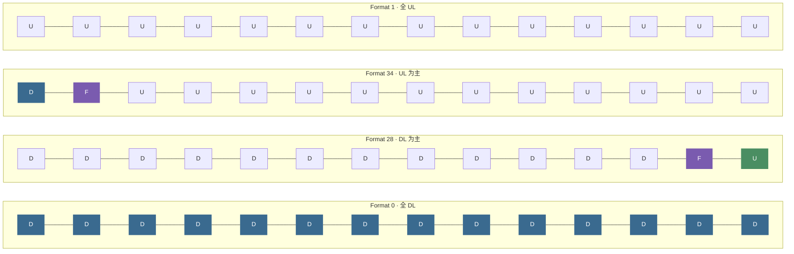

# 5G NR Numerology（参数集）

> **3GPP 版本定锚**
>
> | 内容 | 版本 | 规范 |
> |---|---|---|
> | Numerology 基础定义（μ=0~4） | **Rel-15** | 38.211 v15.x |
> | IAB 多 SCS 共存约束 | **Rel-16** | 38.174 v16.x |
> | μ=5,6 (FR2-2 > 52.6 GHz) | **Rel-17** | 38.211 v17.x |
> | NTN Numerology 选择与 TA 扩展 | **Rel-17** | 38.821 v17.x |

---

## 📡 知识定位

```
整个 5G NR 物理层知识树
│
├── Numerology (μ / SCS) + 帧结构 Frame Structure         ← 我们在这里
│     └── 决定 → 帧结构时序 / 资源网格频域刻度 / CP 长度 / 调度粒度
│
├── 资源网格 (Resource Grid)
│     └── Point A 锚定频域起点；BWP 在网格上划定工作窗口（下一篇）
│
└── 物理信道映射 / PDCCH / PDSCH / CSI / Beam Management
      └── 全部建立在 Numerology 确定的"时频坐标系"上
```

**一句话理解**：Numerology 是 5G 物理层的"单位制"。μ 选定，时域的"秒"与频域的"赫兹"都随之确定——此后所有"何时发、发多宽、等多久"的讨论都在这把尺子上进行。

---

## 💡 核心逻辑

### 1. 为什么 LTE 的单一 SCS 不够用？

LTE 只有一种子载波间隔：**15 kHz**，为宏蜂窝、低速、Sub-6 GHz 场景量身定制。

5G 需要同时服务三类物理约束相互对立的场景：

| 场景 | 代表业务 | 物理层核心需求 | 对 SCS 的倾向 |
|---|---|---|:---:|
| **eMBB** mmWave | 4K/8K 流媒体 | 大带宽；多普勒容忍（mmWave 移动场景） | 宽 SCS ↑ |
| **URLLC** | 工业控制、远程手术 | 极短调度时延 | 宽 SCS ↑ |
| **mMTC / IoT** | 海量传感器 | 长覆盖；窄带 | 窄 SCS ↓ |
| **NTN / LEO** | 卫星宽带 | 强多普勒 + 大传播时延（见第 5 节） | 存在深层矛盾 ⚠️ |

**根本矛盾**：OFDM 的时频对偶性是硬约束——

$$
T_{\text{symbol}} = \frac{1}{\Delta f}
$$

宽 SCS → 短符号 → 低时延，但 CP 绝对时长变短，**抗多径能力下降**；
窄 SCS → 长符号 → 强抗多径，但单位时间调度次数少，**时延上升**。

5G 的解法：**不做非此即彼的选择**，而是用 μ 将所有选择都参数化，让运营商和设备商根据部署场景按需配置。

---

### 2. Numerology 的数学定义

#### 2.1 子载波间隔公式

**参考 38.211 Table 4.2-1**：

$$
\boxed{\Delta f = 2^{\mu} \times 15 \text{ kHz}}, \quad \mu \in \{0, 1, 2, 3, 4, 5, 6\}
$$

这是一个**以 2 为底的指数缩放族**——μ=0 与 LTE 兼容，每增加 1，SCS 翻倍、符号时长减半。

| μ | SCS (kHz) | CP 类型 | 数据 (PDSCH/PUSCH) | 同步 (PSS/SSS/PBCH) | PRACH | 典型场景 |
|:---:|:---:|:---:|:---:|:---:|:---:|:---:|
| 0 | 15 | Normal | ✅ | ✅ | Short | FR1 宏蜂窝 / NTN |
| 1 | 30 | Normal | ✅ | ✅ | Short | FR1 主力配置 / NTN |
| 2 | 60 | Normal/**Extended** | ✅ | ❌ | Short | FR1 高密度 / URLLC |
| 3 | 120 | Normal | ✅ | ✅ | Short | FR2 mmWave 数据 |
| 4 | 240 | Normal | ❌ | ✅ (仅 SSB) | — | FR2 Beam 扫描专用 |
| 5 | 480 | Normal | ✅ | ✅ | — | FR2-2 (Rel-17) |
| 6 | 960 | Normal | ✅ | ✅ | — | FR2-2 (Rel-17) |

> **μ=4 的设计意图**：240 kHz 不承载数据。FR2 基站需对数十条波束逐一扫描发送 SSB，若同时调度数据，波束切换打断会导致调度空洞。3GPP 的决策是将 SSB 发现（μ=4）与数据传输（μ=3）**功能分离**——这是工程妥协，不是规范缺陷。

#### 2.2 OFDM 符号时长推导

$$
T_{\mu,\text{symbol}} = \frac{1}{\Delta f} = \frac{1}{2^{\mu} \times 15 \times 10^3} \text{ s}
$$

| μ | SCS | 纯符号时长 | Normal CP | 含 CP 总时长 |
|:---:|:---:|:---:|:---:|:---:|
| 0 | 15 kHz | 66.67 μs | 4.69 μs | **71.35 μs** |
| 1 | 30 kHz | 33.33 μs | 2.34 μs | **35.68 μs** |
| 2 | 60 kHz | 16.67 μs | 1.17 μs | **17.84 μs** |
| 3 | 120 kHz | 8.33 μs | 0.57 μs | **8.92 μs** |
| 4 | 240 kHz | 4.17 μs | 0.29 μs | **4.46 μs** |

> ⚠️ **注意**：每个 slot 的第 0 个 OFDM 符号 CP 比其他符号略长（约多 16 个采样），
> 目的是维持 0.5 ms 子帧边界的整数样点对齐（源于 LTE 兼容性设计）：
>
> | μ | 第 0 符号 CP | 其他符号 CP |
> |:---:|:---:|:---:|
> | 0 | 5.21 μs（160 × Ts）| 4.69 μs（144 × Ts）|
> | 1 | 2.60 μs | 2.34 μs |
> | 2 | 1.30 μs | 1.17 μs |
>
> 表格中列出的值为**普通符号（非第一个符号）**的 CP 时长。
---

### 3. 帧结构的推导：从 SCS 到 Slot

#### 3.1 固定锚点（LTE 兼容性保证）

$$
T_{\text{frame}} = 10 \text{ ms} \quad (\text{固定}) \qquad T_{\text{subframe}} = 1 \text{ ms} \quad (\text{固定})
$$

#### 3.2 Slot 数量推导

$$
N_{\text{slot}}^{\text{subframe}, \mu} = 2^{\mu}, \qquad
N_{\text{slot}}^{\text{frame}, \mu} = 10 \times 2^{\mu}, \qquad
T_{\text{slot}}^{\mu} = \frac{1 \text{ ms}}{2^{\mu}}
$$

每个 slot 内的符号数（**与 μ 无关**，仅由 CP 类型决定）：

$$
N_{\text{symb}}^{\text{slot}} = \begin{cases} 14 & \text{Normal CP} \\ 12 & \text{Extended CP（仅 μ=2，Rel-15）} \end{cases}
$$

#### 3.3 全参数展开表

| μ | SCS | Slots/Subframe | Slots/Frame | Slot 时长 | 每帧总符号数 |
|:---:|:---:|:---:|:---:|:---:|:---:|
| 0 | 15 kHz | 1 | 10 | 1 ms | 140 |
| 1 | 30 kHz | 2 | 20 | 500 μs | 280 |
| 2 | 60 kHz | 4 | 40 | 250 μs | 560 |
| 3 | 120 kHz | 8 | 80 | 125 μs | 1120 |
| 4 | 240 kHz | 16 | 160 | 62.5 μs | 2240 |

<NumerologySlider />

---

### 4. 物理时序单位 $T_c$ 与 $T_s$

38.211 Section 4.1 定义了两个基础时序原子：

$$
T_c = \frac{1}{\Delta f_{\max} \cdot N_f} = \frac{1}{480\,\text{kHz} \times 4096} \approx 0.509 \text{ ns}
$$

$$
T_s = \frac{1}{15\,\text{kHz} \times 2048} \approx 32.55 \text{ ns} = 64 \cdot T_c
$$

$T_c$ 是 NR 的**最小时间粒度**。所有 Timing Advance、timing offset 都以 $T_c$ 的整数倍表达：

- 地面 TA 命令单位：$16 \cdot T_c \approx 8.14$ ns
- LEO 最大 TA（Rel-17，38.821）：$67700 \times 64 \cdot T_c \approx 2.2$ ms
- GEO 最大 TA（Rel-17，38.821）：$1{,}282{,}240 \times 64 \cdot T_c \approx 41.7$ ms

---

### 5. ⚠️ NTN (Rel-17) 深度分析：LEO 场景的物理层根本矛盾

> **架构师笔记**：这一节是 Numerology 理论的试金石。如果只能回答"NTN 用 μ=0 因为时延大"，说明还停留在结论层面。真正的问题是：**既然多普勒严重，为什么不用更大的 μ 来对抗 ICI？**

#### 5.1 定量分析：LEO 轨道的双重物理压迫

以 Starlink 第一代轨道（h = 550 km）为基准：

**轨道速度**（由万有引力提供向心力）：

$$
v_{\text{LEO}} = \sqrt{\frac{GM}{R_e + h}} = \sqrt{\frac{3.986 \times 10^{14}}{6{,}921 \times 10^3}} \approx 7{,}590 \text{ m/s}
$$

**最大多普勒频移**（卫星从地平线扫过顶点，径向速度最大时）：

$$
f_d^{\max} = \frac{v_{\text{LEO}}}{c} \cdot f_c
$$

| 频段 | 载频 $f_c$ | 最大多普勒 $f_d^{\max}$ | 相对 μ=0 SCS (15kHz) | 相对 μ=3 SCS (120kHz) |
|:---:|:---:|:---:|:---:|:---:|
| S-band UL | 2 GHz | **±50.6 kHz** | 337% | 42% |
| Ka-band DL | 20 GHz | **±506 kHz** | 3373% | 421% |
| Ka-band UL | 30 GHz | **±759 kHz** | 5060% | 632% |

**ICI 容忍判据**：子载波间干扰不可忽略的阈值约为 $f_d / \Delta f > 0.05 \sim 0.1$。

这张表揭示了一个令人清醒的事实：**即使使用 μ=3（120 kHz），S-band 的多普勒（42% of SCS）仍远超 ICI 容忍阈值。对于 Ka-band，完全没有任何现有 Numerology 能在不预补偿的情况下对抗这个量级的多普勒。**

**传播时延**（仰角 90° 时最短，边缘仰角 10° 时最长）：

$$
\tau_{\text{one-way}}^{\min} = \frac{h}{c} = \frac{550 \times 10^3}{3 \times 10^8} \approx 1.83 \text{ ms}
\quad \text{（nadir）}
$$

$$
\tau_{\text{one-way}}^{\max} \approx \frac{h}{c \cdot \sin(10°)} \approx 10.6 \text{ ms}
\quad \text{（覆盖边缘）}
$$

LEO 往返时延（RTT）范围：**3.6 ms ~ 21.2 ms**。

#### 5.2 核心矛盾的精确表述

很多教材写道："NTN 大时延要求小 SCS 换取长 CP"。**这个说法在物理上是错误的。** 让我们严格拆开：

**CP 的物理作用**是对抗**多径时延扩展**（multipath delay spread），即不同反射路径之间的**相对时延差**。NTN 信道由视距（LOS）主导，几乎无强散射体，多径时延扩展仅 **< 几 μs**。μ=0 的 CP（4.69 μs）对 NTN 多径**完全够用**。

**传播时延**（~ms 量级）是绝对时延，不是 CP 要解决的问题——它由 **TA（Timing Advance）机制**负责。

**真正的矛盾不在 CP，而在以下两个轴的对立**：

```
═══════════════════════════════════════════════════════
矛盾轴 A：对抗多普勒 ICI
───────────────────────────────────────────────────────
  物理要求：Δf >> f_d
  → S-band 需 Δf > 506 kHz（ICI < 10%）→ μ >> 5
  → Ka-band 需 Δf > 7.6 MHz（物理不可能）
  结论：用加大 SCS 对抗 NTN 多普勒，在 Ka-band 是死路。

矛盾轴 B：控制 HARQ 时序开销（加大 μ 的代价）
───────────────────────────────────────────────────────
  大 μ → 更多 slot/frame → HARQ K1/K2 需更大值
  例：1-way delay = 10 ms
    μ=3 (125μs/slot)：K1 = 80 slots（需要 7-bit 字段）
    μ=0 (1ms/slot) ：K1 = 10 slots（4-bit 字段即可）
  → 大 μ 在长时延场景下不仅没优势，信令开销反而更大。
═══════════════════════════════════════════════════════
```

**两个矛盾的唯一出路：将补偿移到发射端，彻底绕开空口的 Numerology 限制。**

#### 5.3 Rel-17 的工程折中：预补偿架构

3GPP 38.821 确立的核心思路是**在问题影响到 OFDM 解调之前就把它消掉**：

```
UE 发射侧预补偿流程（38.821 Section 6.3.3）
───────────────────────────────────────────────────────────────

[GNSS 接收机] ──→ UE 精确位置 (x, y, z)
[星历广播]   ──→ 卫星位置 + 速度向量  ← 新增 IE: ntn-SatelliteInfo-r17
                     │
                     ▼
             [UE 本地计算引擎]
               ① 几何路径长度: d = |P_sat - P_UE|
               ② 单向传播时延: τ = d / c
               ③ 径向相对速度: v_r = (P_sat - P_UE)/d · (V_sat - V_UE)
               ④ 多普勒频移:   f_d = (v_r / c) × f_c
                     │
                     ▼
             [发射前预补偿]
               时间预补偿: 提前 τ 发送（开环 TA 预补偿）
               频率预补偿: 将发射载频移动 -f_d
                     │
                     ▼
             [残余误差（不可消除，但可控）]
               残余时延误差: ~ ns 量级（受 GNSS 精度限制，3m → 10ns）
               残余频率误差: < 100~200 Hz（受星历精度和计算延迟限制）
```
#### 5.4 Rel-17 NTN 的 TA 双层架构

```
总 TA = Common TA（网络广播）+ Service Link TA（UE 自主计算）
         ↓                          ↓
  补偿馈电链路时延              补偿卫星→UE 时延
  (gNB→卫星，固定)              (卫星→UE，随位置变化)
  来源：ta-Info-r17              来源：UE GNSS + 星历计算
```

**暗坑**：若 UE 实现将 Common TA 重复叠加（即两次都补偿了馈电链路），
上行时序会偏移一个 Common TA 的量（约数百 μs），
导致 PRACH 和 PUSCH 均超出基带检测窗口。

**关键结论**：

预补偿后，残余多普勒 < 200 Hz，这仅仅是 μ=0 SCS（15 kHz）的 **1.3%**——完全在正常信道估计的纠错能力范围内。**因此 NTN 优先使用 μ=0 或 μ=1，不是因为它们"抗多普勒能力强"，而是预补偿已将多普勒降低到这两个 Numerology 完全可以处理的水平。**

| 问题 | 地面网络解法 | NTN (Rel-17) 解法 |
|---|---|---|
| 传播时延补偿 | TA 命令（网络闭环控制） | UE 自主预补偿（开环）+ 网络微调 |
| 多普勒补偿 | 不需要（地面 < 300 km/h） | UE 频率预补偿（开环，基于星历） |
| 残余误差吸收 | 正常 CP + 信道估计 | 正常 CP + 增强 DMRS 密度（可配） |
| Numerology 选择 | 按业务和频段选 | **μ=0/1 优先**（HARQ 时序最优） |
| 新增 IE | 无 | `ntn-Config-r17`, `ntn-SatelliteInfo-r17`, `ta-Info-r17` |

#### 5.5 架构洞见：SCS 的设计边界

这一分析揭示了 Numerology 设计的内在哲学边界：

> **SCS 的设计空间服务于"静态信道特性"**（多径扩展大小、调度粒度需求）；
> **"动态信道扰动"**（多普勒、大传播时延）应在 MAC/PHY 补偿流程中处理，
> 而不是试图通过加大 SCS 来"硬抗"。

这一哲学在 Rel-17 NTN 中被贯彻到极致：**不新增 NTN 专用 Numerology**（μ=0~6 保持不变），而是扩展 TA 范围、新增星历 IE、增强频率补偿流程。这体现了 3GPP 的一个核心工程原则——**接口不变，能力扩展**。

---

### 6. Slot Format：TDD 灵活性的根源

38.213 Table 11.1.1-1 定义了 **56 种预定义 Slot Format**，每种 Format 规定了 14 个符号的 D/U/F 属性：

| 符号类型 | 含义 | 谁决定 |
|:---:|---|---|
| **D** | Downlink（仅 gNB 可发） | 固定配置 |
| **U** | Uplink（仅 UE 可发） | 固定配置 |
| **F** | Flexible（可由 DCI 2_0 动态指定） | 调度器按需 |

典型示例：

| Format | D/U/F 序列（14符号） | 用途 |
|:---:|---|---|
| 0 | D×14 | 全 DL slot（eMBB 下行密集） |
| 1 | U×14 | 全 UL slot（上行突发） |
| 28 | D×12, F, U | DL-heavy，末尾 UL 用于 HARQ-ACK |
| 34 | D, F, U×12 | UL-heavy，首符号 DL 控制信道 |

**四种典型 Format 的时域图样：**



> 📌 **D** = Downlink（固定下行）· **U** = Uplink（固定上行）· **F** = Flexible（动态由 DCI 2_0 指定）

**关键 IE**：
- `tdd-UL-DL-ConfigurationCommon`：SIB1 广播，所有 UE 共享的基础配置
- `tdd-UL-DL-ConfigurationDedicated`：RRC Reconfiguration，UE 专属精细配置

#### 6.1 Mini-Slot：比 Slot 更小的调度单元

标准 Slot 含 14 个符号（Normal CP），对于 URLLC 场景，
等待一整个 slot 完成调度再发送的时延仍然过高。

NR 引入了 **Mini-Slot**，支持在 slot 内任意位置开始的短调度单元：

| Mini-Slot 长度 | 起始符号 | 典型用途 |
|:---:|---|---|
| **2 符号** | 任意偶数符号 | URLLC 超低时延数据 |
| **4 符号** | 任意符号 | URLLC 数据 + 控制 |
| **7 符号** | 0 或 7 | 半个 slot，通用 |

**时延对比**（μ=1，SCS=30kHz）：

| 调度粒度 | 时长 | 适用场景 |
|---|---|---|
| 完整 Slot（14 符号）| 500 μs | eMBB 标准调度 |
| Mini-Slot（7 符号）| 250 μs | 工业控制 |
| Mini-Slot（2 符号）| 71 μs | 工厂自动化、URLLC |

> **3GPP 参考**：38.213 §9（PDSCH/PUSCH 时域资源分配），
> Mini-Slot 对应 PDSCH Mapping Type B（Type A 为 Slot-based）。
---

## 🔍 实战信令视角（IE / Log Analysis）

### 关键 IE 字段速查

```
RRC: ServingCellConfigCommon
└── scs-SpecificCarrierList
    └── SCS-SpecificCarrier
        ├── subcarrierSpacing    ← μ 的直接映射（kHz15/kHz30/kHz60/kHz120）
        ├── offsetToCarrier      ← 相对 Point A 的 RB 偏移（下一篇核心概念）
        └── carrierBandwidth     ← 载波带宽（RB 数，FR1 最大 275 RB @ 15kHz）

RRC: MIB
├── subCarrierSpacingCommon      ← SSB + SIB1 PDCCH 使用的 SCS
└── pdcch-ConfigSIB1             ← CORESET#0 隐式配置（8 bits → 查 38.213 Table 13-x）

RRC: BWP-Downlink / BWP-Uplink
└── bwp-Common
    └── genericParameters
        └── subcarrierSpacing    ← 该 BWP 的 SCS（可与 SSB SCS 不同！）

RRC (Rel-17 NTN 新增): ServingCellConfig
└── ntn-Config-r17
    ├── ntn-SatelliteInfo-r17    ← 卫星星历（位置向量、速度向量）
    ├── ta-Info-r17              ← Common TA（补偿馈电链路固定时延）
    └── ntn-UlSyncValidityDuration-r17  ← UE 自主预补偿值的有效时窗
```

### 🚨 故障排查速查表

| 故障现象 | 首先检查的 Log 字段 | 最可能根因 |
|---|---|---|
| UE 无法检测 SSB | `ssb-subcarrierOffset` (k_ssb) | k_ssb 与 gNB 配置不一致 |
| MIB 解码失败 | `subCarrierSpacingCommon` | UE 不支持该 SCS（能力匹配问题） |
| SIB1 持续获取失败 | `pdcch-ConfigSIB1`（原始 8 bit 值） | CORESET#0 频域位置计算错误 |
| NTN UE 接入失败 | `ntn-Config` → `ta-Info` | Common TA 未正确配置，UE 时序错乱 |
| BWP 切换后 PDCCH 丢失 | 切换后 `subcarrierSpacing` 是否变化 | 新旧 BWP SCS 不一致，UE 未更新解调参数 |

> **Rel-15 vs Rel-16 差异（IAB）**：Rel-16 IAB-node 可能同时运行两套 SCS——MT 侧（作为 UE 接入父节点）和 DU 侧（作为基站服务子 UE）。Log 分析时必须区分两个 SCS 上下文，否则极易将 MT 侧 `subcarrierSpacing` 误认为 DU 侧配置，导致排查方向完全错误。

---

## 🐍 仿真实现：从公式到时域波形

### 数学到代码的映射：伪代码骨架

在写任何真实代码之前，先建立"数学 → 算法 → 实现"的三层映射，这是物理层工程师的核心思维方式：

```
══════════════════════════════════════════════════════════════
【数学层】38.211 Eq.5.3.1-1
──────────────────────────────────────────────────────────────
OFDM 调制信号：

    s_l(t) = Σ_{k=0}^{N-1}  a_{k,l} · exp(j·2π·k·Δf·t)

其中：
    a_{k,l}   第 l 个符号、第 k 个子载波上的调制符号（QPSK/QAM）
    N         FFT 大小（子载波数）
    Δf        2^μ × 15 kHz
══════════════════════════════════════════════════════════════
【算法层】伪代码
──────────────────────────────────────────────────────────────
FUNCTION ofdm_modulate(freq_symbols[N_fft], N_cp):
    time_domain  ← IFFT(freq_symbols)          # 核心：调制 = IFFT
    cp           ← time_domain[-N_cp:]          # 取末尾 N_cp 个采样
    tx_signal    ← CONCAT(cp, time_domain)      # 前置 CP
    RETURN tx_signal                             # 长度 = N_fft + N_cp

FUNCTION ofdm_demodulate(rx_signal, N_cp, channel_H[N_fft]):
    no_cp        ← rx_signal[N_cp:]             # 去除 CP
    freq_rx      ← FFT(no_cp)                   # 解调 = FFT
    equalized    ← freq_rx / channel_H          # 单抽头均衡（CP 保证前提）
    RETURN equalized
══════════════════════════════════════════════════════════════
【实现层】PyTorch（见独立文件 code/numerology_sim.py）
──────────────────────────────────────────────────────────────
# IFFT：数学 → 代码，一行完成
time_domain = torch.fft.ifft(freq_domain, n=N_fft, dim=-1)

# CP：维度安全的切片（支持 batch）
cp = time_domain[..., -N_cp:]

# 拼接：广播友好
tx = torch.cat([cp, time_domain], dim=-1)
══════════════════════════════════════════════════════════════
```

### 为什么用 PyTorch 而不是 NumPy？——AI 原生优势

这不是工具偏好，而是**面向可微物理层的架构选择**。

**① 自动微分（Autograd）：梯度穿越 FFT**

```python
# NumPy：IFFT 是纯数值操作，梯度链在此断开
time_np = np.fft.ifft(freq_np)   # 无法 backward()

# PyTorch：FFT/IFFT 的梯度完整保留
freq_tensor = torch.randn(N_fft, dtype=torch.cfloat, requires_grad=True)
time_tensor = torch.fft.ifft(freq_tensor)

loss = channel_loss(time_tensor)
loss.backward()   # ✅ 梯度一路回传至 freq_tensor
```

这使**端到端可微物理层（E2E Differentiable PHY）**成为可能——在编码器、调制器、信道、均衡器、解调器组成的完整链路中，可以插入神经网络模块并用 SGD/Adam 联合优化：

```
[信道编码器] → [QAM 映射] → [OFDM IFFT] → [物理信道] → [FFT] → [神经网络均衡器] → [译码]
      ↑___________________________梯度反向传播（全链路可微）___________________________↑
```

这正是 **Deep Unfolding 接收机**（OAMP-Net、DetNet、HyperMIMO）的代码基础。`numerology_sim.py` 中包含了该架构的扩展骨架。

**② 批处理（Batch Operations）：从单符号到全基站**

```python
# shape: (batch=32, slots=14, subcarriers=1024)
freq_batch = torch.randn(32, 14, 1024, dtype=torch.cfloat)
time_batch = torch.fft.ifft(freq_batch, dim=-1)  # 一次调用，32×14 个符号并行
```

**③ GPU 零迁移成本**

```python
device = 'cuda' if torch.cuda.is_available() else 'cpu'
freq_tensor = freq_tensor.to(device)   # 后续所有运算自动在 GPU 上执行
```

> **完整仿真代码**：见独立文件 `code/numerology_sim.py`
>
> 实现内容：PyTorch OFDM 调制/解调器（支持 batch）、NTN 多普勒信道仿真、预补偿对比实验、BER 曲线生成、可视化套件，以及 Deep Unfolding 扩展接口。

### 关键实验：主动探索

```python
# 实验 1：观察 μ 对符号"密度"的压缩效果
visualize_frame_structure(mu_list=[0, 1, 3])

# 实验 2：让 CP 不够用——主动制造 ISI
# 在 numerology_sim.py 中修改：
tau_samples = 40   # 超过 CP 长度 → 观察 FFT 后子载波幅度失真

# 实验 3：NTN 多普勒对比（最有价值的实验）
ntn = NTNChannelSimulator(altitude_km=550, freq_hz=2e9, mu=0)
ntn.run_ber_comparison()   # 对比：无补偿 / 理想预补偿 / 残余 200Hz

# 实验 4：梯度流验证（AI 扩展基础）
verify_gradient_flow_through_fft()  # 确认梯度能穿越 torch.fft.ifft
```

---

## 🔗 走向资源网格（Resource Grid）

### Numerology 确定了"刻度"，但刻度尺放在哪里？

μ 确定了频域的子载波间隔 Δf 和时域的符号时长——相当于制好了一把"时频尺子"。但 5G 工作的频谱只是整个载波的某个窗口，还需要回答两个关键问题：

**问题 1：这把尺子的"零刻度"对准哪个频率？**

答案是 **Point A**——网络通过 `absoluteFrequencyPointA`（ARFCN 格式）广播的**频域绝对锚点**。Point A 本身不承载任何信号能量，它是整个资源网格的频率坐标原点，所有 RB 编号都从 Point A 开始计数。

**问题 2：UE 当前使用尺子的哪一段？**

答案是 **BWP（Bandwidth Part）**——UE 在某一时刻只激活资源网格中的一个**子窗口**工作，以减少功耗和处理复杂度。关键特性：

- BWP 拥有**独立的 SCS**（即独立的 μ），同一载波可配置多个不同 SCS 的 BWP
- UE 同时只激活一个 DL BWP + 一个 UL BWP
- **Dormant BWP**（Rel-16 新增）：允许 UE 在非激活时驻留极窄带宽，大幅降低待机功耗

```
整个载波带宽（例：100 MHz @ 30kHz SCS = 275 RBs）
│
├── Point A ───────────────── 频域坐标系原点（ARFCN）
│
├── Initial BWP               ← UE 开机首先工作的窗口（SIB1 配置）
│     ├── SCS = 30kHz (μ=1)
│     └── RB 范围由 offsetToPointA + initialBWP_size 确定
│
├── Active DL BWP             ← RRC 配置，UE 当前工作窗口
│     ├── SCS 可 ≠ Initial BWP（跨 SCS 切换！）
│     └── 宽度可远小于载波带宽
│
└── Dormant BWP (Rel-16)      ← 待机驻留，超低功耗
      └── 极窄带宽，仅监听 Paging
```

**下一篇笔记预告**：《5G NR Resource Grid》将深入推导 Point A 的 ARFCN 计算公式、BWP 四个核心参数（`locationAndBandwidth`、`subcarrierSpacing`、`cyclicPrefix`、`BWP-Id`），并演示如何从 Wireshark 的 RRC Reconfiguration 消息中**反推 UE 的真实工作频率范围**。

---

## 📝 版本演进与工程自测

### 版本演进速览

| Feature | Rel-15 | Rel-16 | Rel-17 | Rel-18 |
|---|:---:|:---:|:---:|:---:|
| 基础 Numerology μ=0~4 | ✅ | 不变 | 不变 | 不变 |
| μ=5,6（FR2-2）| ❌ | ❌ | ✅ | 增强 |
| Extended CP（μ=2）| ✅ | 不变 | 不变 | 不变 |
| IAB 多 SCS 共存 | ❌ | ✅ | 增强 | — |
| NTN Numerology 选择指导 | ❌ | ❌ | ✅ 38.821 | 增强 |
| NTN TA 范围扩展 | ❌ | ❌ | ✅ | — |
| NTN 星历 IE (`ntn-SatelliteInfo`) | ❌ | ❌ | ✅ | 增强 |
| BWP-based SCS 切换 | ✅ 基础 | ✅ Inactive BWP | 不变 | 增强 |
| Dormant BWP（省电）| ❌ | ✅ | 增强 | — |

---

### 面试级自测题

**Q1 · 概念题（陷阱密集）**

> μ=4（240 kHz）为什么不支持 PDSCH 数据传输？请从 beam 管理角度解释。

<details>
<summary>💡 展开答案</summary>

**参考答案**：FR2 基站需遍历所有候选波束（Lmax 最多 64 个）逐一扫描发送 SSB。若 μ=4 同时承载 PDSCH，调度器在波束扫描期间插入数据调度会造成两个问题：

1. **波束切换打断**：扫描波束 n → n+1 的切换间隙中，PDSCH 连续性被破坏，接收端需要额外的波束跟踪开销。

2. **时序冲突**：240 kHz 符号时长仅 4.17 μs，在此时隙内完成"波束切换 + 数据调度 + HARQ 反馈"完整闭环是不现实的。

因此 3GPP 将 μ=4 **专用于 SSB 发现**（利用其极短符号实现密集波束扫描），数据传输由 μ=3 承担。这是**功能分离**的工程妥协。

参考：38.211 Table 4.2-1 note，38.213 Section 4.1。

</details>

---

**Q2 · 计算题（工程必考）**

> 一个 5G gNB 配置 μ=1（30 kHz SCS），FR1 频段，100 MHz 带宽。
>
> (a) 一个 Radio Frame 内共有多少个 OFDM 符号？
> (b) 调度器每 slot 触发一次，每秒调度多少次？
> (c) 若升级 μ=2（60 kHz），调度频率如何变化？对 gNB 实时处理预算有何工程影响？

<details>
<summary>💡 展开答案</summary>

**(a)**

$$N_{\text{slot}}^{\text{frame}} = 10 \times 2^1 = 20, \quad N_{\text{sym}} = 20 \times 14 = \mathbf{280} \text{ symbols/frame}$$

**(b)**

$$f_{\text{sched}} = \frac{20 \text{ slots}}{10 \text{ ms}} = \mathbf{2000 \text{ slots/s} = 2 \text{ kHz}}$$

**(c)** μ=2：调度频率 = **4 kHz**（翻倍）。

**工程影响**：调度器、HARQ 状态机、DCI 打包、PDCCH 编码全部以 slot 为周期，处理预算从 500 μs **压缩至 250 μs**。对于 L1/L2 实时软件，这意味着每个调度周期内可执行的算法复杂度减半。这是实际产品中 μ 选择的核心约束，不只是空口参数的数字游戏。

</details>

---

**Q3 · NTN 故障排查题（高级）**

> Rel-17 NTN 网络现场：UE 已支持 Doppler 预补偿功能，但上行时序仍频繁偏移，导致 PUSCH 无法被正确解调，gNB 侧 HARQ NACK 率高达 60%。UE 侧 Log 显示 `ta-Info` 接收正常，星历数据也在有效期内。
>
> 请给出两种最可能的根因，并指出各自需要检查的具体 Log 字段。

<details>
<summary>💡 展开答案</summary>

**根因 1：Common TA 与 UE 专用 Service Link TA 叠加错误**

Rel-17 NTN 的总 TA 由两部分叠加：网络广播的 `ta-Common`（补偿馈电链路 gNB→卫星的固定时延）+ UE 自主计算的 Service Link TA（补偿卫星→UE 的可变时延）。若 UE 实现错误地将两者**重复叠加**，上行发送会整体提前一个 Common TA 的时间量。

**检查字段**：`ta-Info-r17` 中的 `ta-Common` 数值；UE 侧记录的"总 TA 应用值"vs"Service Link 单独计算值"之差。

**根因 2：UE 速度估计误差导致多普勒预补偿过补偿**

若 UE 自身有移动速度（如机载场景），径向相对速度 $v_r = v_{\text{sat,radial}} + v_{\text{UE,radial}}$，但部分实现可能只考虑了卫星速度而忽略了 UE 自身速度分量，导致频率预补偿**方向相反或幅度错误**，反而引入更大的残余多普勒，加剧相位旋转，最终使时序估计失真。

**检查字段**：UE 侧"多普勒预补偿值"Log；比较 gNB 侧 timing offset measurement 与理论预期值；检查 UE 是否上报了 `ue-Velocity-r17`（Rel-17 新增能力）。

参考：38.821 Section 6.3.3，38.133 Table 7.1.2.1-2（NTN TA 精度要求：± 几 μs）。

</details>

---

## 参考资料

- **3GPP TS 38.211 v15.7.0** — 物理信道与调制；时频结构定义（Section 4 & 5.3）
- **3GPP TS 38.213 v15.7.0** — 物理层控制流程；Slot Format（Section 11.1.1）；SSB 时域位置（Section 4.1）
- **3GPP TS 38.300 v15.7.0** — NR 总体描述；Numerology 能力汇总（Table 5.1-1）
- **3GPP TR 38.821 v17.3.0** — NTN 解决方案；Numerology 选择与 TA 扩展（Section 6.3）
- **3GPP TS 38.331 v15.7.0** — RRC 协议；MIB / SIB1 / BWP IE 定义（Section 6.2.2）
- ShareTechnote — [5G Frame Structure](https://www.sharetechnote.com/html/5G/5G_FrameStructure.html)
- Ericsson Technology Review — *5G NR: Designing for the Future* (2017)
- Qualcomm White Paper — *Making 5G NR a Reality* (2017)
