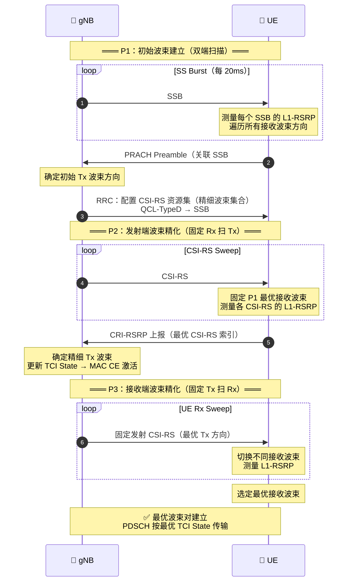
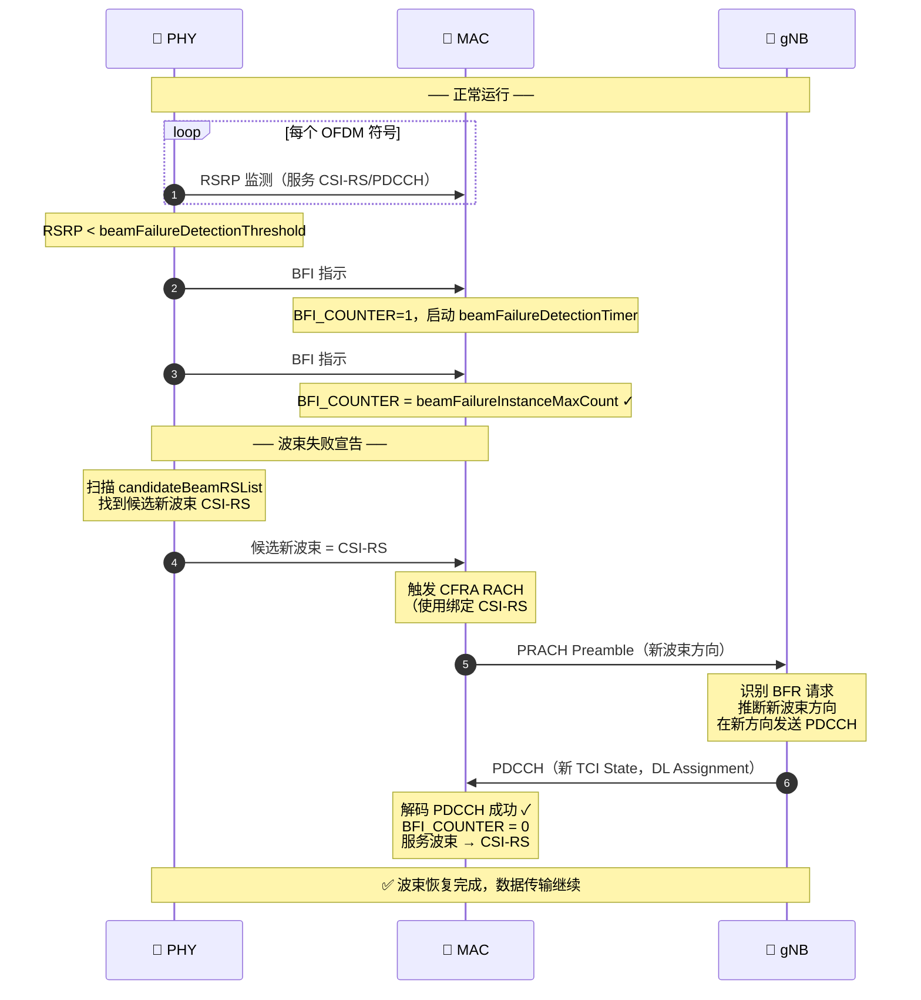

# 5G NR 波束管理（Beam Management）

> **3GPP 版本定锚**
>
> | 内容 | 版本 | 规范 |
> |---|---|---|
> | P1/P2/P3 三流程基础框架 | **Rel-15** | TR 38.802 §6.1.6.1，38.214 §5.2.2，38.300 §9.2 |
> | QCL 定义与四种类型 | **Rel-15** | 38.214 §5.1.5 |
> | TCI State 激活机制 | **Rel-15** | 38.214 §5.1.5，38.213 §10 |
> | Beam Failure Recovery（BFR）| **Rel-15** | 38.321 §5.17，38.213 §10 |
> | 多 TRP 增强波束管理 | **Rel-16** | 38.214，38.300 |
> | NTN 波束管理挑战（大时延/高多普勒）| **Rel-17** | TR 38.821 §6 |

---

## 📡 知识定位

```
Phase 2 骨架层
│
├── RACH          ← UE 第一次上行发声，P1 的入口
├── PDCCH & DCI   ← TCI State 通过 DCI 动态指示
├── HARQ          ← BFR 触发依赖 PDCCH BLER 检测
├── MIMO          ← 波束 = 空间预编码向量
├── CSI 框架      ← L1-RSRP 测量 = 波束质量指标
│
└── ▶ Beam Management  ← 我们在这里
      核心问题：毫米波窄波束系统中，如何在任何时刻保证
                gNB 和 UE 的空间波束"对准"？
```

**一句话理解**：波束管理是 5G NR 中独有的"空间同步"机制。
LTE 只需要时频同步；NR 在 FR2 毫米波场景下，还需要持续维护发射/接收波束的空间方向对齐。
P1/P2/P3 是建立和维护这个对准状态的三级流程，BFR 是对准突然失效时的应急恢复机制。

---

## 💡 核心逻辑

### 1. 为什么 NR 需要波束管理？

```
LTE（Sub-6GHz，宏覆盖）：
  路径损耗：d⁻³·⁵，覆盖半径可达数公里
  天线波束：全向或扇区（宽波束），信号"铺满"整个小区
  UE 接收：无需特定方向，随时可收到信号
  → 没有波束对准的需求

NR FR2（毫米波，28GHz~52GHz）：
  路径损耗：d⁻²·¹（自由空间），但障碍物穿透损耗极大（30dB+）
  天线：数百根阵元，波束宽度仅 3°~10°（极窄）
  阵列增益补偿路径损耗（128 天线 → +21dB 增益）
  问题：波束像"激光笔"，偏差 5° → 信号骤降 20dB → 链路中断！
  → 必须持续精确追踪用户方向
```

**波束管理的本质**：在时变空间信道中，实时维护最优**波束对（Beam Pair）**——gNB 发射波束 + UE 接收波束的组合，使接收 RSRP 最大。

---

### 2. 关键概念前置

#### 2.1 QCL（准共址，Quasi Co-Location）

**定义（38.214 §5.1.5）**：若从一个天线端口的信道可以推断另一个天线端口的大尺度信道参数，则称两个端口**准共址**。

工程含义：两个参考信号由同一物理波束（相同空间滤波器）发送，则它们 QCL——UE 用测量一个信号获得的信道信息，可直接用于接收另一个信号。

**四种 QCL 类型（38.214 Table 7.6.3.1-1）**：

| 类型 | 共享的信道参数 | 适用频段 | 工程含义 |
|:---:|---|:---:|---|
| **Type A** | 多普勒频移、多普勒扩展、平均时延、时延扩展 | FR1+FR2 | 时频同步辅助，用于信道估计插值 |
| **Type B** | 多普勒频移、多普勒扩展 | FR1+FR2 | 高速场景的频率跟踪 |
| **Type C** | 多普勒频移、平均时延 | FR1+FR2 | 定时/频率参考 |
| **Type D** | **空间接收参数（Spatial Rx Parameter）** | **FR2** | **波束对准！UE 接收方向与参考信号相同** |

> **QCL-TypeD 是波束管理的核心**：当 gNB 告知 UE "信号 X 与参考信号 Y 是 QCL-TypeD"，意味着 UE 接收 X 时应使用与接收 Y 相同的接收波束方向——这是整个波束管理信令体系的理论基础。

#### 2.2 TCI State（传输配置指示状态）

**定义**：TCI State 是一个配置条目，指定某个信道/信号的 QCL 关系——即"接收这个信道时，应使用哪个参考信号的空间方向"。

```
TCI State 结构：
  TCI-StateId        → 标识符（0~127）
  qcl-Type1          → 第一个 QCL 关系（RS + QCL 类型）
  qcl-Type2（可选）  → 第二个 QCL 关系（类型必须与 qcl-Type1 不同）

举例（FR2 典型配置）：
  TCI State #3：
    qcl-Type1：SSB #2，QCL-TypeA  （时频参数参考 SSB #2）
    qcl-Type2：CSI-RS #7，QCL-TypeD （空间接收方向参考 CSI-RS #7）
  
  含义：接收 PDSCH 时，从 CSI-RS #7 的方向接收，并使用 SSB #2 的信道估计参数
```

**TCI State 的层次**：

```
RRC 配置（慢）→ 最多 128 个 TCI State 候选列表
       ↓
MAC CE 激活（中）→ 从候选列表中激活最多 8 个，映射到 DCI 中的 3bit 字段
       ↓
DCI 指示（快）→ 每次调度时，DCI format 1_1 的"TCI"字段（3bit）指定本次传输用哪个 TCI State
```

生效时序：UE 对携带激活命令的 PDSCH 发送 HARQ-ACK 后的第 $n + 3$ 个时隙起，新 TCI State 生效（38.214 §5.1.5）。

#### 2.3 L1-RSRP（层 1 参考信号接收功率）

L1-RSRP 是波束质量的基本测量指标，在物理层计算，不需要 RRC 层的 CQI 上报机制：

$$L1\text{-}RSRP = \frac{1}{N_{RE}} \sum_{k \in \text{DMRS RE}} |h_k|^2 P_t$$

UE 在每个波束扫描机会（Sweep Occasion）上测量 L1-RSRP，上报给 gNB 用于波束选择决策。

---

### 3. P1 流程：初始波束建立

#### 3.1 P1 的触发场景

- UE 开机 / 接入（IDLE → CONNECTED）
- 切换到新小区后重新建立波束
- 信道质量长期恶化，需要重新扫描全角度空间

#### 3.2 P1 流程：SSB 扫描（双端扫描）

P1 基于 SSB（Synchronization Signal Block）进行**双端扫描（Dual Sweep）**——gNB 和 UE 两端同时做方向扫描：

```
gNB 侧（发射端扫描）：
  SS/PBCH Burst：在 5ms 窗口内连续发送 Lmax 个 SSB
  每个 SSB 对应一个不同的发射波束方向（空间预编码向量不同）
  Lmax 配置：FR1 ≤ 4GHz → Lmax=4；FR1 4~7.125GHz → Lmax=8；FR2 → Lmax=64
  SSB 周期：5ms / 10ms / 20ms（默认 20ms）

UE 侧（接收端扫描）：
  每次 SS Burst 到来时，在不同接收波束方向上分别接收
  对每个 SSB，测量 L1-RSRP（基于 SSS 或 PBCH-DMRS）
  遍历所有接收波束方向，记录 RSRP

最优波束对选择：
  Best Tx Beam：RSRP 最高的那个 SSB 的发射方向
  Best Rx Beam：测量出 Best Tx Beam 时使用的接收方向
  → 得到初始最优波束对 (beam_tx*, beam_rx*)
```

**波束对的数量**：若 gNB 有 $N_{tx}$ 个发射波束，UE 有 $M_{rx}$ 个接收波束，完整 P1 扫描需测量 $N_{tx} \times M_{rx}$ 个波束对，但实际上 UE 对每个 SSB 顺序尝试各接收波束，不是同时。

#### 3.3 P1 的波束报告

P1 完成后，UE 通过 PRACH 将选定的最优 SSB 索引（即最优发射波束）隐式上报给 gNB：

```
UE 选择了 SSB #k → 在与 SSB #k 关联的 PRACH 资源上发送 Preamble
gNB 收到 Preamble → 通过 PRACH 资源的映射关系反推 SSB 索引
→ gNB 知道 UE 认为的最优下行发射波束是哪个方向
```

这与 Phase 2 RACH 笔记中"Beam-based RACH"的内容直接呼应：PRACH 资源选择 = 隐式的波束上报。

---

### 4. P2 流程：发射端波束精化

#### 4.1 为什么 P1 的 SSB 波束不够用？

```
SSB 波束（P1）：
  角度分辨率：覆盖全空间，波束较宽（FR2 64个SSB覆盖180°，每束约3°宽）
  适合：初始接入，找到大致方向
  不适合：高吞吐量数据传输（波束不够窄，增益不够高）

CSI-RS 波束（P2）：
  角度分辨率：在 P1 确定的方向附近，用更窄更多的波束精确搜索
  波束宽度可以小于1°（Massive MIMO 128天线时）
  适合：数据传输时的精准波束对准，最大化 SINR
```

#### 4.2 P2 流程：CSI-RS 精化（固定接收端）

P2 基于 NZP-CSI-RS（Non-Zero-Power CSI-RS），**固定 UE 接收波束，只扫描 gNB 发射端**：

```
gNB 动作：
  在 P1 确定的大致方向附近，配置多个 CSI-RS 资源（不同波束方向）
  每个 CSI-RS 资源对应一个精细化候选发射波束
  所有 CSI-RS 资源 QCL-TypeD 关联到 P1 得到的最优 SSB（指示接收方向不变）

UE 动作：
  固定 P1 得到的最优接收波束
  在各 CSI-RS 资源上测量 L1-RSRP
  上报最优 CSI-RS 资源（= 最优精细发射波束）

上报机制：
  L1-RSRP 上报（CRI-RSRP）：通过 CSI 报告（PUCCH 或 PUSCH）上报
  CRI（CSI-RS Resource Indicator）：指示最优 CSI-RS 资源编号
  gNB 根据 CRI → 更新 TCI State → 后续 PDSCH 使用更窄的精确波束
```

**P2 的 SRS 对应（上行方向）**：

下行 P2 用 CSI-RS 让 UE 帮 gNB 扫描下行发射波束；上行方向类比，gNB 用 SRS 扫描上行发射波束（即最优 UE 发射方向），结果用于 PUSCH 预编码。

---

### 5. P3 流程：接收端波束精化

#### 5.1 P3 与 P2 的区别

```
P2（发射端精化）：
  gNB 发射波束变化（多个 CSI-RS 方向扫描）
  UE 接收波束固定
  目的：找最优 gNB 发射波束

P3（接收端精化）：
  gNB 发射波束固定（使用 P2 选出的最优发射波束）
  UE 接收波束变化（尝试多个候选接收方向）
  目的：找最优 UE 接收波束
```

#### 5.2 P3 流程：固定发射端，扫描接收端

```
gNB 动作：
  在 P2 确定的最优发射方向上，重复发送同一 CSI-RS 资源
  发射波束保持固定

UE 动作：
  对同一 CSI-RS 资源，依次切换不同接收波束（接收方向）
  在每个接收方向上测量 L1-RSRP
  选择 RSRP 最高的接收方向 → 最优 UE 接收波束

注意：P3 在空口上与 P2 形式相同（都是测 CSI-RS）
     区别仅在于 UE 侧是否固定接收波束：
     P2 → UE 固定接收，gNB 变发射
     P3 → gNB 固定发射，UE 变接收
```

---

### 6. 三流程全景：P1 → P2 → P3 的层次关系



**P1/P2/P3 关键参数对比**：

| 维度 | P1 | P2 | P3 |
|---|:---:|:---:|:---:|
| 参考信号 | **SSB** | **NZP-CSI-RS** | NZP-CSI-RS |
| 扫描端 | **双端**（gNB+UE 同时）| **发射端**（gNB）| **接收端**（UE）|
| UE 接收波束 | 变化 | 固定（P1 结果）| 变化 |
| 波束粒度 | 粗（宽波束）| 精（窄波束）| 精（窄波束）|
| 触发条件 | 初始接入 / 重接入 | P1 完成后 | P2 完成后 |
| 结果 | 初始最优 SSB | 最优 CSI-RS / TCI | 最优接收方向 |
| 上报机制 | PRACH 资源选择（隐式）| CRI-RSRP（PUCCH/PUSCH）| UE 内部决策 |
| 3GPP 参考 | 38.300 §9.2 | 38.214 §5.2.2 | 38.214 §5.2.2 |

---

<BeamManagementFlow />

### 7. SSB-based vs CSI-RS-based 扫描的本质区别

这是 P1 与 P2/P3 的核心差异，不只是参考信号类型不同：

| 维度 | SSB-based（P1）| CSI-RS-based（P2/P3）|
|---|---|---|
| **适用状态** | IDLE + CONNECTED 初始接入 | **仅 CONNECTED** |
| **波束覆盖** | 全空间（360° 或 180°）| 局部（P1 邻域内精化）|
| **波束宽度** | 宽（低增益，保证覆盖）| 窄（高增益，最大 SINR）|
| **CSI-RS 端口数** | 不适用（SSB = 1 端口/方向）| 1~32 端口（多层 MIMO）|
| **配置方式** | 由 SIB1 广播，UE 自动读取 | RRC 专用信令配置，UE 专属 |
| **周期性** | 固定（5/10/20ms）| 灵活（Periodic/SP/AP）|
| **QCL 关系** | SSB 自身是 QCL 参考源 | CSI-RS 的 QCL-TypeD 关联到 SSB |
| **UE 能力要求** | 基本 | 支持 CSI-RS 测量 + 更复杂处理 |

**层次关系（重要！）**：

```
SSB（广播，全向）
  ↓ QCL-TypeD 参考
NZP-CSI-RS Layer 1（宽，覆盖若干 SSB 方向）
  ↓ QCL-TypeD 参考  
NZP-CSI-RS Layer 2（窄，P2/P3 精化）
  ↓ TCI State 激活
PDSCH/PDCCH 最终传输

每一层 CSI-RS 都以上一层为 QCL-TypeD 参考，形成
"波束分层精化"的架构——广播 → 专用 → 数据
```

---

### 8. Beam Failure Recovery（BFR）完整流程

BFR 是 5G NR 特有的机制（LTE 没有），专为毫米波窄波束突然被遮挡（人体、车辆经过）而设计。

#### 8.1 BFR vs RLF（无线链路失败）的区别

```
RLF（Radio Link Failure）：
  所有波束都失败 → 小区覆盖丢失
  处理：触发 RRC 重建（慢，100ms~秒级）

BFR（Beam Failure Recovery）：
  当前服务波束失败，但同一小区其他方向有可用波束
  处理：在物理层/MAC层快速切换到新波束（快，几个 slot）
  本质：BFR 是小区内的波束级别"切换"，不是小区切换
```

#### 8.2 BFR 四阶段详解

**阶段 1：波束失败检测（Beam Failure Detection）**

```
物理层（PHY）监控机制：
  UE 持续监测服务 PDCCH 关联的 CSI-RS 的 L1-RSRP
  计算假设性 PDCCH BLER（Hypothetical BLER）：
    若 RSRP 降到门限 beamFailureDetectionThreshold 以下
    → 生成一次 BFI（Beam Failure Instance）指示给 MAC 层

MAC 层计数机制（38.321 §5.17）：
  BFI_COUNTER：初始为 0
  每收到一次 BFI 指示 → BFI_COUNTER++
  同时启动/重启 beamFailureDetectionTimer

判决：
  若 BFI_COUNTER ≥ beamFailureInstanceMaxCount（配置值，通常 1~8）
  → 宣告波束失败，进入阶段 2
  
  若 beamFailureDetectionTimer 超时前未达到 maxCount
  → BFI_COUNTER 重置，波束继续使用
```

**关键参数（RRC IE `beamFailureRecoveryConfig`）**：

| 参数 | 含义 | 典型值 |
|---|---|---|
| `beamFailureDetectionTimer` | BFI 计数窗口 | 10~240 ms |
| `beamFailureInstanceMaxCount` | 宣告失败所需 BFI 次数 | 1~8 次 |
| `beamFailureRecoveryTimer` | 恢复尝试超时 | 10~240 ms |

**阶段 2：候选新波束识别（New Beam Identification）**

```
候选波束资源（candidateBeamRSList）：
  由 RRC 预配置的 SSB 或 CSI-RS 列表
  UE 在宣告波束失败的同时，扫描候选列表
  选择 RSRP 超过阈值 rsrp-ThresholdBFR 的第一个候选波束

优先级顺序（38.213 §10）：
  1. 候选 CSI-RS 中 RSRP > 阈值 → 使用该 CSI-RS
  2. 候选 CSI-RS 都不满足 → 扫描 SSB，RSRP > 阈值
  3. 全部不满足 → 仍选择 RSRP 最高的候选，或等待下次

若完全找不到候选波束（全向信号都弱）→ 触发 RLF
```

**阶段 3：BFR 请求发送（Beam Failure Recovery Request）**

```
方式 1：CFRA（非竞争随机接入，优先）
  使用 beamFailureRecoveryConfig 中预配置的专属 PRACH 资源
  PRACH 资源与候选新波束（SSB/CSI-RS）绑定
  gNB 通过 PRACH 资源识别：
    ① UE 发生了波束失败（BFR 请求）
    ② UE 选择的新候选波束是哪个方向

方式 2：CBRA（竞争随机接入，备用）
  当 CFRA 未成功或未配置时使用
  通过 MAC CE（BFR MAC Control Element）携带新波束的 RS 标识

发送时序：
  BFI_COUNTER 达到阈值 → 立即触发 PRACH（不等待下一个 RACH Occasion）
  使用关联到新候选波束方向的 PRACH 资源
  → gNB 通过接收 PRACH 的方向，推断 UE 期望的新波束
```

**阶段 4：gNB 响应与波束切换**

```
gNB 收到 BFR 请求后：
  1. 解析 UE 选择的候选波束
  2. 在新波束方向上发送 PDCCH（使用新 TCI State）
  3. PDCCH 中可以携带 DL Assignment 或 UL Grant
  → 隐式确认：UE 能解码新方向的 PDCCH，说明新波束可用

UE 确认成功：
  BFI_COUNTER 重置为 0
  beamFailureRecoveryTimer 停止
  更新服务波束 → 正常数据传输继续
```

#### 8.3 BFR 完整信令时序图



---

### 9. NTN 场景下的波束管理特殊挑战

NTN（非地面网络）中，P1/P2/P3 和 BFR 面临地面系统完全没有的挑战：

#### 9.1 大传播时延对 TCI State 切换的影响

```
地面 TCI State 切换时序：
  DCI 指示新 TCI State → slot n + 3 后生效
  时延 << 1ms，近乎瞬时

LEO NTN（550km 轨道，仰角 45°）：
  UE 发送 CRI-RSRP 上报 → 2.12ms 到达 gNB
  gNB 处理 + 发送 MAC CE → 再 2.12ms 到达 UE
  总切换时延 ≈ 5~6ms

GEO NTN（36000km 轨道）：
  单程时延 ≈ 238ms
  波束切换时延 ≈ 480ms！
  → 在此期间波束方向已发生显著变化

挑战：NTN UE 高速移动（LEO 星速 7.9km/s），
      5ms 内卫星移动 ≈ 40m，对应地面波束偏移约 0.004°
      对于宽波束 LEO 系统（波束宽度约 1°~3°）影响有限，
      但对 LEO 高频段（毫米波，窄波束）将是严重问题
```

#### 9.2 高多普勒对 P1 波束扫描的影响

```
地面 P1 假设：
  扫描期间（<100ms），信道方向基本不变
  选出的波束在一段时间内有效

LEO NTN 的问题：
  卫星速度 ≈ 7.9km/s，相对 UE 的多普勒 ≈ ±87.5kHz@3.5GHz
  多普勒变化率：≈ 1kHz/s（不可忽略）
  
  更严重的是：
  信号到达角（AOA）随时间线性变化（过境弧线移动）
  一次完整的 SSB Burst（64个SSB，5ms窗口）期间，
  卫星已偏移约 0.0043°
  → 但 NTN 通常用宽波束（覆盖地面光斑 100~1000km），
    波束偏移在宽波束系统中是可以接受的

Rel-17 NTN 的处理方式：
  · TA 预补偿（GNSS + 星历）：消除绝对时延
  · 频率预补偿：UE 侧预补偿下行多普勒
  · UE 侧波束方向：基于星历预测卫星方向，主动调整接收波束
```

#### 9.3 BFR 在 NTN 中的特殊情形

```
地面 BFR 设计假设：
  波束失败原因：障碍物短暂遮挡（人体经过，持续 < 1s）
  恢复时间目标：< 50ms（几个 slot）

NTN 中 BFR 面临的问题：

  问题 1：beamFailureRecoveryTimer 可能不够大
    地面最大值 ≈ 240ms
    LEO RTT ≈ 4~21ms（仰角 90° 到 10°）→ 一般够用
    GEO RTT ≈ 480ms → 远超 240ms！

  问题 2：BFR PRACH 的 ra-ResponseWindow
    与 RACH 流程相同，NTN 中需要扩展至 640 slots（Rel-17）

  问题 3：NTN 波束失败原因与地面不同
    地面：短时障碍物遮挡（随机、短暂）
    NTN：固定障碍物遮挡（建筑物阴影，持续时间可能 > 1s）
         Rel-17 引入：星历预测的方向性遮挡规避

  问题 4：候选波束的方向随时间变化
    地面：候选波束方向静态，candidateBeamRSList 配置后不变
    NTN：卫星在移动，"候选波束方向 = 哪个 SSB"随时间漂移
         → NTN 设备需要结合星历动态预测最佳候选波束方向
```

---

### 10. 关键 IE 速查

```
RRC: BeamFailureRecoveryConfig
├── beamFailureDetectionTimer       ← BFI 计数窗口（10~240ms）
├── beamFailureInstanceMaxCount     ← 触发失败的 BFI 次数阈值（1~8）
├── beamFailureRecoveryTimer        ← 恢复超时窗口
├── candidateBeamRSList             ← 候选新波束 RS 列表（SSB 或 CSI-RS）
│   └── BeamFailureRecoveryCandidateRS：
│       ├── referenceSignal         ← SSBIndex 或 nzp-CSI-RS-ResourceId
│       └── RSRP-Range              ← RSRP 阈值（rsrp-ThresholdBFR）
├── prach-ConfigurationIndex        ← BFR 专用 PRACH 配置
├── ra-ssb-OccasionMaskIndex        ← SSB 关联的 PRACH Occasion
└── ra-OccasionList                 ← BFR PRACH 的时频资源列表

RRC: PDSCH-Config
└── tciStatesForPDSCH               ← 最多 M 个 TCI State 候选列表
    └── TCI-State：
        ├── tci-StateId
        ├── qcl-Type1（RS + QCL 类型）
        └── qcl-Type2（可选，类型必须不同于 qcl-Type1）

MAC CE: TCI States Activation/Deactivation
└── bitmask（8 bit）→ 激活最多 8 个 TCI State 映射到 DCI 3bit 字段
    生效时刻：HARQ-ACK 对应 PDSCH 后 n+3 slot

DCI format 1_1：
└── Transmission Configuration Indication（3 bit）
    → 指向激活的 8 个 TCI State 之一
    → 0 bit if tci-PresentInDCI 未使能（FR1 宽波束场景常用此简化）
```

---

### 🚨 故障排查速查表

| 故障现象 | 首先检查 | 最可能根因 |
|---|---|---|
| P2 波束扫描后 PDSCH RSRP 未改善 | CSI-RS 的 QCL-TypeD 是否正确关联到 P1 选出的 SSB | QCL 配置错误，UE 接收波束方向未跟随 |
| TCI State 切换后 PDSCH BLER 飙升 | MAC CE 激活命令的 HARQ-ACK 时序，是否满足 n+3 offset | TCI State 在错误时刻生效，UE 在新方向上接收但 gNB 仍在旧方向发 |
| BFR 触发后 PRACH 无响应 | `beamFailureRecoveryTimer` 大小 + `ra-ResponseWindow` 配置 | NTN 中 RTT 超过恢复窗口，gNB 响应到达时 UE 窗口已关闭 |
| BFR 成功但马上再次失败 | `candidateBeamRSList` 的 RS 质量 | 选出的候选波束本身质量不稳定，应配置更多候选 RS |
| L1-RSRP 上报但 gNB 不更新 TCI State | CRI 上报是否配置为 `noPMI` 模式以外 | CSI 上报配置与波束管理场景不匹配，未启用 L1-RSRP 上报 |
| P3 后 UE 接收方向不更新 | UE 实现是否区分了 P2 和 P3 的测量行为 | UE 在两种情况下均固定了接收波束（误用 P2 逻辑处理 P3）|

---

## 🔍 实战信令视角：一次完整波束管理的 Log 解析

```
# 阶段1：P1 - SSB 扫描（接入时）
[PHY] SSB Sweep: SSB#0..#7 received, best SSB_idx=5, L1-RSRP=-78dBm
[MAC] PRACH TX: occasion associated to SSB#5 (Beam-based RACH)
[RRC] RRC Setup: CSI-RS resources configured, 8 beams around SSB#5 direction

# 阶段2：P2 - CSI-RS 精化
[PHY] L1-RSRP Report: CSI-RS#0=-82, CSI-RS#1=-79, CSI-RS#2=-71, CSI-RS#3=-76, 
                       CSI-RS#4=-80, CSI-RS#5=-69, CSI-RS#6=-75, CSI-RS#7=-83
[PHY] Best CRI=5, L1-RSRP=-69dBm
[MAC] CSI Report TX: CRI=5 (PUCCH)
[MAC] TCI Activation MAC CE: TCI_State#3 → activated for PDSCH
  → TCI_State#3: qcl-Type1={SSB#5, TypeA}, qcl-Type2={CSI-RS#5, TypeD}
[PHY] TCI effective from slot n+3

# 正常传输：PDSCH 按 TCI_State#3 最优方向接收

# 波束失败检测
[PHY] BFI: RSRP=-96dBm < threshold=-92dBm → BFI_COUNTER=1
[PHY] BFI: RSRP=-98dBm → BFI_COUNTER=2
[PHY] BFI: RSRP=-99dBm → BFI_COUNTER=3 (= beamFailureInstanceMaxCount)
[MAC] BEAM FAILURE DECLARED
[PHY] Scanning candidateBeamRSList: SSB#2=-88, SSB#6=-75, CSI-RS#12=-71
[PHY] Best candidate: CSI-RS#12, RSRP=-71dBm > threshold=-90dBm ✓

# BFR 请求
[MAC] BFR PRACH TX: CFRA preamble on PRACH occasion linked to CSI-RS#12
[MAC] beamFailureRecoveryTimer started (80ms)
[PHY] PDCCH detected in new beam direction (TCI_State#7)
[MAC] beamFailureRecoveryTimer stopped
[MAC] BFI_COUNTER reset to 0
[PHY] New serving beam: CSI-RS#12 direction ✓
```

---

## 🐍 仿真实现思路

见独立文件 `simulation/phase2/beam_management_sim.py`（Phase 2 代码库）

**核心实现内容**：
- P1 双端波束扫描（ULA 阵列因子 × 接收波束）
- L1-RSRP 测量（含 AWGN + 瑞利衰落）
- P2 CSI-RS 精化（固定接收端扫发射端）
- BFR 检测状态机（BFI_COUNTER + 计时器）
- NTN 场景对比：大时延 + 高多普勒对 P1 扫描的影响

---

## 📝 版本演进速览

| Feature | Rel-15 | Rel-16 | Rel-17 |
|---|:---:|:---:|:---:|
| P1/P2/P3 三流程基础 | ✅ | 不变 | 不变 |
| QCL Type A/B/C/D | ✅ | 不变 | 不变 |
| TCI State 机制 | ✅ | 增强 | 不变 |
| BFR（SpCell）| ✅ | 增强 | 不变 |
| BFR（SCell，载波聚合）| ❌ | ✅ | 不变 |
| 多 TRP 波束管理 | ❌ | ✅ | 增强 |
| NTN 波束管理 + 大时延适配 | ❌ | ❌ | ✅ |
| UE 侧预测性波束切换 | ❌ | ❌ | ✅（研究中）|

---

## 面试级自测题

**Q1 · 概念题**

> QCL-TypeD 在波束管理中起什么作用？如果不配置 QCL-TypeD，UE 会如何处理新的 CSI-RS？

:::details 💡 展开答案

**QCL-TypeD 的作用**：告知 UE"接收这个参考信号时，应该使用与某个参考信号相同的空间接收方向（接收波束）"。若 CSI-RS #5 与 SSB #3 是 QCL-TypeD 关系，则 UE 接收 CSI-RS #5 时直接复用接收 SSB #3 时的波束赋形权重，无需重新扫描接收方向。

**若不配置 QCL-TypeD（仅适用于 FR1）**：FR1 频段由于波束较宽，UE 无需精确对准接收波束，可以用全向或宽波束接收所有 CSI-RS，QCL-TypeD 不是必需的。

**FR2 中若缺少 QCL-TypeD**：UE 不知道用哪个接收波束接收 CSI-RS，会尝试用默认波束（通常是初始接入 SSB 对应的波束）——如果该方向与实际 CSI-RS 发射方向偏差较大，测量的 L1-RSRP 将严重偏低，导致 P2 波束选择失效。

**协议规定（38.214 §5.1.5）**：FR2 中，每个 TCI State 必须配置一个 QCL-TypeD 的参考 RS，且只允许一个 QCL-TypeD 关系（因为空间方向是单一的）。

:::

---

**Q2 · 计算题**

> 一个 FR2（28GHz）系统，Massive MIMO 天线阵列 64×8（水平 64 根，垂直 8 根），阵元间距 d=0.5λ。
>
> (a) 估算 3dB 水平波束宽度
> (b) 每次 P1 扫描，gNB 需要发送多少个 SSB？（覆盖 ±60° 水平方向）
> (c) 若 UE 移动速度为 3km/h，最优波束在 P2 完成后还能维持多久？（波束宽度为 3dB 宽度的一半时认为失效）

:::details 💡 展开答案

**(a) 3dB 水平波束宽度**

均匀线阵（64 根），阵元间距 d=0.5λ：

$$\theta_{3dB} \approx \frac{0.886}{N_H \cdot d/\lambda} = \frac{0.886}{64 \times 0.5} \approx 0.028\ \text{rad} \approx 1.6°$$

**(b) 覆盖 ±60°（120°）所需 SSB 数**

采样定理：SSB 间角度间距 ≤ 1/2 × 波束宽度 ≈ 0.8°（不重叠覆盖可用 1.6°）

$$N_{SSB} = \frac{120°}{\theta_{3dB}} = \frac{120}{1.6} = 75\ \text{个}$$

NR FR2 Lmax=64，实际只能用 64 个 SSB，覆盖约 102°（64×1.6°）。要覆盖±60°需要更宽的 SSB 波束或多次扫描。

**(c) 波束维持时间**

3dB 波束宽度 1.6°，失效门限取 0.8°偏移（一半波束宽度）。

在 28GHz，λ = 10.7mm，基站到 UE 距离设为 100m（小区半径典型值）：

$$\Delta\theta = \arctan\!\left(\frac{\Delta x}{d_{UE}}\right) \approx \frac{\Delta x}{d_{UE}} \ \text{（小角近似）}$$

允许 UE 移动的最大水平距离：

$$\Delta x = d_{UE} \cdot \tan(0.8°) \approx 100 \times 0.014 = 1.4\ \text{m}$$

以 3km/h = 0.833m/s 移动：

$$T_{valid} = \frac{1.4}{0.833} \approx 1.7\ \text{s}$$

实际系统中，P2/P3 重新执行的周期应小于 1.7s，约每 500~1000ms 刷新一次——这正是 CSI-RS 周期配置通常为 10~80 slots 的物理依据。

:::

---

**Q3 · 工程排障题（综合）**

> 现场问题：FR2 毫米波系统，UE 处于 CONNECTED 状态。信令 Log 显示：P1 选出了 SSB #5，P2 配置并上报了最优 CSI-RS #3（L1-RSRP=-70dBm）。gNB 发送了 TCI State 激活 MAC CE（TCI_State #2 对应 CSI-RS #3 方向）。但 UE 反映 PDSCH 解调质量没有任何改善，L1-RSRP 仍约 -82dBm。
>
> 请分析最可能的根因，并说明需要检查的配置项。

:::details 💡 展开答案

**症状分析**：P2 测量显示 -70dBm（改善了 12dB），但 PDSCH 实际接收仍为 -82dBm（与改善前持平），说明 TCI State 激活了但 UE 没有正确对准新波束方向。

**最可能根因：TCI State 中 QCL-TypeD 的参考 RS 配置错误**

具体情形之一：TCI_State #2 配置为：
```
qcl-Type1: SSB #5, TypeA  ← 正确
qcl-Type2: CSI-RS #3, TypeD ← 这里有问题
```
若 CSI-RS #3 的 QCL-TypeD 配置指向了一个错误的 SSB（不是 SSB #5 附近），则 UE 计算出的接收空间方向（来自这个错误的 SSB 的方向）与 CSI-RS #3 的实际发射方向不符，导致接收波束指向错误，尽管 gNB 的发射方向是正确的。

**另一种可能：TCI State 生效时序问题**

MAC CE 激活命令在某个 slot 发送，UE 应在对该 PDSCH 的 HARQ-ACK 后第 n+3 个 slot 生效。若 gNB 在 n+3 之前就按新 TCI State 方向发送了 PDSCH，UE 仍用旧方向接收，导致性能差。检查 gNB 侧 TCI State 切换时序是否与 38.214 §5.1.5 的 n+3 规则一致。

**需要检查的配置项**：
1. `PDSCH-Config → tciStatesForPDSCH → TCI_State #2 → qcl-Type2` 的 referenceSignal 是否指向正确的 CSI-RS，及该 CSI-RS 是否真的在 SSB #5 方向上
2. MAC CE 激活的 PDSCH 对应的 HARQ-ACK slot，以及 gNB 发送新方向 PDSCH 的起始 slot
3. UE Log 中接收该 PDSCH 时实际使用的接收波束方向（是否还是旧方向）

**参考**：38.214 §5.1.5（TCI State + QCL），38.321 §5.17（MAC CE 处理时序）

:::

---

## 参考资料

- **3GPP TR 38.802 v14.2.0** — NR 接入技术研究；P1/P2/P3 三流程定义（§6.1.6.1）
- **3GPP TS 38.214 v15.7.0** — 物理层数据流程；QCL 与 TCI State（§5.1.5）；L1-RSRP 测量（§5.2.2）
- **3GPP TS 38.213 v15.7.0** — 物理层控制流程；PDCCH 波束指示（§10）
- **3GPP TS 38.321 v15.7.0** — MAC 层；BFR 流程（§5.17）；TCI State MAC CE（§6.1.3.14）
- **3GPP TR 38.821 v17.3.0** — NTN 技术；波束管理大时延适配（§6）
- MathWorks White Paper — *Understanding 5G Beam Management*（2021）
- ShareTechnote — 5G NR Beam Management & QCL
