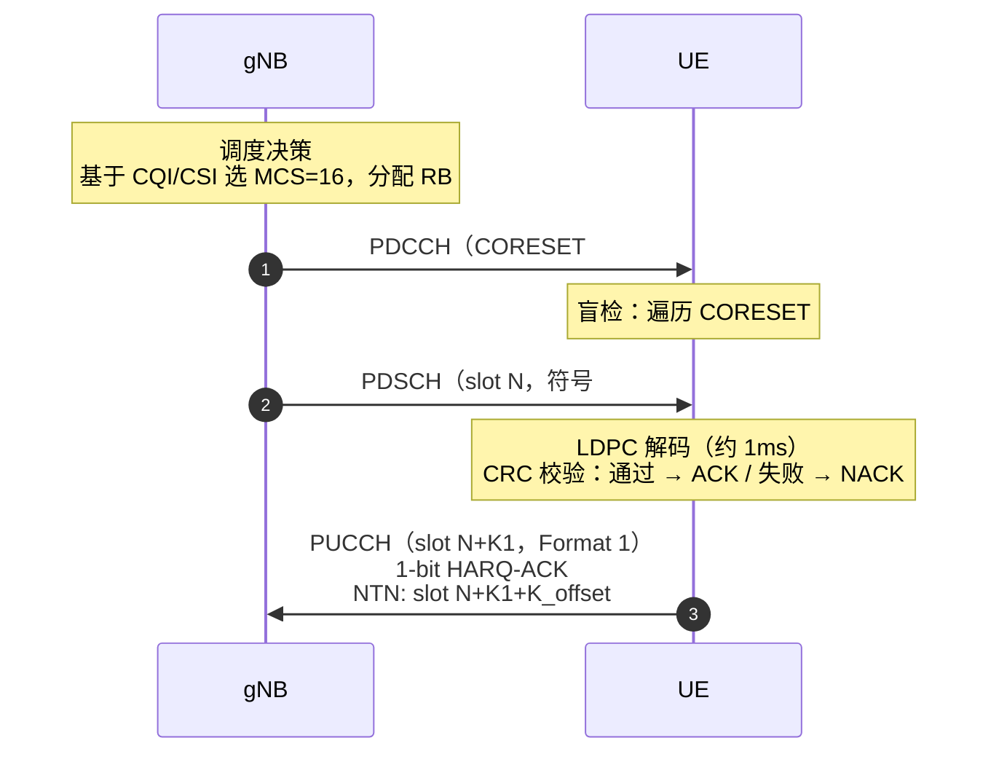

# 5G NR PDCCH & DCI 调度机制

> **3GPP 版本定锚**
>
> | 内容 | 版本 | 规范 |
> |---|---|---|
> | CORESET / Search Space / 盲检基础 | **Rel-15** | 38.211 §7.3，38.213 §10 |
> | DCI format 0_0/0_1/1_0/1_1/2_x | **Rel-15** | 38.212 §7.3 |
> | PDCCH 编码处理链（Polar Code）| **Rel-15** | 38.212 §7.3 |
> | Rel-16 增强：Multi-TRP PDCCH | **Rel-16** | 38.213 §10.3 |
> | NTN DCI：K-offset 大时延补偿 | **Rel-17** | 38.821 §6.3 |

---

## 📡 知识定位

```
Phase 2 骨架层
│
├── ✅ RACH 随机接入          UE 第一次开口，建立上行同步，获得 C-RNTI
│
├── ▶ PDCCH & DCI 调度机制    ← 我们在这里
│     核心问题：UE 获得 C-RNTI 后，每个 slot 里
│               如何找到属于自己的调度指令？
│
├── HARQ 混合自动重传          DCI 触发的重传机制
├── MIMO & Beamforming        DCI 中的预编码信息
└── CSI 框架                  驱动 DCI 中 MCS 选择的反馈机制
```

**一句话理解**：PDCCH 是调度器的"广播电台"，DCI 是每条"播报内容"。
UE 的任务是在茫茫无线资源中，用自己的 C-RNTI 当"频道号"，找到属于
自己的那条 DCI，然后按指令行事。这个"找"的过程就叫**盲检（Blind Decoding）**。

---

## 💡 核心逻辑

### 1. PDCCH 在 5G 架构中的位置

```
gNB 调度器（每 slot 决策）
  │
  ├── 决策：给 UE-A 下行调度（PDSCH：MCS=16，RB#10~60，时域符号#2~13）
  │         给 UE-B 上行授权（PUSCH：MCS=9，RB#0~25，时域符号#6~13）
  │
  ▼
PDCCH（携带 DCI）                ← 本课核心
  │
  ├── DCI format 1_1 → UE-A：解调 PDSCH
  └── DCI format 0_1 → UE-B：发送 PUSCH

  每个 UE 用自己的 C-RNTI 盲检 PDCCH，找到属于自己的 DCI
```

**与 LTE 的核心差异**：

| 维度 | LTE PDCCH | NR PDCCH |
|---|---|---|
| 时域位置 | 固定前 1~3 个符号 | **灵活**，由 CORESET 定义 |
| 频域范围 | 全载波带宽 | **局部**，由 CORESET 频域 bitmap 限定 |
| 信道编码 | 咬尾卷积码 | **Polar Code**（更优） |
| 多 CORESET | 不支持 | 支持最多 **3 个 CORESET** |
| Beam 关联 | 无 | **TCI State**（每 CORESET 关联波束）|

---

### 2. CORESET：PDCCH 的时频容器

**CORESET（Control Resource Set）** 是 PDCCH 候选传输的时频矩形区域，
是理解 NR 调度的基础概念。

#### 2.1 CORESET 的三个核心参数

**频域**：由 `frequencyDomainResources`（45 bit bitmap）指定，以 6 RB 为粒度：

```
45 bit bitmap，每 bit 对应 BWP 内连续 6 个 RB（REG-bundle）：

bit[0]=1 → RB#0~5  启用为 CORESET 频域
bit[1]=1 → RB#6~11 启用
bit[2]=0 → RB#12~17 不用
...
bit[44]=1 → BWP 最高端 6 RB

例：'111111111111111110000000000000000000000000000'B
   → 前 18 个 6-RB 块 = 前 108 个 RB 均为 CORESET 频域
```

**时域**：`duration`（1/2/3 个 OFDM 符号），从 `monitoringSymbolsWithinSlot` 指定的起始符号开始。

**映射方式**：`cce-REG-MappingType`
- `interleaved`：CCE 分散映射到不连续 REG，获得频率分集
- `nonInterleaved`：CCE 连续映射，适合 Massive MIMO 波束成形

#### 2.2 CCE 与 REG：PDCCH 的资源单元层次

```
REG（Resource Element Group）= 1 个 RB × 1 个 OFDM 符号 = 12 个 RE
  其中 PDCCH DMRS 占 3 个 RE → 有效 RE = 9 个（携带 QPSK 调制符号）

CCE（Control Channel Element）= 6 个 REG = 54 个有效 RE = 108 bit（QPSK）

聚合级别（Aggregation Level，AL）= 一个 PDCCH 候选占用的 CCE 数量：
  AL = 1  →  1 CCE  = 108 bit 编码容量（最不鲁棒，频谱效率最高）
  AL = 2  →  2 CCE  = 216 bit
  AL = 4  →  4 CCE  = 432 bit
  AL = 8  →  8 CCE  = 864 bit
  AL = 16 → 16 CCE  = 1728 bit（最鲁棒，覆盖最差信道）
```

**AL 选择逻辑**：
```
信道质量好（SNR 高）→ AL=1/2，节省 CORESET 资源
信道质量差（覆盖边缘、NTN 大路损）→ AL=8/16，保障解码可靠性
```

#### 2.3 CORESET#0 的特殊地位

CORESET#0 是 UE 初始接入时唯一已知的 CORESET，由 **MIB 中 `pdcch-ConfigSIB1`（8 bits）隐式决定**，查 38.213 Table 13-1 ~ 13-15：

```
pdcch-ConfigSIB1 = 8 bits
  高 4 bits → coreset-zero index → 查表得 CORESET#0 的频域起始位置和大小
  低 4 bits → search-space-zero index → 查表得 Search Space #0 的监听周期
```

<CORESETConfigurator />

---

### 3. Search Space："何时何地盲检"的规则书

CORESET 定义了"资源在哪里"，Search Space 定义"何时去找、找什么类型的 DCI"。

**Search Space 的六个核心参数**：

```
SearchSpace IE（38.331）

searchSpaceId               → SS 编号（0~39）
controlResourceSetId        → 关联的 CORESET ID
monitoringSlotPeriodicityAndOffset  → 监听周期（sl1/sl2/sl4/...sl2560）+ 偏移
monitoringSymbolsWithinSlot → 14 bit bitmap，哪些符号开始监听
                              '10000000000000'B → 仅第 0 个符号
nrofCandidates              → 每个 AL 的候选 PDCCH 数量（0~8）
searchSpaceType             → common（公共）或 ue-Specific（UE 专属）
```

#### 3.1 两种 Search Space 类型

**CSS（Common Search Space，公共搜索空间）**：

| 类型 | RNTI | 用途 |
|---|---|---|
| Type0-PDCCH | SI-RNTI | SIB1 接收（CORESET#0）|
| Type0A-PDCCH | SI-RNTI | 其他 SIB |
| Type1-PDCCH | RA-RNTI / TC-RNTI | RACH（Msg2/Msg4）|
| Type2-PDCCH | P-RNTI | 寻呼（Paging）|
| Type3-PDCCH | SFI-RNTI / INT-RNTI / TPC-x-RNTI | TDD 格式/抢占/功控 |

**USS（UE-specific Search Space，UE 专属搜索空间）**：
- 使用 C-RNTI / CS-RNTI / SP-CSI-RNTI
- 监听 DCI format 0_1（上行调度）和 1_1（下行调度）
- 通过 RRC Reconfiguration 专属配置

#### 3.2 监听周期的工程意义

```
monitoringSlotPeriodicityAndOffset = sl4, offset = 2

表示：从第 2 个 slot 开始，每 4 个 slot 监听一次

时隙序列：0  1  2  3  4  5  6  7  8  9 10 11 ...
监听位置：            ▲        ▲        ▲
（offset=2，周期=4）

工程权衡：
  周期小（sl1）→ 调度灵活，但 UE 功耗高（每 slot 都要盲检）
  周期大（sl20）→ 功耗低，但调度延迟增大
```

---

### 4. 盲检（Blind Decoding）：UE 的"大海捞针"

盲检是 PDCCH 接收的核心算法，也是理解 PDCCH 容量限制的关键。

#### 4.1 盲检的本质

UE **不知道**以下信息（需要通过"试"来发现）：
- DCI 落在哪些 CCE 上（CCE 起始索引）
- DCI 使用的 AL（聚合级别）
- DCI 是什么格式（format 0_0 / 1_0 / 0_1 / 1_1 / ...）

因此 UE 必须对所有可能的组合进行**并行解码尝试**，通过 RNTI 解掩 CRC 来判断是否解码成功：

```
盲检过程（每个 slot，每个 Search Space）：

FOR 每个 AL in {1, 2, 4, 8, 16}:
  FOR 每个候选位置（nrofCandidates 个）:
    FOR 每个 DCI format（该 SS 配置的格式）:
      尝试解码该 CCE 位置的 PDCCH
      用 C-RNTI 解掩 CRC 后 16 bit
      IF CRC 通过：
        ✅ 找到！该 DCI 是给我的，提取调度信息
      ELSE：
        继续下一个候选
```

#### 4.2 盲检次数限制（38.213 §10.1）

盲检次数有硬上限（防止 UE 处理过载）：

| UE 能力 | 最大盲检次数/slot | 最大 CCE 数/slot |
|---|---|---|
| 基础（Rel-15）| **44 次** | **56 CCE** |
| 增强（Rel-15）| **最多 4 个 SS，3 个 CORESET** | — |

这意味着：并非所有 SS 和 AL 组合都能无限配置，gNB 必须在"灵活性"和"UE 处理能力"之间权衡。

<BlindDecodingVisualizer />

---

### 5. PDCCH 传输处理链（7 步）

**参考：38.212 §7.3.2**

```
DCI 比特流
      │
      ▼ (1) IE 复用
  所有 DCI 字段拼接；若总长 < 12 bit → 补零至 12 bit

      │
      ▼ (2) CRC 附加（24 bit）+ RNTI 掩码
  CRC 计算 → 24 bit CRC 附加到 DCI 尾部
  后 16 bit XOR 目标 RNTI → 接收端用 RNTI 反解，验证"是否给我的"

      │
      ▼ (3) 交织（Interleaving）
  CRC 比特分散到信息比特之间（最大输入 164 bit，DCI 不含 CRC 最大 140 bit）

      │
      ▼ (4) Polar Code 编码
  nmax = 9（最大编码长度 2^9 = 512 bit）
  IIL = 1，npc = 0，npcwm = 0
  输出：d[0], d[1], ..., d[N-1]（N 由 AL 决定）

      │
      ▼ (5) 速率匹配
  子块交织（IBIL=0，无额外交织）
  比特选择 → 输出长度 E = AL × 9 RE × 2 bit/RE（QPSK）

      │
      ▼ (6) 加扰
  cinit = (RNTI × 2^16 + nID) mod 2^31
  nID = PDCCH-DMRS-Scrambling-ID（UE 专属，RRC 配置）
       或 NID_cell（物理小区 ID，若无专属配置）

      │
      ▼ (7) QPSK 调制 → RE 映射
  QPSK（固定，不支持高阶调制 → 最大鲁棒性）
  按 k（子载波）升序、l（符号）升序映射到 CORESET 内的 RE
  天线端口：p = 2000（PDCCH 专属端口）
  能量缩放因子：β_PDCCH
```

**为什么 PDCCH 固定 QPSK 而不用高阶调制？**

PDCCH 的设计哲学是"**鲁棒性优先**"——UE 必须在接收任何调度信息之前先解码 PDCCH，若 PDCCH 失败则整个调度链路崩溃。QPSK 在低 SNR 下的可靠性远优于 16QAM，这个代价（频谱效率较低）是值得的，因为 PDCCH 占用的 RE 数量相对较少。

---

### 6. DCI 格式详解

#### 6.1 DCI 格式总览

| DCI Format | 用途 | 典型 RNTI | 主要字段 |
|---|---|---|---|
| **0_0** | UL 调度（简化版）| C-RNTI | 频域 RIV、时域索引、MCS、HARQ |
| **0_1** | UL 调度（完整版）| C-RNTI | 同上 + BWP 指示、SRS、预编码、PTRS |
| **1_0** | DL 调度（简化版）| C-RNTI / P-RNTI / SI-RNTI / RA-RNTI | 频域 RIV、时域、MCS、HARQ |
| **1_1** | DL 调度（完整版）| C-RNTI | 同上 + 多码字、TCI、DMRS 配置 |
| **2_0** | Slot Format 指示 | SFI-RNTI | 时隙内符号方向（TDD 动态调度）|
| **2_1** | 下行抢占指示 | INT-RNTI | 哪些 PRB/符号被 URLLC 抢占 |
| **2_2** | TPC 功率控制 | TPC-PUSCH-RNTI | PUSCH/PUCCH 功率调整 |
| **2_3** | SRS 功率控制 | TPC-SRS-RNTI | SRS 发射功率 |

#### 6.2 DCI format 1_1 深度解析（最常用的下行调度 DCI）

**参考：38.212 §7.3.1.2.2**

```
DCI format 1_1（DL 调度，C-RNTI 加扰）字段清单：

┌─────────────────────────────────────────────────────────────────┐
│ 字段名                    │ 比特数     │ 含义                    │
├─────────────────────────────────────────────────────────────────┤
│ Identifier for DCI format │ 1         │ 1=DL，0=UL（区分 0_1）  │
│ Carrier indicator         │ 0/3       │ 载波聚合场景             │
│ BWP indicator             │ 0/1/2     │ 切换激活 BWP            │
│ Frequency domain resource │ Variable  │ RIV（Type1）或 Bitmap   │
│ Time domain resource      │ 4 bits    │ SLIV 行索引→查 pdsch_   │
│                           │           │ AllocationList          │
│ VRB-to-PRB mapping        │ 1 bit     │ 交织/非交织              │
│ PRB bundling size         │ 0/1       │ 预编码 bundle 大小       │
│ Rate matching indicator   │ 0/2       │ ZP-CSI-RS 速率匹配      │
│ ZP CSI-RS trigger         │ 0/2       │ 触发非周期 ZP-CSI-RS    │
│ MCS (CW0)                 │ 5 bits    │ MCS 索引（查 Table）     │
│ New data indicator (CW0)  │ 1 bit     │ 新传=1/重传=0            │
│ Redundancy version (CW0)  │ 2 bits    │ RV = 0/1/2/3            │
│ MCS (CW1)                 │ 5 bits    │ 第二码字（若配置）        │
│ New data indicator (CW1)  │ 1 bit     │                         │
│ Redundancy version (CW1)  │ 2 bits    │                         │
│ HARQ process number       │ 4 bits    │ 0~15（最多 16 个进程）   │
│ Downlink assignment index │ 1/2 bits  │ DAI（FDD=1b，TDD=2b）   │
│ TPC for PUCCH             │ 2 bits    │ HARQ-ACK 功率控制        │
│ PUCCH resource indicator  │ 3 bits    │ HARQ-ACK 用的 PUCCH 资源│
│ PDSCH-to-HARQ timing      │ 3 bits    │ K1：PDSCH→HARQ-ACK 时隙 │
│ Antenna ports             │ 4/5/6 bits│ DMRS 端口配置            │
│ TCI                       │ 3 bits    │ TCI state（波束指向）    │
│ SRS request               │ 2/3 bits  │ 触发 SRS 上行探测        │
│ CBG transmission info     │ 0~8 bits  │ 码块组重传（CBG-based）  │
│ CBG flushing              │ 0/1       │ 清空 CBG 缓存            │
│ DMRS sequence init        │ 1 bit     │ DMRS 序列初始值          │
└─────────────────────────────────────────────────────────────────┘
```

> **PDSCH-to-HARQ timing（K1）**：从 PDSCH 接收完毕到 UE 发送 HARQ-ACK 的时隙间隔。地面 TN 通常 K1=1（下一个 slot），NTN 需要大幅增大（见第 7 节）。

#### 6.3 DCI 大小对齐规则

为了防止 UE 盲检时"大小不匹配"导致混淆，38.212 §7.3.1.0 规定：
- 同一个 Search Space 内，所有 DCI 的大小必须相同（若不同则填充 padding bits）
- DCI 0_0 和 1_0 的大小需相同（若不同则对较小者补零）

<DCIFieldParser />

---

### 7. NTN (Rel-17) 的 PDCCH 挑战：K-offset

#### 7.1 问题根源

DCI format 1_1 中的 **PDSCH-to-HARQ timing（K1）** 在地面网络默认 = 1 slot。
但在 NTN 中：

```
地面 TN 时序：
  slot N:   gNB 发送 PDSCH
  slot N+1: UE 发送 HARQ-ACK（K1=1）
  RTT ≈ 1ms，可行

NTN 时序（LEO，仰角 30°）：
  slot N:   gNB 发送 PDSCH，经 2.33ms 到达 UE
  slot N+X: UE 解码完成，准备发 HARQ-ACK
  RTT ≈ 8.5ms，期间经历约 17 个 slot（μ=1）
  → K1=1 完全不够！HARQ-ACK 根本来不及发送
```

#### 7.2 Rel-17 解法：K-offset（38.213 §9.2.3）

Rel-17 引入全局 K-offset，作用于 DCI 中所有时序相关字段：

$$
K_1^{\text{eff}} = K_1 + K_{\text{offset}}
$$

$$
K_2^{\text{eff}} = K_2 + K_{\text{offset}}
$$

| 字段 | 原含义 | NTN 有效值 |
|---|---|---|
| K1（PDSCH→HARQ-ACK）| 1~8 slots | K1 + K_offset（可达数十 slots）|
| K2（DCI→PUSCH）| 1~32 slots | K2 + K_offset |
| PDCCH-to-PDSCH | 相对位置 | 不受 K-offset 影响（同 slot 内）|

**K_offset 配置**：通过 RRC 参数 `schedulingRequestResourceConfig-r17` 或 `k-Offset` 下发，取值范围扩展至 0~1023 slots（Rel-17）。

#### 7.3 K-offset 的工程计算

```
LEO 550km，仰角 30°，μ=1（SCS=30kHz，slot=0.5ms）：

单程时延 τ ≈ 2.12ms
RTT ≈ 4.24ms + gNB处理时间（≈1ms）+ UE处理时间（≈1ms）≈ 6.24ms

所需最小 K-offset：
  K_offset = ⌈RTT / T_slot⌉ = ⌈6.24 / 0.5⌉ = 13 slots

实际取 K_offset = 15～20 slots（留余量）

NTN Rel-17 最大支持 K_offset = 1023 slots
（可覆盖 GEO 卫星 RTT ≈ 600ms → 1200 slots @ μ=1，但 GEO 还在研究中）
```

---

### 8. 完整调度交互：从 DCI 到数据



---

## 🔍 实战信令视角（IE / Log Analysis）

### 关键 IE 速查

```
RRC: PDCCH-Config（专用 PDCCH 配置）
├── controlResourceSetToAddModList（最多 3 个 CORESET）
│   └── ControlResourceSet
│       ├── controlResourceSetId      ← CORESET 编号（1~11，0 由 MIB 隐式决定）
│       ├── frequencyDomainResources  ← 45 bit bitmap（6 RB 粒度）
│       ├── duration                  ← 1/2/3 OFDM 符号
│       ├── cce-REG-MappingType       ← interleaved / nonInterleaved
│       ├── precoderGranularity       ← sameAsREG-bundle / allContiguousRBs
│       └── tci-StatesPDCCH-ToAddList ← 关联的 TCI State（波束）
│
└── searchSpacesToAddModList（最多 10 个 SS）
    └── SearchSpace
        ├── searchSpaceId             ← SS 编号
        ├── controlResourceSetId      ← 关联 CORESET
        ├── monitoringSlotPeriodicityAndOffset  ← 监听周期/偏移
        ├── monitoringSymbolsWithinSlot         ← 14 bit，起始监听符号
        ├── nrofCandidates            ← 每 AL 的候选数
        └── searchSpaceType           ← common / ue-Specific

RRC（Rel-17 NTN）:
└── k-Offset-r17                      ← 全局 K-offset，作用于所有时序字段
```

### 🚨 故障排查速查表

| 故障现象 | 首先检查 | 最可能根因 |
|---|---|---|
| UE 完全收不到 PDCCH | `frequencyDomainResources` bitmap | CORESET 频域位置与 gNB 配置不一致 |
| PDCCH 偶发漏检 | `nrofCandidates` + `duration` | 候选数不足或 CORESET 符号数配置错误 |
| DCI 解码成功但 PDSCH 不对 | `monitoringSymbolsWithinSlot` | UE 在错误符号开始盲检，CCE 索引偏移 |
| HARQ-ACK 时序错乱（NTN）| `k-Offset-r17` 配置 | K-offset 未正确配置，HARQ-ACK 比预期早发 |
| UE 进入 RRC_CONNECTED 后无数据 | USS 是否配置 | RRC Setup 未携带 PDCCH-Config（专属 SS）|
| 高负载时 PDCCH 容量不足 | 盲检次数限制（44次/slot）| CORESET 和 SS 配置的候选总数超过上限 |

::: code-group

```log [PDCCH 解码成功 Log]
[PHY] CORESET#1 monitoring: slot=42, symbols=0, AL=4
[PHY] CCE index=8, DCI format=1_1, RNTI=0xC1A3 ✅
[MAC] DCI 1_1 decoded: MCS=16, RB_start=10, RB_len=50
[MAC] HARQ process=3, NDI=1(new), K1=4
[PHY] PDSCH scheduled: slot=42, sym#2~13, RB#10~59
```

```log [盲检失败（CORESET 配置错误）Log]
[PHY] CORESET#1 monitoring: slot=42, symbols=0, AL=4
[PHY] No PDCCH detected (all 44 candidates failed CRC)
[PHY] CORESET freq bitmap: '111111100000...' (RB#0~41)
      gNB configured:      '000000111111...' (RB#42~83)
根因：UE 侧 frequencyDomainResources 与 gNB 配置方向相反
```

```log [NTN K-offset 未配置（HARQ 时序错乱）Log]
[MAC] HARQ-ACK sent at slot N+4 (K1=4, K_offset=0)
[gNB] HARQ-ACK expected at slot N+4+15=N+19 (K_offset should be 15)
[gNB] PUCCH not detected at N+19 → NACK assumed → retransmission
根因：k-Offset-r17 未配置，UE 用 K1=4 而非 K1+K_offset=4+15=19 发 ACK
修复：在 RRC Reconfiguration 中添加 k-Offset-r17 = 15
```

:::

---

## 🐍 仿真实现思路

### 伪代码骨架

```
══════════════════════════════════════════════════════════════
【数学层】CCE 起始索引计算（38.213 §10.1）
──────────────────────────────────────────────────────────────
对于 AL=L 的第 m 个候选（m=0,...,M_L-1）：

CCE_start(m) = L × { (Y_p + floor(m×N_CCE / (L×M_L)) + n_CI) mod floor(N_CCE/L) }

其中：
  Y_p    = (A_p × Y_{p-1}) mod D（UE 专属哈希，避免所有 UE 同位置）
  N_CCE  = CORESET 内总 CCE 数
  n_CI   = 载波指示字段值
══════════════════════════════════════════════════════════════
【算法层】PDCCH 盲检状态机
──────────────────────────────────────────────────────────────
FOR each slot:
  FOR each Search Space in configured_SS_list:
    IF slot matches monitoringSlotPeriodicityAndOffset:
      FOR each AL in [1, 2, 4, 8, 16]:
        n_candidates = nrofCandidates[AL]
        FOR m in range(n_candidates):
          cce_start = compute_cce_start(AL, m, N_CCE, Y_p)
          polar_decode(coreset_res[cce_start:cce_start+AL*6])
          descramble(cinit = RNTI×2^16 + nID)
          crc_check(target_rnti)
          IF pass:
            extract_dci_fields()
            RETURN success
══════════════════════════════════════════════════════════════
```

**完整仿真代码**：见 `simulation/phase2/pdcch_sim.py`

实现内容：
- CCE 起始索引计算（含 UE 专属哈希 $Y_p$）
- PDCCH 盲检状态机（多 SS / 多 AL 并行）
- DCI format 1_1 字段打包/解包
- CORESET 时频资源可视化
- NTN K-offset 对 HARQ 时序的影响分析

---

## 🔗 走向 HARQ

### DCI 下达了，数据传完了，然后呢？

PDCCH 下发了调度指令（DCI format 1_1），UE 按指令接收了 PDSCH。
接下来有两种情况：

```
情况 A：PDSCH 解码成功（CRC 通过）
  UE 在 slot N+K1（+K_offset）发送 HARQ-ACK = 1
  gNB 收到 ACK → 标记该 HARQ 进程为"完成"→ 数据确认传达

情况 B：PDSCH 解码失败（CRC 失败）
  UE 发送 HARQ-NACK = 0
  gNB 收到 NACK → 触发重传：
    选项 1：Chase Combining（发送相同的 RV=0）
    选项 2：Incremental Redundancy（发送 RV=1/2/3，不同冗余版本）
    重传也用 PDCCH 调度（DCI format 1_1，NDI 不翻转 = 重传标志）
```

**下一课的核心问题**：
- 最多重传多少次？HARQ 进程（0~15）如何轮转？
- IR（增量冗余）为什么比 CC（追踪合并）效果更好？
- NTN 中 HARQ RTT 长达数十 ms，是否要关闭 HARQ？如何改用 RLC ARQ 替代？

---

## 📝 版本演进与工程自测

### 版本演进速览

| Feature | Rel-15 | Rel-16 | Rel-17 |
|---|:---:|:---:|:---:|
| CORESET / Search Space 基础 | ✅ | 不变 | 不变 |
| DCI format 0_0/0_1/1_0/1_1 | ✅ | 增强 | 不变 |
| DCI format 2_0~2_3 | ✅ | 不变 | 不变 |
| Multi-TRP PDCCH（空间分集）| ❌ | ✅ | 增强 |
| Enhanced Type3 CSS | ❌ | ✅ | 不变 |
| NTN K-offset | ❌ | ❌ | ✅ |
| Reduced Capability（RedCap）PDCCH 精简 | ❌ | ❌ | ✅ |
| DCI format 4_x（侧链路调度）| ❌ | ✅（部分）| 增强 |

---

### 面试级自测题

**Q1 · 概念题**

> 一个 gNB 配置了 CORESET#1，`frequencyDomainResources = '111111111111111110000000000000000000000000000'B`，`duration = 1`。这个 CORESET 共有多少个 CCE？最多能同时调度多少个 AL=4 的 UE？

:::details 💡 展开答案

**bitmap 解析**：前 18 个 bit 为 1，其余为 0。每个 bit 对应 6 个 RB：

$$N_{RB}^{CORESET} = 18 \times 6 = 108 \text{ RB}$$

每个 REG = 1 RB × 1 符号（duration=1），CORESET 内 REG 总数：

$$N_{REG} = 108 \times 1 = 108 \text{ REG}$$

每个 CCE = 6 REG：

$$N_{CCE} = 108 / 6 = \mathbf{18 \text{ CCE}}$$

AL=4 时，每个 PDCCH 候选占 4 CCE：

$$N_{UE,max} = \lfloor 18 / 4 \rfloor = \mathbf{4 \text{ 个 UE}}$$（同时调度）

但实际还受盲检次数限制（44次/slot），需综合考虑。

参考：38.211 §7.3.2，38.213 §10.1

:::

---

**Q2 · 计算题**

> LEO NTN 网络，μ=1（SCS=30kHz），卫星轨道高度 1200km，UE 仰角 45°。
>
> (a) 计算单程传播时延（ms）
> (b) DCI format 1_1 中 K1 字段可编码值为 1~8 slots。若不使用 K-offset，最大 K1 = 8 slots 能否覆盖 HARQ RTT？
> (c) 需要配置多大的 K-offset（slots）？

:::details 💡 展开答案

**(a)** 轨道半径 $r = 6371 + 1200 = 7571$ km，仰角 45°：

$$d = \sqrt{r^2 - (R_E \cos\theta)^2} - R_E \sin\theta$$
$$= \sqrt{7571^2 - (6371 \times \cos 45°)^2} - 6371 \times \sin 45°$$
$$\approx \sqrt{57320041 - 20301401} - 4504 \approx 6083 - 4504 \approx 1579 \text{ km}$$

$$\tau = \frac{1579}{300} \approx \mathbf{5.26 \text{ ms}}$$

**(b)** RTT（含 gNB + UE 处理各约 1ms）：

$$\text{RTT} \approx 2 \times 5.26 + 2 = 12.52 \text{ ms}$$

μ=1 slot 时长 = 0.5ms，K1=8 slots = 4ms << 12.52ms

**不够**，差距约 8.52ms ≈ 17 slots。

**(c)** 所需 K-offset：

$$K_\text{offset} = \left\lceil \frac{12.52 - 4}{0.5} \right\rceil = \left\lceil 17.04 \right\rceil = \mathbf{18 \text{ slots}}$$

建议取 K_offset = 20 slots（留 2 slots 余量）。

:::

---

**Q3 · 工程排障题（综合）**

> 现场问题：UE 处于 RRC_CONNECTED，基带显示 UE 在 CORESET#1 的 USS（Search Space#2）盲检，每 slot 均有 44 次盲检尝试，但 DCI 始终无法解码，PDCCH BLER = 100%。信道质量良好（DL RSRP = -90dBm，SINR = 18dB）。Wireshark 显示 gNB 正在发 PDCCH（能看到 CORESET#1 的 RE 有信号），RRC Reconfiguration 中 `controlResourceSetId = 1`。
>
> 请列出最可能的 2~3 个根因，并说明各自的排查方法。

:::details 💡 展开答案

**根因 1：加扰 ID（nID）不一致**

PDCCH 加扰 cinit = (RNTI × 2^16 + **nID**) mod 2^31。若 gNB 配置了 `PDCCH-DMRS-Scrambling-ID`（`pdcch-Config → controlResourceSet → pdcch-DMRS-ScramblingID`），但 UE 实现使用了默认值 NID_cell，加扰序列完全不同 → 解扰后全部 CRC 失败。

**排查**：比对 RRC Reconfiguration 中 CORESET#1 的 `pdcch-DMRS-ScramblingID` 字段值，确认 UE 是否正确应用。

---

**根因 2：`frequencyDomainResources` bitmap 解析方向相反**

45 bit bitmap 的 MSB 对应 BWP 最低端的 RB 还是最高端？若 UE 和 gNB 的 bit 顺序理解相反，CORESET 频域位置错位，UE 在错误的 RB 上盲检。

**排查**：抓取 UE 侧 CORESET RE 监听位置，与 gNB 侧 PDCCH 实际发送位置对比，看是否存在对称偏移（如 gNB 在 RB#0~41，UE 监听 RB#3~44）。

---

**根因 3：Search Space 监听符号未对齐**

`monitoringSymbolsWithinSlot = '10000000000000'B` → UE 应在符号 #0 开始监听。若 gNB 实际在符号 #2 发送（duration=1，从 symbol #2 开始），UE 在 #0 盲检时收到的是 PDSCH 或空 RE，全部失败。

**排查**：检查 gNB 侧 PDCCH 实际发送的起始符号 vs RRC 配置的 `monitoringSymbolsWithinSlot`，确认一致性。

参考：38.213 §10.1（盲检），38.211 §7.3.2（CORESET 映射），38.212 §7.3.2（加扰）。

:::

---

## 参考资料

- **3GPP TS 38.211 v15.7.0** — CORESET 定义（§7.3.2）；PDCCH RE 映射（§7.3.2.3）
- **3GPP TS 38.212 v15.7.0** — PDCCH 传输处理（§7.3.2）；DCI 格式（§7.3.1）
- **3GPP TS 38.213 v15.7.0** — 搜索空间（§10.1）；盲检次数限制；PDCCH-to-PDSCH 时序；K1
- **3GPP TS 38.331 v15.7.0** — RRC IE：PDCCH-Config、ControlResourceSet、SearchSpace
- **3GPP TR 38.821 v17.3.0** — NTN K-offset（§6.3）；NTN 调度时序增强
- Kazuki Takeda et al. — *Understanding the Heart of the 5G Air Interface: An Overview of PDCCH for 5G NR* (arXiv:1910.01711)
- ShareTechnote — [5G PDCCH](https://www.sharetechnote.com/html/5G/5G_PDCCH.html)
- ShareTechnote — [5G Search Space](https://www.sharetechnote.com/html/5G/5G_SearchSpace.html)
- ShareTechnote — [5G DCI](https://www.sharetechnote.com/html/5G/5G_DCI.html)
