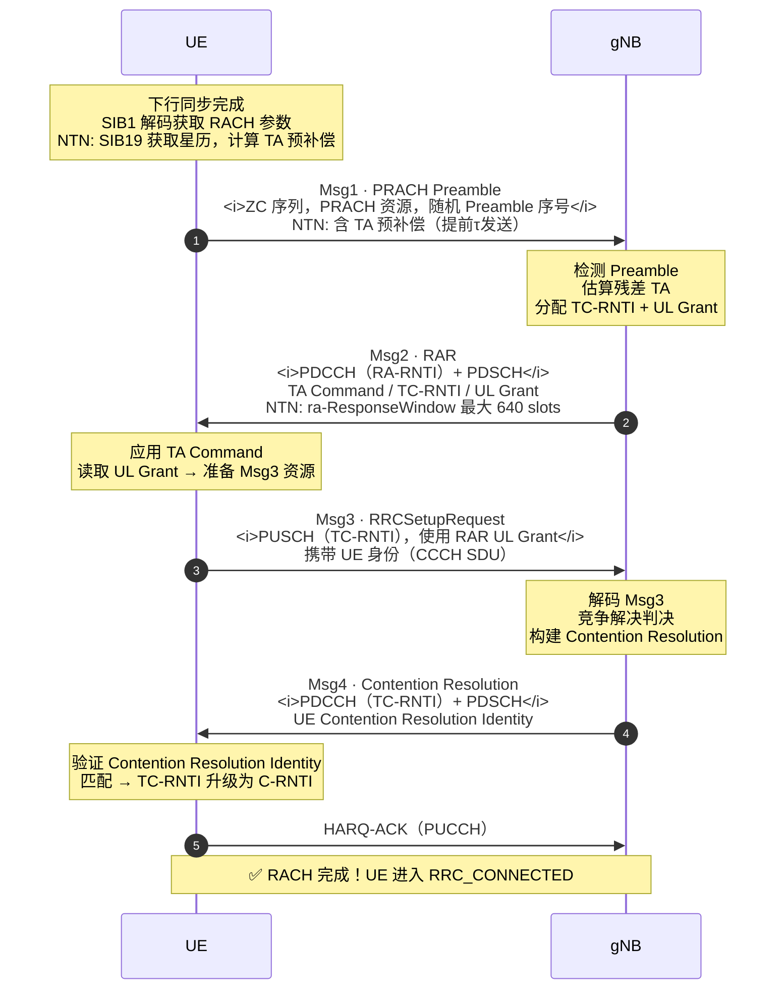

# 5G NR RACH 随机接入流程

> **3GPP 版本定锚**
>
> | 内容 | 版本 | 规范 |
> |---|---|---|
> | 4-step CBRA / CFRA 基础流程 | **Rel-15** | 38.321 §5.1，38.300 §9.2.6 |
> | 2-step RACH（MsgA / MsgB）| **Rel-16** | 38.321 §5.1.1a |
> | Beam-based RACH（SSB / CSI-RS 关联）| **Rel-15** | 38.213 §8.1 |
> | NTN RACH 增强（大时延，ra-ResponseWindow 扩展）| **Rel-17** | 38.821 §6.3 |

---

## 📡 知识定位

```
Phase 2 骨架层
│
├── ▶ RACH 随机接入           ← 我们在这里
│     核心问题：UE 第一次"开口说话"时，
│               如何在完全未知的信道下建立上行同步？
│
├── PDCCH & DCI 调度机制      RACH 结束后，调度器如何指挥 UE
├── HARQ 混合自动重传          数据传输的可靠性保障
├── MIMO & Beamforming        空间维度的资源利用
├── CSI 框架                  MIMO 的反馈信息来源
└── Beam Management           波束管理（Phase 2 收尾）
```

**一句话理解**：RACH 是 UE 与网络建立关系的"握手仪式"。
在此之前，UE 只能"听"（接收下行），无法"说"（上行传输）。
RACH 解决了三个核心问题：**上行同步、身份标识、资源申请**。

---

## 💡 核心逻辑

### 1. 为什么需要 RACH？

#### 1.1 下行同步 vs 上行同步的本质不对称

下行同步已在 Phase 1 的 Channel Mapping 中学过——UE 通过检测 PSS/SSS 完成时频同步。
但上行同步面临一个根本性挑战：

```
下行同步（已解决）：
  gNB 广播 SSB（PSS + SSS + PBCH）→ 所有 UE 同时接收
  时域对齐问题：gNB 控制发送时刻，UE 只需"听"即可

上行同步（待解决）：
  问题：UE 距 gNB 的距离各不相同
        UE-A（100m）：上行信号到达 gNB 耗时 ≈ 0.33 μs
        UE-B（10km）：上行信号到达 gNB 耗时 ≈ 33.3 μs
        UE-C（LEO NTN，550km）：上行信号耗时 ≈ 1.83 ms

  如果不补偿传播时延：
        UE-A 的信号先到 → 干扰了 UE-B 的上行时隙
        → 上行多址接入彻底失效！
```

**TA（Timing Advance）**：RACH 的核心目的之一就是让 gNB 测量每个 UE 的上行时延，
然后下发 TA 命令，让 UE 提前发送以补偿传播时延。

#### 1.2 RACH 触发条件（38.300 §9.2.6）

| 触发场景 | RRC 状态 | RACH 类型 | 说明 |
|---|---|---|---|
| **初始接入** | IDLE | CBRA | 最常见，UE 首次注册 |
| **RRC 重建** | 断开→重建 | CBRA | 无线链路失败（RLF）后 |
| **切换** | CONNECTED | **CFRA** | 网络分配专属前导，无竞争 |
| **UL 数据到达（非同步）**| CONNECTED | CBRA | 长时间无上行，TA 失效 |
| **RRC_INACTIVE 恢复** | INACTIVE | CBRA/CFRA | 5G 新增状态（LTE 无）|
| **SCell 添加（载波聚合）**| CONNECTED | CFRA | 建立 SCell 上行同步 |
| **Beam 失败恢复** | CONNECTED | CFRA | 5G NR 专属，LTE 无 |
| **On-demand SI 请求** | IDLE/INACTIVE | CBRA | 按需获取特定 SIB |

---

### 2. 两种 RACH 类型

#### 2.1 CBRA vs CFRA 对比

```
CBRA（Contention Based Random Access，竞争接入）：
  64 个前导码中，UE 随机选一个
  多个 UE 可能选同一个 → 碰撞（Contention）
  → 需要第 4 步"竞争解决"来确认唯一性
  适用：初始接入、RLF 重建、状态恢复

CFRA（Contention Free Random Access，非竞争接入）：
  网络预先为每个 UE 分配专属前导码
  不可能碰撞 → 无需竞争解决步骤
  → 只需 2 步（Msg1 + Msg2）即可完成
  适用：切换、Beam 失败恢复（需 UE 已在连接态）
```

<CollisionProbabilityChart />

---

### 3. 4-Step CBRA 完整流程（初始接入）

这是最重要也最复杂的 RACH 过程，必须彻底理解每一步的"为什么"。

#### 3.1 前置条件：下行同步与 SI 获取

```
UE 开机
  │
  ├── PSS/SSS 检测 → 帧同步，获取 PCI
  ├── PBCH 解码   → MIB（SFN / SCS / k_SSB / CORESET#0 配置）
  └── SIB1 解码   → RACH 参数（prach-ConfigurationIndex / rach-ConfigCommon）
                    NTN 额外读取：SIB19（卫星星历 → TA 预补偿计算）
```

---

#### 3.2 Msg1：PRACH Preamble

```
UE 侧行为                                    协议层
──────────────────────────────────────────────────
选择 PRACH 时频资源（RACH Occasion）           PHY
  由 prach-ConfigurationIndex 查表决定
  → 时域：具体帧/子帧/符号位置
  → 频域：msg1-FrequencyStart 指定起始 RB

选择 Preamble 序列
  CBRA：从 64 个中随机选一个
  CFRA：gNB 通过 RRC 信令指定

生成 ZC 序列（Zadoff-Chu，恒包络）
  xu(n) = exp(-jπu·n(n+1)/N_ZC)
  N_ZC = 839（长序列 FR1）或 139（短序列）

计算并应用 TA 预补偿（NTN Rel-17）
  τ = |d_UE-satellite| / c
  提前 τ 发送 Preamble

在 PRACH 资源上发射 Preamble                   PHY → 空口
```

<PRACHResourceMap />

**PRACH 格式选择关键参数**：

| 参数 | 含义 | 关键影响 |
|---|---|---|
| `prach-ConfigurationIndex` | 查表索引，决定时域位置 | RACH Occasion 的时域坐标 |
| `msg1-SubcarrierSpacing` | PRACH 使用的 SCS | 1.25 / 5 / 15 / 30 / 60 / 120 kHz |
| `msg1-FrequencyStart` | PRACH 频域起始 RB（相对 BWP 低端）| PRACH 的频域位置 |
| `zeroCorrelationZoneConfig` | 循环移位步长 Ncs | 小区覆盖半径（越大支持越远）|
| `preambleReceivedTargetPower` | 目标接收功率 | 上行功率控制初始值 |

**长序列 vs 短序列**：

| 类型 | 格式 | N_ZC | SCS | 覆盖半径 | 典型场景 |
|---|---|---|---|---|---|
| 长序列 | 0 | 839 | 1.25 kHz | ~14.5 km | FR1 大覆盖宏蜂窝 |
| 长序列 | 1 | 839 | 1.25 kHz | ~77.3 km | 超大小区 |
| 长序列 | 2 | 839 | 1.25 kHz | ~29.5 km | — |
| 长序列 | 3 | 839 | 5 kHz | ~11.5 km | 高速移动 |
| 短序列 | A1~C2 | 139 | 15/30/60/120 kHz | ~几 km | FR2 mmWave 小覆盖 |

---

#### 3.3 Msg2：RAR（Random Access Response）

```
gNB 侧行为（收到 Preamble 后）               协议层
──────────────────────────────────────────────────
检测 PRACH（相关运算，找到 ZC 峰值）           PHY
  → 提取：Preamble 序号（RAPID）
  → 估算：残差 TA（接收时刻偏移 → 传播时延）

构建 RAR MAC PDU                              MAC
  RAR 内容：
    ├── RAPID（Random Access Preamble ID）    ← 告诉 UE "我收到的是你的 Preamble"
    ├── TA Command（11 bits）                 ← 上行时序校正量（0~3846，步长 16Tc）
    ├── UL Grant（27 bits）                   ← Msg3 的时频资源分配
    └── TC-RNTI（Temporary C-RNTI）           ← 临时身份标识

通过 PDCCH + PDSCH 发送 RAR                   PHY
  PDCCH：使用 RA-RNTI 加扰（非 C-RNTI！）
  RA-RNTI 计算：
    f(s_id, t_id, f_id, ul_carrier_id, cell_id)
    s_id：时隙编号；t_id：OFDM 符号；f_id：频域索引
```

**UE 侧 Msg2 接收行为**：

```
UE 在 ra-ResponseWindow 窗口内监听 PDCCH
  窗口大小：由 SIB1 中 ra-ResponseWindow 参数决定
  地面：最大 40 slots（约 20ms @ 30kHz）
  NTN：最大 640 slots（约 320ms @ 30kHz）← Rel-17 扩展！

PDCCH 盲检（使用 RA-RNTI）
  找到匹配 → 解调 PDSCH（RAR 内容）
  未找到 → 继续等待，直到窗口结束

解析 RAR：
  ├── RAPID 匹配 → 确认是给我的 RAR
  ├── 应用 TA Command → 调整上行发送时刻
  └── 读取 UL Grant → 准备 Msg3 资源
```

---

#### 3.4 Msg3：RRC 连接请求（PUSCH）

```
UE 侧行为                                    协议层
──────────────────────────────────────────────────
使用 RAR 中的 UL Grant 发送 Msg3              MAC/RRC
  信道：PUSCH（普通上行数据信道）
  RNTI：TC-RNTI（临时标识）
  内容（取决于场景）：
    初始接入：RRCSetupRequest
    RRC 重建：RRCReestablishmentRequest
    TAU：RegistrationRequest（NAS 层）

功率控制
  目标功率 = preambleReceivedTargetPower
           + ΔP_rampup（每次重传 preambleTransMax 增加）
           + 路损估计修正
```

**Msg3 携带的内容决定了后续 NAS 层的行为**——这是 RACH 从纯物理层流程跨越到 RRC/NAS 协议层的关键节点。

---

#### 3.5 Msg4：竞争解决（Contention Resolution）

```
gNB 侧行为                                    协议层
──────────────────────────────────────────────────
接收并解码 Msg3
  若多个 UE 发送了相同 Preamble（碰撞）：
    情形 A：两个信号互相干扰，全部解码失败
            → 两个 UE 均不回应，各自退避重试
    情形 B：一个 UE 解码成功（较强信号）
            → 只对成功的 UE 回应

构建 Msg4（竞争解决 MAC PDU）                 MAC
  内容：UE Contention Resolution Identity
        = Msg3 中携带的 CCCH SDU（UE 身份）
  信道：PDCCH（使用 TC-RNTI）+ PDSCH

UE 侧：
  接收 Msg4 → 对比 Contention Resolution Identity
  与自己在 Msg3 中发送的内容是否一致？
    一致 → 竞争解决成功！TC-RNTI 升级为 C-RNTI
    不一致 → 竞争失败，退避，重新发起 RACH
```

---

#### 3.6 Msg4 HARQ-ACK

```
UE 接收 Msg4 成功后：
  发送 HARQ-ACK（通过 PUCCH）
  → gNB 确认 UE 已成功接收 Msg4

RACH 完成！UE 正式获得 C-RNTI，进入 RRC_CONNECTED
```

---

### 4. 完整 4-Step CBRA 信令时序图



---

### 5. Rel-16 新增：2-Step RACH

Rel-16 引入了 2-Step RACH，将 4 步简化为 2 步，主要目标是**降低接入时延和 UE 能耗**：

```
4-Step RACH：Msg1 → Msg2 → Msg3 → Msg4

2-Step RACH：
  MsgA = Msg1 的 PRACH Preamble + Msg3 的 PUSCH 合并发送
  MsgB = Msg2 的 RAR + Msg4 的 Contention Resolution 合并接收
```

| 维度 | 4-Step RACH | 2-Step RACH |
|---|---|---|
| 往返次数 | 2 次（Msg1→2，Msg3→4）| 1 次（MsgA→MsgB）|
| 时延 | 高 | 低（约减半）|
| 覆盖 | 优（Preamble 独立发送）| 较差（PUSCH 同时发送，功率受限）|
| 适用场景 | 所有场景 | 信道条件好、低时延要求 |
| NTN 适用性 | ✅ 优先 | ⚠️ RTT 已大，优势减弱 |

---

### 6. NR Beam-based RACH（与 LTE 的根本差异）

**这是 NR RACH 与 LTE RACH 最本质的区别**：

```
LTE RACH：
  UE 直接发送 Preamble，gNB 全向接收
  → 无波束概念

NR RACH（尤其 mmWave FR2）：
  gNB 通过波束扫描发送多个 SSB（最多 Lmax=64 个方向）
  每个 SSB → 关联一组 PRACH Occasion + Preamble 集合
  UE 根据最优 SSB 选择对应的 PRACH 资源
  gNB 通过 UE 选择的 PRACH 资源推断 UE 所在波束方向
  → 立即用对应的下行波束发送 RAR（Msg2）

简单来说：
  PRACH 资源选择 = 隐式的"我在这个方向"
  gNB 不需要 UE 明确告知波束，通过 PRACH 资源反推
```

**SSB 与 RACH Occasion 的映射**（38.213 §8.1）：

```
可用 SSB 数量 ≤ RACH Occasion 数量时：
  每个 SSB 对应一个或多个 RACH Occasion
  
可用 SSB 数量 > RACH Occasion 数量时：
  多个 SSB 共享一个 RACH Occasion（用 Preamble 范围区分）
```

<NTNWindowAnalyzer />

---

## 🔍 实战信令视角（IE / Log Analysis）

### 关键 IE 速查

```
SIB1 → rach-ConfigCommon
├── rach-ConfigGeneric
│   ├── prach-ConfigurationIndex  ← 查 38.211 Table 6.3.3.2-x，决定 PRACH 时频位置
│   ├── msg1-FrequencyStart       ← PRACH 起始频率偏移（相对 BWP 低端，RB 数）
│   ├── zeroCorrelationZoneConfig ← Ncs 配置（影响覆盖半径）
│   ├── preambleReceivedTargetPower ← 目标接收功率（dBm）
│   └── ra-ResponseWindow         ← Msg2 等待窗口（slots）← NTN 最大 640！
├── totalNumberOfRA-Preambles     ← 总前导码数（通常 64）
├── ssb-perRACH-OccasionAndCB-PreamblesPerSSB ← SSB 与 RACH 资源映射
└── ra-ContentionResolutionTimer  ← Msg4 等待定时器

RRC Reconfiguration → rach-ConfigDedicated（CFRA）
├── cfra-SSB-Resource            ← 专属 SSB + Preamble 分配
└── cfra-CSI-RS-Resource         ← 基于 CSI-RS 的 CFRA（Beam 失败恢复）

SIB1（Rel-17 NTN 新增）→ ntn-Config-r17
└── ra-ResponseWindow-r17         ← 覆盖 SIB1 中的 ra-ResponseWindow，专用于 NTN 大时延
```

### 🚨 故障排查速查表

| 故障现象 | 首先检查 | 最可能根因 |
|---|---|---|
| PRACH 持续无 RAR 响应 | `ra-ResponseWindow` 大小 | NTN 场景窗口未扩展（RTT > 窗口）|
| Msg2 TA Command 异常大 | UE TA 预补偿是否生效 | NTN 中星历过期或 GNSS 未就绪 |
| 竞争解决失败（Msg4 不匹配）| Msg3 中的 UE Identity 内容 | Msg3 被部分解码或 UE 身份字段错误 |
| PRACH 检测率低 | `zeroCorrelationZoneConfig` / Ncs | Ncs 过小，循环移位空间不足（小区过大）|
| Beam-based RACH 失败 | SSB 与 PRACH Occasion 映射表 | SSB index 与 RACH 资源关联配置错误 |
| Msg3 功率不足（PUSCH 解调失败）| `preambleReceivedTargetPower` + `powerRampingStep` | 功率爬坡未正确配置，NTN 路损大未补偿 |

::: code-group

```log [Msg1 发送成功 Log]
[PHY] PRACH TX: format=A1, occasion=SF#4 sym#0
[PHY] Preamble index = 23, root_seq_idx = 600
[PHY] TX power = 20 dBm (target=-90dBm, pathloss=110dB)
[MAC] ra-ResponseWindow started: 40 slots
```

```log [NTN 场景 RAR 超时 Log]
[PHY] PRACH TX: done (with TA pre-compensation: 2328746 ns)
[MAC] ra-ResponseWindow: 40 slots (expires at SFN=102 slot=3)
[MAC] RAR not received → ra-ResponseWindow expired
[MAC] Preamble retransmission (attempt 2/4), power ramp: +2 dB
根因：ra-ResponseWindow 为 40 slots（= 20ms @ 30kHz）
      NTN RTT ≈ 46.6ms（远点往返），RAR 尚未到达时窗口已关闭
修复：将 ra-ResponseWindow 配置为 640 slots（Rel-17 NTN 最大值）
```

```log [竞争解决成功 Log]
[MAC] Msg4 received, TC-RNTI=0xC1A3
[MAC] Contention Resolution ID match: 0x1A2B3C4D5E6F (OK)
[MAC] TC-RNTI promoted to C-RNTI=0xC1A3
[RRC] RRC Setup received → entering RRC_CONNECTED
```

:::

---

## ⚠️ NTN (Rel-17) 深度分析：RACH 的星地挑战

### RACH 是 NTN 中协议改动最密集的流程

```
地面 4-Step RACH 时序（μ=1，SCS=30kHz）：

t=0ms    Msg1 发出
t=1~2ms  RAR 到达（RTT < 5ms）
t=~3ms   Msg3 发出
t=~5ms   Msg4 到达
总耗时：< 10ms
```

```
LEO NTN 4-Step RACH 时序（μ=1，远点）：

t=0ms       Msg1 发出（含 TA 预补偿）
t=4.66ms    Msg1 到达 gNB（单程 ≈ 2.33ms）
t=~5ms      gNB 处理并发送 RAR
t=9.66ms    RAR 到达 UE（再次单程 ≈ 4.66ms 往返）
t=~11ms     Msg3 发出
t=15.66ms   Msg3 到达 gNB
t=~16ms     gNB 发送 Msg4
t=20.66ms   Msg4 到达 UE
总耗时：> 20ms（地面的 2 倍以上）
```

### Rel-17 的五项 NTN RACH 增强

| 增强项 | 地面默认值 | NTN Rel-17 配置 | 解决的问题 |
|---|---|---|---|
| `ra-ResponseWindow` | 最大 40 slots | **最大 640 slots** | RTT 大，RAR 无法及时到达 |
| UE TA 预补偿 | 无（网络闭环）| **UE 开环预补偿**（GNSS + 星历）| 初始 TA 偏差太大，PRACH 超出检测窗口 |
| `ra-ContentionResolutionTimer` | 最大 64 slots | **扩展至更大值** | Msg4 到达时间延长 |
| PRACH 格式选择 | 按覆盖半径 | **长序列格式**（N_ZC=839）优先 | LEO 时延大，需长 CP 的格式 |
| `msgA-PUSCH`（2-Step）| 可选 | **谨慎使用** | RTT 已大，2-Step 优势不明显 |

### NTN RACH 的物理层关键约束

$$
\text{PRACH CP 长度} \geq \tau_{\max} = \frac{h}{c \cdot \sin(\theta_{\min})}
$$

LEO 550km，仰角 10° 时：$\tau_{\max} \approx 10.6\ \text{ms}$

Preamble Format 0 的 CP 长度：$N_{CP} = 3168 \times T_s \approx 103\ \mu\text{s}$

**问题**：103 μs << 10.6 ms！

**解答**：NTN 中 CP 不需要覆盖绝对传播时延。UE 的 TA 预补偿将上行发送提前 τ，
使 Preamble 到达 gNB 时的残余时延误差 < 几 μs，CP 只需对抗这个**残余误差**即可。

这再次印证了 Phase 1 的核心结论：**CP 对抗多径扩展，TA 对抗传播时延。**

---

## 🐍 仿真实现思路

### 伪代码骨架

```
══════════════════════════════════════════════════════════════
【数学层】RA-RNTI 计算（38.321 §5.1.3）
──────────────────────────────────────────────────────────────
RA-RNTI = 1 + s_id + 14×t_id + 14×80×f_id + 14×80×8×ul_carrier_id

其中：
  s_id：PRACH 起始符号索引（0~13）
  t_id：PRACH 在 10ms 窗口内的时隙索引（0~79）
  f_id：PRACH 频域索引（0~7）
  ul_carrier_id：上行载波索引（0=NUL，1=SUL）
══════════════════════════════════════════════════════════════
【算法层】RACH 流程状态机
──────────────────────────────────────────────────────────────
STATE = IDLE

WHILE STATE != CONNECTED:
  IF STATE == IDLE:
    preamble = random.choice(available_preambles)    # CBRA
    tx_prach(preamble, power=initial_power)
    start_timer(ra_ResponseWindow)
    STATE = WAIT_RAR

  IF STATE == WAIT_RAR:
    rar = monitor_pdcch(ra_rnti)
    IF rar received AND rar.RAPID == preamble.index:
      apply_ta(rar.ta_command)
      tx_pusch(msg3, grant=rar.ul_grant, rnti=rar.tc_rnti)
      STATE = WAIT_MSG4
    IF timer expired:
      power += power_ramping_step
      STATE = IDLE  # 重试

  IF STATE == WAIT_MSG4:
    msg4 = monitor_pdcch(tc_rnti)
    IF msg4.contention_id == msg3.ue_identity:
      c_rnti = tc_rnti       # 竞争解决成功
      tx_harq_ack(pucch)
      STATE = CONNECTED
    ELSE:
      STATE = IDLE  # 竞争失败，退避重试
══════════════════════════════════════════════════════════════
```

**完整仿真代码**：见 `simulation/phase2/rach_sim.py`（Phase 2 代码库新建）

实现内容：
- ZC 序列生成 + PRACH 相关检测（复用 Phase 1 代码）
- RA-RNTI 计算
- RACH 状态机仿真（含 NTN 大时延场景）
- 竞争碰撞概率分析（N_UE vs N_preamble）

---

## 🔗 走向 PDCCH & DCI

### RACH 完成后的世界

RACH 结束后，UE 获得了 **C-RNTI**，正式"入籍"网络。此后每次数据收发，都通过 **PDCCH** 上的 **DCI** 来协调：

```
gNB 调度器（每个 slot 决策）：
  ① 哪个 UE 可以接收数据？→ 在 PDCCH 上发 DCI format 1_1（下行调度）
  ② 哪个 UE 可以发送数据？→ 在 PDCCH 上发 DCI format 0_1（上行授权）
  ③ TDD 符号方向如何？→ 在 PDCCH 上发 DCI format 2_0（SFI）

UE 的任务（每个 slot）：
  在 CORESET + Search Space 定义的时频区域内
  用自己的 C-RNTI 盲检 PDCCH
  找到 → 按 DCI 指示操作（接收 PDSCH 或发送 PUSCH）
  未找到 → 本 slot 无调度，继续监听
```

**下一课的核心问题**：
- CORESET 和 Search Space 如何配合定义盲检的"搜索空间"？
- DCI format 1_1 的 27 个字段各代表什么含义？
- Aggregation Level 如何影响 PDCCH 的鲁棒性与容量？

---

## 📝 版本演进与工程自测

### 版本演进速览

| Feature | Rel-15 | Rel-16 | Rel-17 |
|---|:---:|:---:|:---:|
| 4-Step CBRA / CFRA | ✅ | 不变 | 不变 |
| 2-Step RACH (MsgA/MsgB) | ❌ | ✅ | 增强 |
| SSB-based Beam RACH | ✅ | 增强 | 不变 |
| CSI-RS-based CFRA | ❌ | ✅ | 不变 |
| NTN ra-ResponseWindow 扩展 | ❌ | ❌ | ✅ |
| NTN UE TA 预补偿 | ❌ | ❌ | ✅ |
| On-demand SI RACH | ❌ | ✅ | 不变 |
| Beam 失败恢复 RACH | ✅（基础）| 增强 | 不变 |

---

### 面试级自测题

**Q1 · 概念题**

> CBRA 中，当两个 UE 发送了相同的 Preamble，最终都没有收到 Msg4 确认（两个信号相互干扰，gNB 解码失败）。此时两个 UE 各自的行为是什么？竞争解决机制如何防止"永久碰撞"？

:::details 💡 展开答案

**两个 UE 的行为**：
- 两者均等待 `ra-ContentionResolutionTimer` 超时
- 定时器超时后，认为 RACH 失败
- 各自独立执行**退避（Backoff）**：等待一个随机时间（0 ~ `preambleBackoffTime`）后重新发起 RACH
- 重新随机选择 Preamble 序号（概率上不同于上次）

**防止永久碰撞的机制**：
1. **随机退避**：两个 UE 的退避时间是独立随机的，大概率不会在同一时刻重试
2. **Preamble 随机选择**：重试时重新随机选，64 个 Preamble 中再次碰撞的概率 = 1/64
3. **功率爬坡**：每次重试增加 `powerRampingStep`（通常 2~4 dB），提升 Preamble 被检测的概率
4. **最大重试次数**：`preambleTransMax` 限制（通常 4~10 次），超过后触发高层（RRC）的失败处理

参考：38.321 §5.1.4（RACH 失败和退避），38.300 §9.2.6

:::

---

**Q2 · 计算题**

> 一个 NR 网络配置如下：μ=1（SCS=30kHz），TDD，`ra-ResponseWindow = 40 slots`。
>
> (a) 以 ms 为单位，ra-ResponseWindow 持续多长时间？
> (b) 在 LEO NTN 场景（轨道高度 550km，仰角 60°），单程传播时延约为多少？往返时延（RTT）约为多少？
> (c) 现有的 ra-ResponseWindow 是否足够？应配置为多少 slots？

:::details 💡 展开答案

**(a)** μ=1 时，slot 时长 = 0.5ms：

$$\text{ra-ResponseWindow} = 40 \times 0.5\ \text{ms} = 20\ \text{ms}$$

**(b)** 仰角 60° 时的斜距：

$$d = \frac{h}{\sin\theta} = \frac{550\ \text{km}}{\sin 60°} = \frac{550}{0.866} \approx 635\ \text{km}$$

$$\tau_{\text{one-way}} = \frac{635 \times 10^3}{3 \times 10^8} \approx 2.12\ \text{ms}$$

$$\text{RTT} = 2 \times 2.12 = 4.24\ \text{ms} \approx 4\ \text{ms}$$

**(c)** 从 Msg1 发出到 RAR 到达 UE 的时间：

$$t_{\text{total}} = \tau + T_{\text{gNB processing}} + \tau \approx 4.24 + 1 = 5.24\ \text{ms}$$

此例 RTT ≈ 5ms < 20ms，**当前 40 slots 的窗口勉强够用**（仰角 60° 时）。

但若仰角降至 10°（覆盖边缘）：$d \approx 3176\ \text{km}$，RTT ≈ 21.2 ms > 20 ms，窗口不够。

**建议配置**（Rel-17）：

$$\text{ra-ResponseWindow} = 640\ \text{slots} = 640 \times 0.5 = 320\ \text{ms}$$

这可以覆盖 GEO 卫星的极端情形（单程 ≈ 238ms，RTT ≈ 476ms，需更大窗口）。

:::

---

**Q3 · 工程排障题（NTN 专项）**

> NTN 网络现场，μ=1，LEO 卫星（550km 轨道）。测试发现：UE 在 ra-ResponseWindow 内成功收到 RAR，Msg2 解码正常，TA Command = 0（表示 gNB 认为无需调整），但随后 Msg3 传输始终失败（gNB 侧 PUSCH 检测不到 Msg3）。
>
> 请分析最可能的根因，并说明需要检查的配置项。

:::details 💡 展开答案

**根因分析**：TA Command = 0 是关键异常信息。

在 NTN 场景中，UE 发送 Preamble 时已做了 TA 预补偿（提前 τ ≈ 2ms 发送），
Preamble 到达 gNB 时理论上接近 0 时延偏差 → gNB 测量残差 TA ≈ 0 → 发送 TA Command = 0。

**问题在于**：Msg3 使用 UL Grant 中指定的时频资源发送，**Msg3 的发送时刻 = RAR 接收后 K2 slots 偏移**。若 UE 在计算 Msg3 发送时刻时，没有继续维持 TA 预补偿（即忘记了在 Msg3 发送时也要提前 τ），Msg3 会晚到 2ms（约 4 个 slot @ 30kHz），超出 gNB 的上行接收窗口。

**具体原因可能是**：
1. UE 侧实现：TA 预补偿仅在 Preamble 发送时应用，Msg3 发送时未继续应用
2. 或：UE 将 TA Command = 0 误解为"无需 TA 补偿"，清除了已有的预补偿值

**需要检查**：
- UE Log 中 Msg3 的实际发送时刻 vs 理论应发时刻（差异是否约为 τ）
- UE 实现中 TA 预补偿是否持续应用于 Msg3
- 38.821 §6.3：NTN 中 UE 应在整个 RACH 过程中持续维持 TA 预补偿，而非仅在 Preamble 时

:::

---

## 参考资料

- **3GPP TS 38.321 v15.7.0** — MAC 协议；RACH 流程（§5.1）；RA-RNTI 计算（§5.1.3）
- **3GPP TS 38.300 v15.7.0** — NR 总体描述；RACH 触发条件（§9.2.6）
- **3GPP TS 38.213 v15.7.0** — PRACH 时域资源（§8.1）；SSB 与 RACH Occasion 映射
- **3GPP TS 38.211 v15.7.0** — PRACH 序列生成（§6.3.3）；ZC 序列
- **3GPP TR 38.821 v17.3.0** — NTN RACH 增强；ra-ResponseWindow 扩展（§6.3）
- **3GPP TS 38.321 v16.x.0** — 2-Step RACH（MsgA / MsgB，§5.1.1a）
- ShareTechnote — [5G NR RACH](https://www.sharetechnote.com/html/5G/5G_RACH.html)

<InitialAccessFlow />
